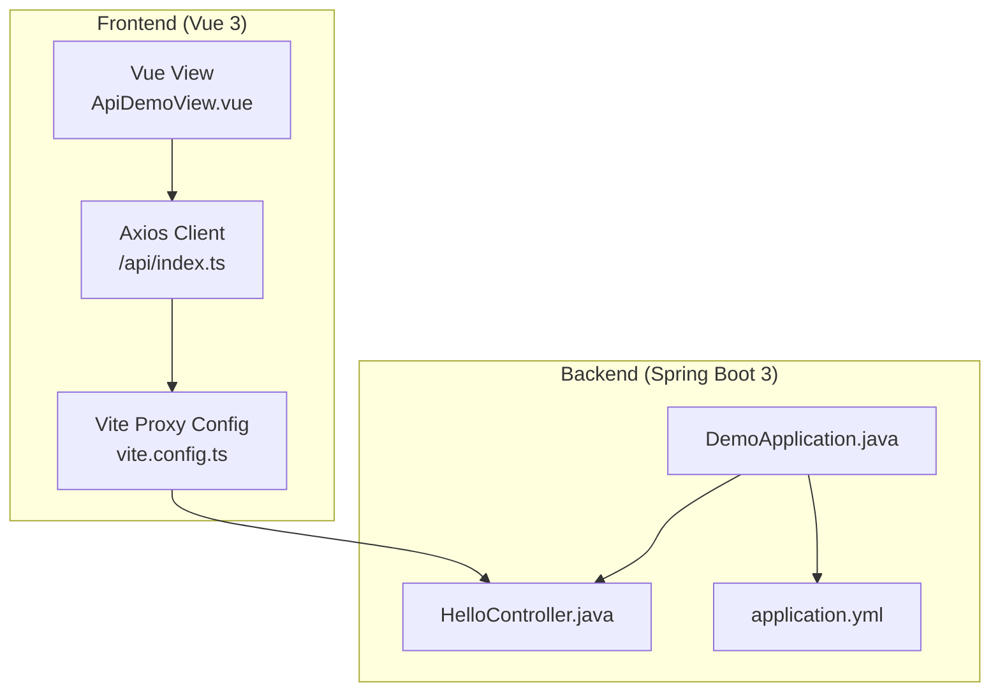
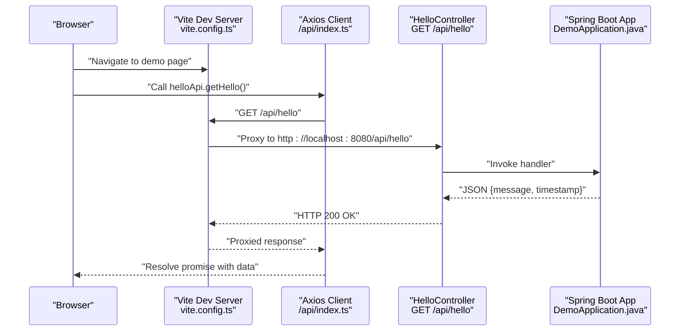
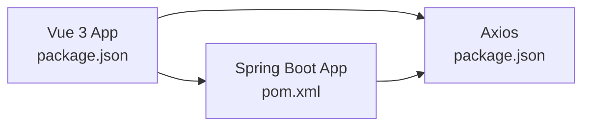

# API Documentation

<cite>
**Referenced Files in This Document**
- [HelloController.java](file://springboot3-demo/src/main/java/com/example/demo/controller/HelloController.java)
- [index.ts](file://vue3-springboot-demo/src/api/index.ts)
- [ApiDemoView.vue](file://vue3-springboot-demo/src/views/ApiDemoView.vue)
- [vite.config.ts](file://vue3-springboot-demo/vite.config.ts)
- [application.yml](file://springboot3-demo/src/main/resources/application.yml)
- [DemoApplication.java](file://springboot3-demo/src/main/java/com/example/demo/DemoApplication.java)
- [pom.xml](file://springboot3-demo/pom.xml)
- [package.json](file://vue3-springboot-demo/package.json)
</cite>

## Table of Contents
1. [Introduction](#introduction)
2. [Project Structure](#project-structure)
3. [Core Components](#core-components)
4. [Architecture Overview](#architecture-overview)
5. [Detailed Component Analysis](#detailed-component-analysis)
6. [Dependency Analysis](#dependency-analysis)
7. [Performance Considerations](#performance-considerations)
8. [Troubleshooting Guide](#troubleshooting-guide)
9. [Conclusion](#conclusion)
10. [Appendices](#appendices)

## Introduction
This document provides comprehensive API documentation for the RESTful endpoints in the qoder application, focusing on the /api/hello endpoint. It covers HTTP methods, URL patterns, request/response schemas, error handling strategies, and the frontend API client implementation using Axios. It also explains integration patterns between the frontend and backend, proxy configuration for development, and cross-origin resource sharing (CORS) setup. Practical examples, debugging approaches, testing strategies, and performance considerations are included to guide developers in consuming and extending the API.

## Project Structure
The qoder project consists of two primary modules:
- Backend (Spring Boot 3): Provides the REST API under the /api base path.
- Frontend (Vue 3 + Vite): Consumes the backend API via an Axios client configured with a proxy for development.

**Diagram sources**
- [HelloController.java:11-23](file://springboot3-demo/src/main/java/com/example/demo/controller/HelloController.java#L11-L23)
- [index.ts:3-19](file://vue3-springboot-demo/src/api/index.ts#L3-L19)
- [ApiDemoView.vue:10-22](file://vue3-springboot-demo/src/views/ApiDemoView.vue#L10-L22)
- [vite.config.ts:18-26](file://vue3-springboot-demo/vite.config.ts#L18-L26)
- [application.yml:1-16](file://springboot3-demo/src/main/resources/application.yml#L1-L16)
- [DemoApplication.java:6-12](file://springboot3-demo/src/main/java/com/example/demo/DemoApplication.java#L6-L12)

**Section sources**
- [HelloController.java:11-23](file://springboot3-demo/src/main/java/com/example/demo/controller/HelloController.java#L11-L23)
- [index.ts:3-19](file://vue3-springboot-demo/src/api/index.ts#L3-L19)
- [ApiDemoView.vue:10-22](file://vue3-springboot-demo/src/views/ApiDemoView.vue#L10-L22)
- [vite.config.ts:18-26](file://vue3-springboot-demo/vite.config.ts#L18-L26)
- [application.yml:1-16](file://springboot3-demo/src/main/resources/application.yml#L1-L16)
- [DemoApplication.java:6-12](file://springboot3-demo/src/main/java/com/example/demo/DemoApplication.java#L6-L12)

## Core Components
- Backend REST Controller: Exposes GET /api/hello returning a JSON payload with a message and a timestamp.
- Frontend Axios Client: Configured with a base URL pointing to /api and a timeout for requests.
- Vue View: Demonstrates fetching data from the backend and handling loading/error states.

Key implementation references:
- Backend endpoint definition and CORS configuration: [HelloController.java:16-22](file://springboot3-demo/src/main/java/com/example/demo/controller/HelloController.java#L16-L22)
- Frontend API client creation and endpoint binding: [index.ts:3-19](file://vue3-springboot-demo/src/api/index.ts#L3-L19)
- Frontend view logic for invoking the API and rendering results: [ApiDemoView.vue:10-22](file://vue3-springboot-demo/src/views/ApiDemoView.vue#L10-L22)

**Section sources**
- [HelloController.java:16-22](file://springboot3-demo/src/main/java/com/example/demo/controller/HelloController.java#L16-L22)
- [index.ts:3-19](file://vue3-springboot-demo/src/api/index.ts#L3-L19)
- [ApiDemoView.vue:10-22](file://vue3-springboot-demo/src/views/ApiDemoView.vue#L10-L22)

## Architecture Overview
The frontend and backend communicate through a proxy during development. The Vue app sends requests to /api/hello, which Vite proxies to the Spring Boot backend running on localhost:8080. The backend responds with a JSON object containing a message and a timestamp.

**Diagram sources**
- [vite.config.ts:20-25](file://vue3-springboot-demo/vite.config.ts#L20-L25)
- [index.ts:17-19](file://vue3-springboot-demo/src/api/index.ts#L17-L19)
- [HelloController.java:16-22](file://springboot3-demo/src/main/java/com/example/demo/controller/HelloController.java#L16-L22)
- [DemoApplication.java:9-11](file://springboot3-demo/src/main/java/com/example/demo/DemoApplication.java#L9-L11)

## Detailed Component Analysis

### Backend Endpoint: GET /api/hello
- HTTP Method: GET
- URL Pattern: /api/hello
- Description: Returns a JSON object with a greeting message and a server-generated timestamp.
- Request Parameters: None
- Response Schema:
  - message: string
  - timestamp: number (milliseconds since epoch)
- Status Codes:
  - 200 OK: Successful response with the greeting payload.
- CORS Configuration:
  - Cross-origin requests are allowed from http://localhost:5173.

Implementation references:
- Endpoint mapping and response construction: [HelloController.java:16-22](file://springboot3-demo/src/main/java/com/example/demo/controller/HelloController.java#L16-L22)
- CORS origin configuration: [HelloController.java:13](file://springboot3-demo/src/main/java/com/example/demo/controller/HelloController.java#L13)
- Application configuration (port and logging): [application.yml:1-16](file://springboot3-demo/src/main/resources/application.yml#L1-L16)

**Section sources**
- [HelloController.java:16-22](file://springboot3-demo/src/main/java/com/example/demo/controller/HelloController.java#L16-L22)
- [HelloController.java:13](file://springboot3-demo/src/main/java/com/example/demo/controller/HelloController.java#L13)
- [application.yml:1-16](file://springboot3-demo/src/main/resources/application.yml#L1-L16)

### Frontend API Client: Axios Configuration and Usage
- Axios Client:
  - Base URL: /api
  - Timeout: 10000 ms
  - Content-Type: application/json
- API Definition:
  - helloApi.getHello(): GET /api/hello
- Frontend Consumption:
  - The Vue view invokes the API on mount, handles loading and error states, and updates reactive data with the response payload.

Implementation references:
- Axios client creation and endpoint binding: [index.ts:3-19](file://vue3-springboot-demo/src/api/index.ts#L3-L19)
- View logic for fetching and displaying data: [ApiDemoView.vue:10-22](file://vue3-springboot-demo/src/views/ApiDemoView.vue#L10-L22)

**Section sources**
- [index.ts:3-19](file://vue3-springboot-demo/src/api/index.ts#L3-L19)
- [ApiDemoView.vue:10-22](file://vue3-springboot-demo/src/views/ApiDemoView.vue#L10-L22)

### Development Proxy and CORS Setup
- Vite Proxy:
  - Route: /api
  - Target: http://localhost:8080
  - changeOrigin: true
- CORS Origin:
  - Allowed origin: http://localhost:5173
- Integration Pattern:
  - Frontend requests to /api/hello are proxied to the backend server, enabling seamless local development without cross-origin issues.

Implementation references:
- Proxy configuration: [vite.config.ts:20-25](file://vue3-springboot-demo/vite.config.ts#L20-L25)
- CORS origin declaration: [HelloController.java:13](file://springboot3-demo/src/main/java/com/example/demo/controller/HelloController.java#L13)

**Section sources**
- [vite.config.ts:20-25](file://vue3-springboot-demo/vite.config.ts#L20-L25)
- [HelloController.java:13](file://springboot3-demo/src/main/java/com/example/demo/controller/HelloController.java#L13)

### Error Handling Strategies
- Frontend:
  - Loading state is toggled during requests.
  - Errors are captured in a dedicated reactive variable and displayed to the user.
  - The UI disables the button while loading to prevent concurrent requests.
- Backend:
  - No explicit exception handling is implemented in the controller; Spring Boot defaults apply for unhandled exceptions.

Implementation references:
- Frontend error handling and UI state: [ApiDemoView.vue:10-22](file://vue3-springboot-demo/src/views/ApiDemoView.vue#L10-L22)

**Section sources**
- [ApiDemoView.vue:10-22](file://vue3-springboot-demo/src/views/ApiDemoView.vue#L10-L22)

### API Client Implementation Guidelines
- Axios Instance:
  - Use a shared instance with a base URL set to /api for consistent routing.
  - Configure timeouts and headers as needed.
- Endpoint Binding:
  - Define typed wrappers for each endpoint to centralize request logic.
- Request/Response Handling:
  - Implement loading and error states in views.
  - Parse and validate response data before updating UI state.
- Error Management:
  - Surface user-friendly messages and log detailed errors for debugging.
  - Consider retry mechanisms and fallback UI states for transient failures.

Implementation references:
- Axios client and endpoint definition: [index.ts:3-19](file://vue3-springboot-demo/src/api/index.ts#L3-L19)
- View consumption and error handling: [ApiDemoView.vue:10-22](file://vue3-springboot-demo/src/views/ApiDemoView.vue#L10-L22)

**Section sources**
- [index.ts:3-19](file://vue3-springboot-demo/src/api/index.ts#L3-L19)
- [ApiDemoView.vue:10-22](file://vue3-springboot-demo/src/views/ApiDemoView.vue#L10-L22)

### Practical Examples and Common Use Cases
- Basic GET Request:
  - Call helloApi.getHello() to retrieve the greeting and timestamp.
  - Update UI with message and timestamp values.
- Re-triggering Requests:
  - Use the view’s button to re-fetch data after an error or on demand.
- Loading States:
  - Disable UI controls while loading and show a loading indicator.

Implementation references:
- Example invocation and state updates: [ApiDemoView.vue:10-22](file://vue3-springboot-demo/src/views/ApiDemoView.vue#L10-L22)

**Section sources**
- [ApiDemoView.vue:10-22](file://vue3-springboot-demo/src/views/ApiDemoView.vue#L10-L22)

## Dependency Analysis
The frontend and backend modules depend on their respective frameworks and configurations. The frontend depends on Axios for HTTP requests, while the backend depends on Spring Web for REST capabilities.

**Diagram sources**
- [package.json:17-22](file://vue3-springboot-demo/package.json#L17-L22)
- [pom.xml:25-49](file://springboot3-demo/pom.xml#L25-L49)

**Section sources**
- [package.json:17-22](file://vue3-springboot-demo/package.json#L17-L22)
- [pom.xml:25-49](file://springboot3-demo/pom.xml#L25-L49)

## Performance Considerations
- Timeout Configuration: Adjust the Axios timeout to balance responsiveness and reliability for network conditions.
- Caching: Consider caching lightweight responses on the frontend to reduce repeated requests.
- Minimizing Payload Size: Keep response payloads small; the current endpoint returns minimal data suitable for frequent polling.
- Network Efficiency: Use a single Axios instance to reuse connections and reduce overhead.
- Monitoring: Add request/response timing metrics to identify slow endpoints and optimize accordingly.

[No sources needed since this section provides general guidance]

## Troubleshooting Guide
- CORS Errors:
  - Ensure the frontend runs on http://localhost:5173 and the backend allows this origin.
  - Verify the @CrossOrigin annotation and proxy configuration.
- Proxy Issues:
  - Confirm the Vite proxy route /api targets http://localhost:8080.
  - Check that the backend server is running on the expected port.
- Timeout Errors:
  - Increase the Axios timeout if requests frequently fail due to latency.
- Logging:
  - Enable debug logging for the backend controller package to inspect request handling.
- Testing:
  - Use unit tests to validate API client behavior and view logic.
  - Use integration tests to verify the proxy and endpoint responses.

**Section sources**
- [HelloController.java:13](file://springboot3-demo/src/main/java/com/example/demo/controller/HelloController.java#L13)
- [vite.config.ts:20-25](file://vue3-springboot-demo/vite.config.ts#L20-L25)
- [application.yml:13-16](file://springboot3-demo/src/main/resources/application.yml#L13-L16)

## Conclusion
The qoder application demonstrates a clean separation between a Vue 3 frontend and a Spring Boot 3 backend. The /api/hello endpoint provides a simple yet effective REST API that returns a message and timestamp. The frontend consumes this endpoint using an Axios client configured with a development proxy and robust error handling. By following the guidelines and patterns outlined here, developers can extend the API, enhance error handling, and optimize performance for production scenarios.

[No sources needed since this section summarizes without analyzing specific files]

## Appendices

### API Definition Summary
- Endpoint: GET /api/hello
- Request: No body or query parameters
- Response: JSON object with fields message (string) and timestamp (number)
- Status Codes: 200 OK

**Section sources**
- [HelloController.java:16-22](file://springboot3-demo/src/main/java/com/example/demo/controller/HelloController.java#L16-L22)

### Frontend Client Reference
- Axios Client: [index.ts:3-19](file://vue3-springboot-demo/src/api/index.ts#L3-L19)
- View Integration: [ApiDemoView.vue:10-22](file://vue3-springboot-demo/src/views/ApiDemoView.vue#L10-L22)
- Proxy Configuration: [vite.config.ts:20-25](file://vue3-springboot-demo/vite.config.ts#L20-L25)

**Section sources**
- [index.ts:3-19](file://vue3-springboot-demo/src/api/index.ts#L3-L19)
- [ApiDemoView.vue:10-22](file://vue3-springboot-demo/src/views/ApiDemoView.vue#L10-L22)
- [vite.config.ts:20-25](file://vue3-springboot-demo/vite.config.ts#L20-L25)