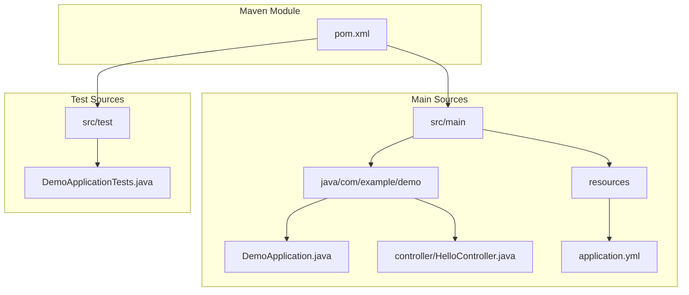
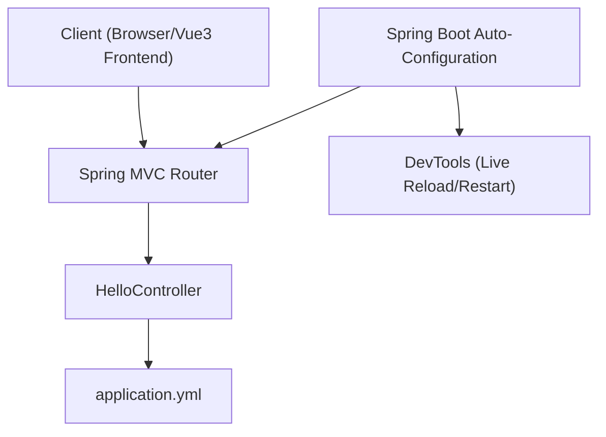
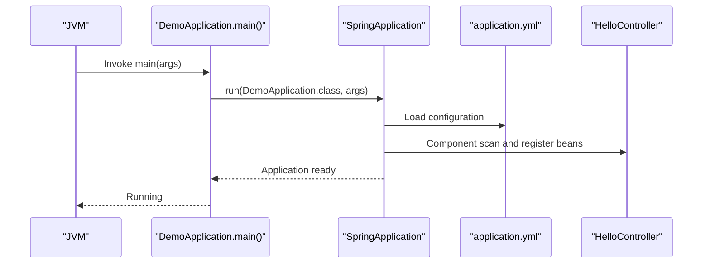
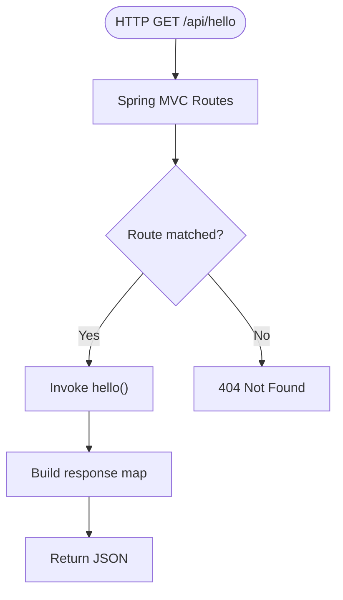
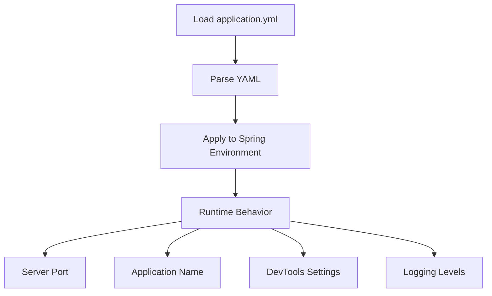
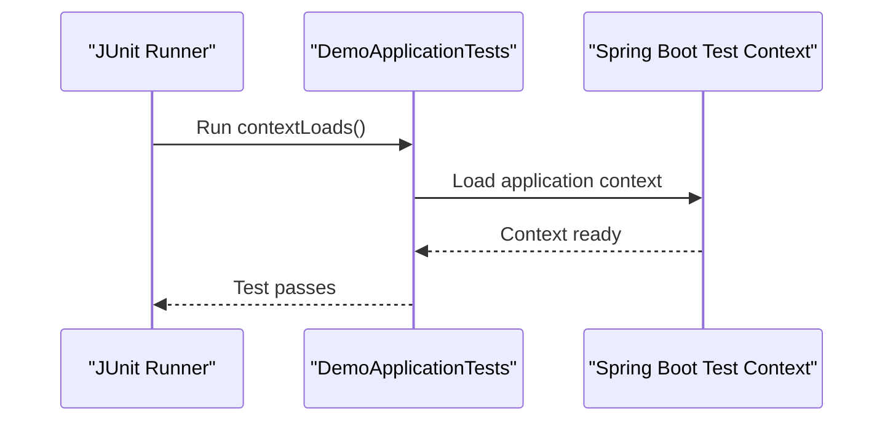
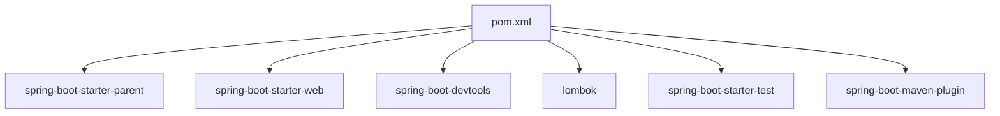

# Application Architecture

<cite>
**Referenced Files in This Document**
- [DemoApplication.java](file://springboot3-demo/src/main/java/com/example/demo/DemoApplication.java)
- [HelloController.java](file://springboot3-demo/src/main/java/com/example/demo/controller/HelloController.java)
- [application.yml](file://springboot3-demo/src/main/resources/application.yml)
- [pom.xml](file://springboot3-demo/pom.xml)
- [DemoApplicationTests.java](file://springboot3-demo/src/test/java/com/example/demo/DemoApplicationTests.java)
</cite>

## Table of Contents
1. [Introduction](#introduction)
2. [Project Structure](#project-structure)
3. [Core Components](#core-components)
4. [Architecture Overview](#architecture-overview)
5. [Detailed Component Analysis](#detailed-component-analysis)
6. [Dependency Analysis](#dependency-analysis)
7. [Performance Considerations](#performance-considerations)
8. [Troubleshooting Guide](#troubleshooting-guide)
9. [Conclusion](#conclusion)

## Introduction
This document explains the Spring Boot application architecture for the Vue3+SpringBoot3 demo project. It covers the project structure, the main application entry point, Spring Boot auto-configuration, the @SpringBootApplication annotation, component scanning, and the application startup process. It also documents Maven build configuration, dependency management, and package organization. Practical examples and best practices for extending the application structure are included to guide future development.

## Project Structure
The project follows the standard Maven layout with a clear separation between production code, resources, and tests. The application is organized into packages that reflect typical Spring Boot conventions:
- Application entry point under the main Java source tree
- REST controller under a dedicated controller package
- Configuration under resources
- Tests under the test source tree

**Diagram sources**
- [pom.xml:1-68](file://springboot3-demo/pom.xml#L1-L68)
- [DemoApplication.java:1-14](file://springboot3-demo/src/main/java/com/example/demo/DemoApplication.java#L1-L14)
- [HelloController.java:1-24](file://springboot3-demo/src/main/java/com/example/demo/controller/HelloController.java#L1-L24)
- [application.yml:1-16](file://springboot3-demo/src/main/resources/application.yml#L1-L16)
- [DemoApplicationTests.java:1-14](file://springboot3-demo/src/test/java/com/example/demo/DemoApplicationTests.java#L1-L14)

**Section sources**
- [pom.xml:1-68](file://springboot3-demo/pom.xml#L1-L68)
- [DemoApplication.java:1-14](file://springboot3-demo/src/main/java/com/example/demo/DemoApplication.java#L1-L14)
- [HelloController.java:1-24](file://springboot3-demo/src/main/java/com/example/demo/controller/HelloController.java#L1-L24)
- [application.yml:1-16](file://springboot3-demo/src/main/resources/application.yml#L1-L16)
- [DemoApplicationTests.java:1-14](file://springboot3-demo/src/test/java/com/example/demo/DemoApplicationTests.java#L1-L14)

## Core Components
- Application entry point: The DemoApplication class serves as the primary entry point. It declares the main method and runs the Spring Boot application using the SpringApplication class.
- Auto-configuration and component scanning: The @SpringBootApplication annotation enables Spring Boot’s auto-configuration and component scanning. By default, component scanning starts from the package containing the annotated class.
- REST controller: The HelloController exposes a GET endpoint under /api/hello, returning a JSON payload with a message and timestamp.
- Configuration: The application.yml defines server port, application name, developer tools behavior, and logging levels.

Key characteristics:
- Minimal configuration: The application relies on Spring Boot’s defaults for most aspects.
- Developer experience: DevTools is included for live reload and restart capabilities.
- Test coverage: A basic test verifies that the application context loads successfully.

**Section sources**
- [DemoApplication.java:6-11](file://springboot3-demo/src/main/java/com/example/demo/DemoApplication.java#L6-L11)
- [HelloController.java:11-22](file://springboot3-demo/src/main/java/com/example/demo/controller/HelloController.java#L11-L22)
- [application.yml:1-16](file://springboot3-demo/src/main/resources/application.yml#L1-L16)

## Architecture Overview
The application follows a layered architecture:
- Presentation layer: REST controller handles incoming requests and returns JSON responses.
- Configuration layer: YAML-based configuration controls server behavior and logging.
- Infrastructure layer: Spring Boot auto-configuration manages beans and web infrastructure.

**Diagram sources**
- [HelloController.java:11-22](file://springboot3-demo/src/main/java/com/example/demo/controller/HelloController.java#L11-L22)
- [application.yml:1-16](file://springboot3-demo/src/main/resources/application.yml#L1-L16)

## Detailed Component Analysis

### Application Entry Point and Startup
The DemoApplication class is the central bootstrap class:
- Declares the @SpringBootApplication annotation, enabling auto-configuration and component scanning.
- Provides the main method that launches the application via SpringApplication.

**Diagram sources**
- [DemoApplication.java:6-11](file://springboot3-demo/src/main/java/com/example/demo/DemoApplication.java#L6-L11)
- [application.yml:1-16](file://springboot3-demo/src/main/resources/application.yml#L1-L16)
- [HelloController.java:11-22](file://springboot3-demo/src/main/java/com/example/demo/controller/HelloController.java#L11-L22)

**Section sources**
- [DemoApplication.java:6-11](file://springboot3-demo/src/main/java/com/example/demo/DemoApplication.java#L6-L11)

### Controller Layer
The HelloController demonstrates a simple REST endpoint:
- Uses @RestController for RESTful responses.
- Exposes a GET endpoint at /api/hello.
- Applies @CrossOrigin to allow requests from the frontend origin.
- Returns a structured response map with a message and timestamp.

**Diagram sources**
- [HelloController.java:11-22](file://springboot3-demo/src/main/java/com/example/demo/controller/HelloController.java#L11-L22)

**Section sources**
- [HelloController.java:11-22](file://springboot3-demo/src/main/java/com/example/demo/controller/HelloController.java#L11-L22)

### Configuration Management
The application.yml centralizes configuration:
- Server port is set to 8080.
- Application name is defined for identification.
- DevTools is configured to enable restart and live reload.
- Logging level for the demo package is set to DEBUG.

**Diagram sources**
- [application.yml:1-16](file://springboot3-demo/src/main/resources/application.yml#L1-L16)

**Section sources**
- [application.yml:1-16](file://springboot3-demo/src/main/resources/application.yml#L1-L16)

### Testing Strategy
The DemoApplicationTests class validates that the application context loads successfully:
- Uses @SpringBootTest to load the full application context.
- Includes a simple test method verifying context initialization.

**Diagram sources**
- [DemoApplicationTests.java:6-11](file://springboot3-demo/src/test/java/com/example/demo/DemoApplicationTests.java#L6-L11)

**Section sources**
- [DemoApplicationTests.java:6-11](file://springboot3-demo/src/test/java/com/example/demo/DemoApplicationTests.java#L6-L11)

## Dependency Analysis
The Maven configuration defines the project’s dependencies and build behavior:
- Parent POM: Inherits from spring-boot-starter-parent for standardized plugin and dependency management.
- Java version: Targets Java 17.
- Dependencies:
  - spring-boot-starter-web: Provides web MVC and embedded Tomcat.
  - spring-boot-devtools: Enhances developer experience with live reload and restart.
  - Lombok: Optional annotation processor for reducing boilerplate.
  - spring-boot-starter-test: Test framework support.
- Build plugins:
  - spring-boot-maven-plugin: Packages the application as an executable JAR and excludes Lombok from the final artifact.

**Diagram sources**
- [pom.xml:8-48](file://springboot3-demo/pom.xml#L8-L48)
- [pom.xml:51-66](file://springboot3-demo/pom.xml#L51-L66)

**Section sources**
- [pom.xml:8-48](file://springboot3-demo/pom.xml#L8-L48)
- [pom.xml:51-66](file://springboot3-demo/pom.xml#L51-L66)

## Performance Considerations
- DevTools configuration: Live reload and restart improve developer productivity during development. Ensure these are disabled or carefully managed in production environments.
- Logging levels: DEBUG logging for the demo package aids troubleshooting but can increase overhead; adjust levels accordingly in production.
- Embedded server: The default embedded Tomcat is suitable for small to medium applications; consider tuning JVM and server settings for larger deployments.

[No sources needed since this section provides general guidance]

## Troubleshooting Guide
Common issues and resolutions:
- Port conflicts: If port 8080 is in use, change the server.port in application.yml to another available port.
- CORS errors: Verify that the @CrossOrigin origin matches the frontend origin. Adjust origins as needed.
- DevTools not reloading: Confirm DevTools is enabled and that changes trigger restart/live reload. Check logs for DevTools activity.
- Test failures: Ensure the application context loads by running the test class. If it fails, inspect configuration and component scanning.

**Section sources**
- [application.yml:1-16](file://springboot3-demo/src/main/resources/application.yml#L1-L16)
- [HelloController.java:13-13](file://springboot3-demo/src/main/java/com/example/demo/controller/HelloController.java#L13-L13)

## Conclusion
This Spring Boot application demonstrates a clean, minimal architecture aligned with Spring Boot conventions. The @SpringBootApplication annotation enables auto-configuration and component scanning, while the controller exposes a simple REST endpoint. The Maven configuration provides a solid foundation for development and testing, with optional DevTools enhancing developer experience. Following the best practices outlined here will help maintain a scalable and organized project structure as the application grows.