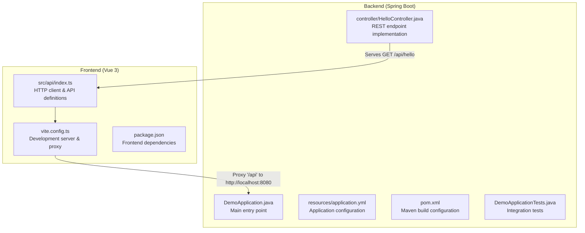
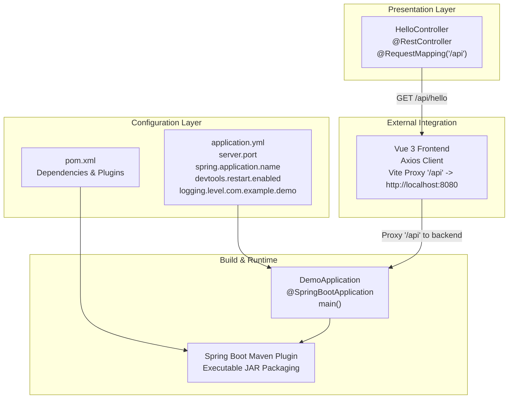
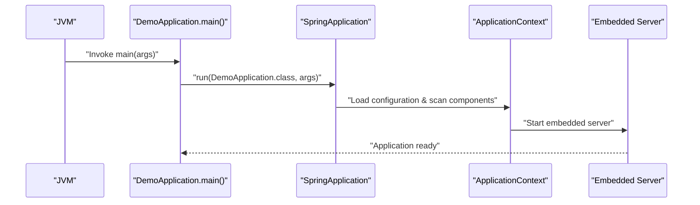
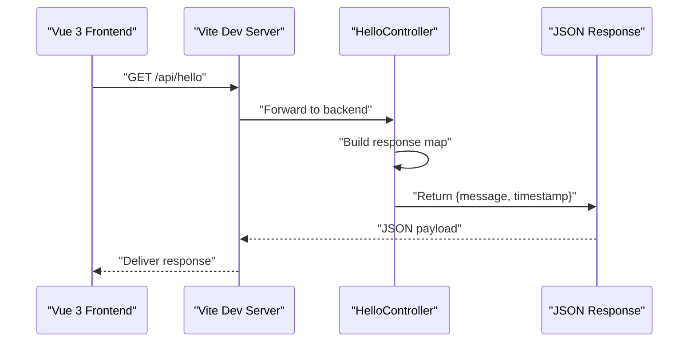
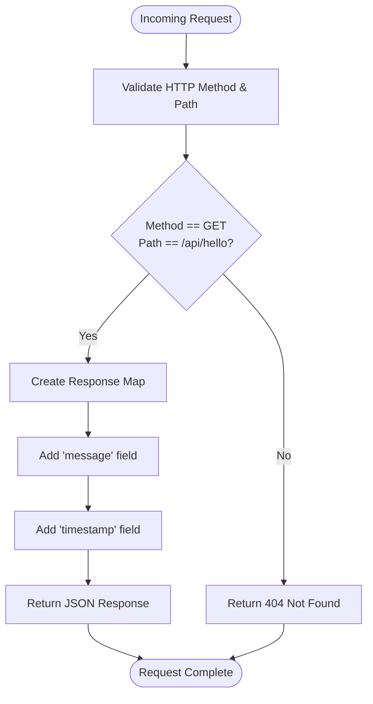
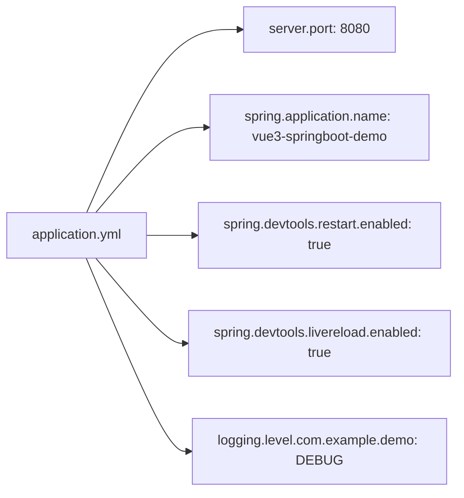
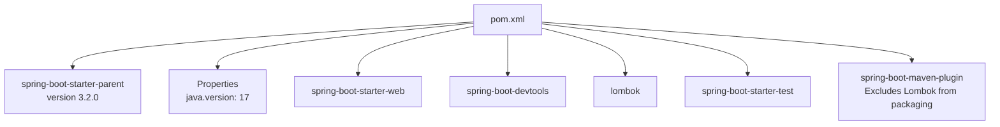
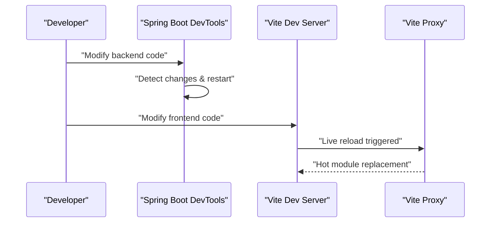
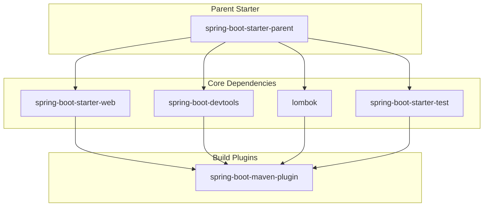

# Backend Application (Spring Boot)

<cite>
**Referenced Files in This Document**
- [DemoApplication.java](file://springboot3-demo/src/main/java/com/example/demo/DemoApplication.java)
- [HelloController.java](file://springboot3-demo/src/main/java/com/example/demo/controller/HelloController.java)
- [application.yml](file://springboot3-demo/src/main/resources/application.yml)
- [pom.xml](file://springboot3-demo/pom.xml)
- [DemoApplicationTests.java](file://springboot3-demo/src/test/java/com/example/demo/DemoApplicationTests.java)
- [index.ts](file://vue3-springboot-demo/src/api/index.ts)
- [vite.config.ts](file://vue3-springboot-demo/vite.config.ts)
- [package.json](file://vue3-springboot-demo/package.json)
</cite>

## Table of Contents
1. [Introduction](#introduction)
2. [Project Structure](#project-structure)
3. [Core Components](#core-components)
4. [Architecture Overview](#architecture-overview)
5. [Detailed Component Analysis](#detailed-component-analysis)
6. [Dependency Analysis](#dependency-analysis)
7. [Performance Considerations](#performance-considerations)
8. [Troubleshooting Guide](#troubleshooting-guide)
9. [Conclusion](#conclusion)
10. [Appendices](#appendices)

## Introduction
This document provides comprehensive documentation for the Spring Boot backend application that powers a Vue 3 + Spring Boot 3 demo. The backend implements a minimal yet complete REST API service with a single endpoint, showcasing modern Spring Boot development practices including auto-configuration, DevTools integration, and clean project structure. The application demonstrates cross-origin resource sharing (CORS) configuration, centralized logging, and seamless integration with a Vue.js frontend through a reverse proxy setup.

## Project Structure
The backend follows a conventional Maven layout with clear separation between production code, resources, and tests. The application is organized into two primary packages: the main application entry point and a dedicated controller package for REST endpoints. Configuration is managed through YAML files, while Maven coordinates dependencies and build lifecycle.

**Diagram sources**
- [DemoApplication.java:1-14](file://springboot3-demo/src/main/java/com/example/demo/DemoApplication.java#L1-L14)
- [HelloController.java:1-24](file://springboot3-demo/src/main/java/com/example/demo/controller/HelloController.java#L1-L24)
- [application.yml:1-16](file://springboot3-demo/src/main/resources/application.yml#L1-L16)
- [pom.xml:1-68](file://springboot3-demo/pom.xml#L1-L68)
- [DemoApplicationTests.java:1-14](file://springboot3-demo/src/test/java/com/example/demo/DemoApplicationTests.java#L1-L14)
- [index.ts:1-22](file://vue3-springboot-demo/src/api/index.ts#L1-L22)
- [vite.config.ts:1-28](file://vue3-springboot-demo/vite.config.ts#L1-L28)

**Section sources**
- [DemoApplication.java:1-14](file://springboot3-demo/src/main/java/com/example/demo/DemoApplication.java#L1-L14)
- [HelloController.java:1-24](file://springboot3-demo/src/main/java/com/example/demo/controller/HelloController.java#L1-L24)
- [application.yml:1-16](file://springboot3-demo/src/main/resources/application.yml#L1-L16)
- [pom.xml:1-68](file://springboot3-demo/pom.xml#L1-L68)
- [DemoApplicationTests.java:1-14](file://springboot3-demo/src/test/java/com/example/demo/DemoApplicationTests.java#L1-L14)

## Core Components
This section outlines the essential building blocks of the backend application, focusing on the main entry point, REST controller, configuration, and testing framework.

- Main Application Entry Point
  - The application starts from a single annotated class that enables Spring Boot auto-configuration and component scanning.
  - The static main method delegates execution to the Spring application runtime, initializing the embedded web server and loading application context.

- REST Controller Implementation
  - A single controller exposes a GET endpoint under a base path with CORS enabled for local development.
  - The endpoint returns a structured JSON response containing a message and a timestamp, demonstrating basic response handling patterns.

- Configuration Management
  - Centralized configuration through YAML defines server port, application name, DevTools behavior, and logging levels.
  - Logging is configured to provide debug visibility for the application package during development.

- Build and Dependency Management
  - Maven coordinates dependencies including Spring Web MVC, DevTools, Lombok, and JUnit-based testing starter.
  - The Spring Boot Maven plugin is configured to package the application with executable JAR support.

- Testing Infrastructure
  - Integration tests leverage Spring Boot Test annotations to validate application context loading without requiring external services.

**Section sources**
- [DemoApplication.java:6-11](file://springboot3-demo/src/main/java/com/example/demo/DemoApplication.java#L6-L11)
- [HelloController.java:11-22](file://springboot3-demo/src/main/java/com/example/demo/controller/HelloController.java#L11-L22)
- [application.yml:1-16](file://springboot3-demo/src/main/resources/application.yml#L1-L16)
- [pom.xml:25-49](file://springboot3-demo/pom.xml#L25-L49)
- [DemoApplicationTests.java:6-11](file://springboot3-demo/src/test/java/com/example/demo/DemoApplicationTests.java#L6-L11)

## Architecture Overview
The backend employs a layered architecture with clear separation of concerns. The presentation layer consists of REST controllers that handle HTTP requests and produce JSON responses. The configuration layer manages application behavior, while the build layer ensures reproducible builds and packaging.

**Diagram sources**
- [HelloController.java:11-22](file://springboot3-demo/src/main/java/com/example/demo/controller/HelloController.java#L11-L22)
- [application.yml:1-16](file://springboot3-demo/src/main/resources/application.yml#L1-L16)
- [pom.xml:51-66](file://springboot3-demo/pom.xml#L51-L66)
- [DemoApplication.java:6-11](file://springboot3-demo/src/main/java/com/example/demo/DemoApplication.java#L6-L11)
- [index.ts:3-9](file://vue3-springboot-demo/src/api/index.ts#L3-L9)
- [vite.config.ts:18-26](file://vue3-springboot-demo/vite.config.ts#L18-L26)

## Detailed Component Analysis

### Main Application Entry Point
The application entry point encapsulates Spring Boot's auto-configuration capabilities and component scanning. The annotation triggers a comprehensive initialization sequence that sets up the web stack, loads configuration, and prepares the application context for serving requests.

**Diagram sources**
- [DemoApplication.java:9-11](file://springboot3-demo/src/main/java/com/example/demo/DemoApplication.java#L9-L11)

**Section sources**
- [DemoApplication.java:6-11](file://springboot3-demo/src/main/java/com/example/demo/DemoApplication.java#L6-L11)

### REST Endpoint Implementation
The HelloController demonstrates a minimal yet robust REST endpoint implementation. It combines request mapping, cross-origin allowance, and response construction patterns commonly used in Spring Boot applications.

**Diagram sources**
- [HelloController.java:16-22](file://springboot3-demo/src/main/java/com/example/demo/controller/HelloController.java#L16-L22)
- [index.ts:17-19](file://vue3-springboot-demo/src/api/index.ts#L17-L19)
- [vite.config.ts:20-25](file://vue3-springboot-demo/vite.config.ts#L20-L25)

**Section sources**
- [HelloController.java:11-22](file://springboot3-demo/src/main/java/com/example/demo/controller/HelloController.java#L11-L22)

### HTTP Endpoint Specifications
The single endpoint follows REST conventions with clear path semantics and standardized response construction. The endpoint specification includes:

- Base Path: "/api"
- Resource Path: "/hello"
- HTTP Method: GET
- Response Format: JSON object containing a message string and a timestamp integer
- CORS Configuration: Allows requests from the Vue development server origin

**Diagram sources**
- [HelloController.java:16-22](file://springboot3-demo/src/main/java/com/example/demo/controller/HelloController.java#L16-L22)

**Section sources**
- [HelloController.java:16-22](file://springboot3-demo/src/main/java/com/example/demo/controller/HelloController.java#L16-L22)

### Application Properties Configuration
The YAML configuration centralizes application behavior across multiple domains:

- Server Configuration: Defines the HTTP port for the embedded server
- Application Metadata: Sets the application name for identification
- Developer Tools: Enables restart and live reload capabilities for rapid iteration
- Logging Control: Establishes debug-level logging for the application package

**Diagram sources**
- [application.yml:1-16](file://springboot3-demo/src/main/resources/application.yml#L1-L16)

**Section sources**
- [application.yml:1-16](file://springboot3-demo/src/main/resources/application.yml#L1-L16)

### Maven Build Configuration
The Maven configuration establishes a modern Java 17 baseline with Spring Boot 3 compatibility. Dependencies include the web starter, developer tools, Lombok, and testing infrastructure. The build plugin integrates Spring Boot's packaging capabilities.

**Diagram sources**
- [pom.xml:8-49](file://springboot3-demo/pom.xml#L8-L49)
- [pom.xml:51-66](file://springboot3-demo/pom.xml#L51-L66)

**Section sources**
- [pom.xml:21-49](file://springboot3-demo/pom.xml#L21-L49)
- [pom.xml:51-66](file://springboot3-demo/pom.xml#L51-L66)

### Development Workflow with DevTools
The development workflow leverages Spring Boot DevTools for enhanced productivity. The configuration enables automatic restarts and live reload capabilities, reducing the feedback loop during development. Combined with the frontend proxy setup, developers can iterate rapidly on both backend and frontend components.

**Diagram sources**
- [application.yml:7-11](file://springboot3-demo/src/main/resources/application.yml#L7-L11)
- [vite.config.ts:18-26](file://vue3-springboot-demo/vite.config.ts#L18-L26)

**Section sources**
- [application.yml:7-11](file://springboot3-demo/src/main/resources/application.yml#L7-L11)
- [vite.config.ts:18-26](file://vue3-springboot-demo/vite.config.ts#L18-L26)

## Dependency Analysis
The application maintains a focused dependency set optimized for a lightweight REST service. The dependency graph illustrates relationships between the parent starter, core web components, developer tools, and testing infrastructure.

**Diagram sources**
- [pom.xml:8-49](file://springboot3-demo/pom.xml#L8-L49)
- [pom.xml:51-66](file://springboot3-demo/pom.xml#L51-L66)

**Section sources**
- [pom.xml:25-49](file://springboot3-demo/pom.xml#L25-L49)

## Performance Considerations
While the current implementation focuses on simplicity, several considerations apply to performance and scalability:

- Embedded Server Efficiency: Using an embedded Tomcat server reduces deployment overhead and improves startup times compared to traditional WAR deployments.
- Minimal Dependencies: The lean dependency set minimizes memory footprint and startup duration.
- Response Construction: Returning a simple map avoids unnecessary serialization overhead typical of complex object hierarchies.
- CORS Configuration: Targeted CORS settings prevent excessive preflight requests and improve cross-origin communication efficiency.

## Troubleshooting Guide
Common issues and their resolutions during development and deployment:

- Port Conflicts
  - Symptom: Application fails to start on the configured port
  - Resolution: Verify port availability or modify the server port in configuration

- CORS Issues
  - Symptom: Frontend requests blocked due to cross-origin restrictions
  - Resolution: Ensure the controller's CORS configuration matches the frontend origin

- DevTools Not Working
  - Symptom: Changes not triggering automatic restarts
  - Resolution: Verify DevTools dependencies and configuration are present

- Test Failures
  - Symptom: Integration tests fail to load application context
  - Resolution: Confirm test annotations and package structure align with the main application

**Section sources**
- [application.yml:1-16](file://springboot3-demo/src/main/resources/application.yml#L1-L16)
- [HelloController.java:13](file://springboot3-demo/src/main/java/com/example/demo/controller/HelloController.java#L13)
- [DemoApplicationTests.java:6](file://springboot3-demo/src/test/java/com/example/demo/DemoApplicationTests.java#L6)

## Conclusion
This Spring Boot backend demonstrates a clean, minimal implementation suitable for modern full-stack development. The architecture balances simplicity with practical development features, including DevTools integration, CORS configuration, and comprehensive testing support. The frontend-backend integration through Vite's proxy simplifies development workflows, enabling rapid iteration across both layers. The modular design facilitates extension with additional endpoints, controllers, and services while maintaining consistent patterns and configurations.

## Appendices

### Extending the Backend with Additional Endpoints
To add new endpoints following established patterns:

1. Create a new controller class with appropriate annotations
2. Define request mappings under the shared base path
3. Implement response handlers returning structured data
4. Configure CORS policies consistently across endpoints
5. Add unit or integration tests following existing patterns

### Best Practices for Spring Boot Development
- Maintain a single responsibility per controller
- Use consistent naming conventions for endpoints and paths
- Leverage configuration files for environment-specific settings
- Enable DevTools for rapid development cycles
- Implement comprehensive logging for debugging and monitoring
- Keep dependencies minimal and purposeful
- Write tests that validate both happy paths and error conditions