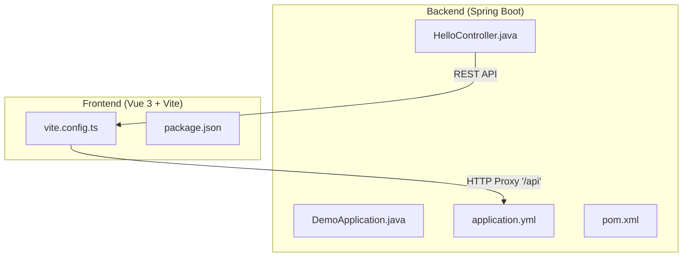
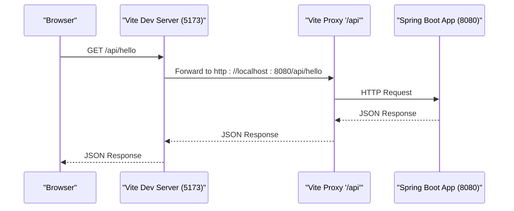
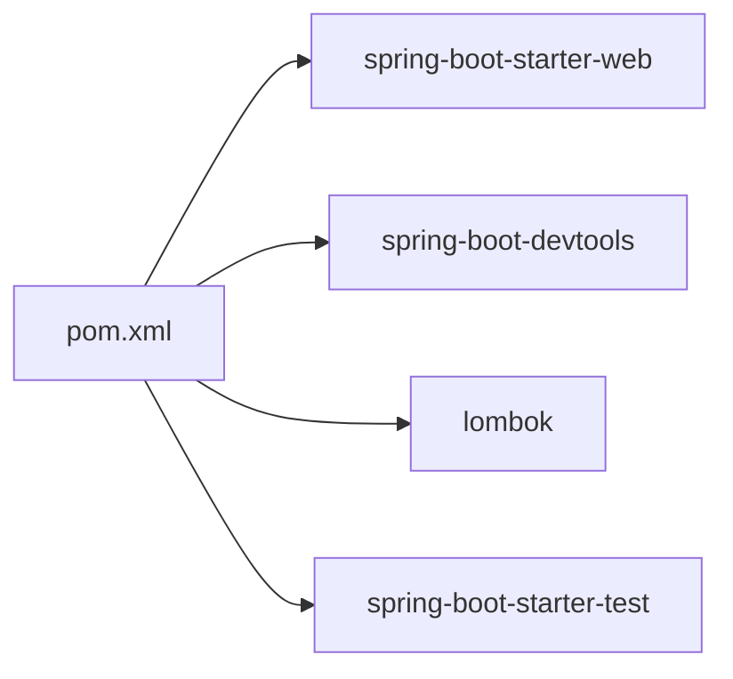

# Development Tools

<cite>
**Referenced Files in This Document**
- [pom.xml](file://springboot3-demo/pom.xml)
- [application.yml](file://springboot3-demo/src/main/resources/application.yml)
- [DemoApplication.java](file://springboot3-demo/src/main/java/com/example/demo/DemoApplication.java)
- [HelloController.java](file://springboot3-demo/src/main/java/com/example/demo/controller/HelloController.java)
- [DemoApplicationTests.java](file://springboot3-demo/src/test/java/com/example/demo/DemoApplicationTests.java)
- [package.json](file://vue3-springboot-demo/package.json)
- [vite.config.ts](file://vue3-springboot-demo/vite.config.ts)
</cite>

## Table of Contents
1. [Introduction](#introduction)
2. [Project Structure](#project-structure)
3. [Core Components](#core-components)
4. [Architecture Overview](#architecture-overview)
5. [Detailed Component Analysis](#detailed-component-analysis)
6. [Dependency Analysis](#dependency-analysis)
7. [Performance Considerations](#performance-considerations)
8. [Troubleshooting Guide](#troubleshooting-guide)
9. [Conclusion](#conclusion)

## Introduction
This document focuses on the Spring Boot development tools configuration for the provided demo project. It covers application property configuration, Maven POM setup, Spring Boot DevTools usage for hot reloading and automatic restarts, and practical guidance for local development workflows. It also includes best practices for development and deployment configurations.

## Project Structure
The project consists of a Spring Boot backend module and a Vue 3 frontend module. The backend exposes a simple REST endpoint and integrates Spring Boot DevTools for development-time productivity. The frontend runs on Vite and proxies API requests to the backend during development.

**Diagram sources**
- [DemoApplication.java:1-14](file://springboot3-demo/src/main/java/com/example/demo/DemoApplication.java#L1-L14)
- [HelloController.java:1-24](file://springboot3-demo/src/main/java/com/example/demo/controller/HelloController.java#L1-L24)
- [application.yml:1-16](file://springboot3-demo/src/main/resources/application.yml#L1-L16)
- [pom.xml:1-68](file://springboot3-demo/pom.xml#L1-L68)
- [vite.config.ts:1-28](file://vue3-springboot-demo/vite.config.ts#L1-L28)
- [package.json:1-49](file://vue3-springboot-demo/package.json#L1-L49)

**Section sources**
- [DemoApplication.java:1-14](file://springboot3-demo/src/main/java/com/example/demo/DemoApplication.java#L1-L14)
- [HelloController.java:1-24](file://springboot3-demo/src/main/java/com/example/demo/controller/HelloController.java#L1-L24)
- [application.yml:1-16](file://springboot3-demo/src/main/resources/application.yml#L1-L16)
- [pom.xml:1-68](file://springboot3-demo/pom.xml#L1-L68)
- [vite.config.ts:1-28](file://vue3-springboot-demo/vite.config.ts#L1-L28)
- [package.json:1-49](file://vue3-springboot-demo/package.json#L1-L49)

## Core Components
- Application configuration: server port, application name, DevTools settings, and logging level.
- Maven build configuration: Java version, Spring Boot parent, starter dependencies, and DevTools runtime scope.
- DevTools integration: automatic restart and live reload toggles.
- Frontend proxy configuration: Vite proxy for API endpoints to the backend during development.

Key configuration highlights:
- Backend server port set to 8080.
- DevTools restart and live reload enabled.
- Logging level configured for the application package.
- DevTools declared as a runtime-scoped dependency.
- Frontend Vite server port set to 5173 with a proxy mapping "/api" to the backend.

**Section sources**
- [application.yml:1-16](file://springboot3-demo/src/main/resources/application.yml#L1-L16)
- [pom.xml:21-48](file://springboot3-demo/pom.xml#L21-L48)
- [vite.config.ts:18-26](file://vue3-springboot-demo/vite.config.ts#L18-L26)

## Architecture Overview
The development architecture pairs a Vue 3 frontend with a Spring Boot backend. During development, the frontend runs on Vite and proxies API calls to the backend. DevTools in the backend enables automatic restarts and live reload to streamline iterative development.

**Diagram sources**
- [HelloController.java:16-22](file://springboot3-demo/src/main/java/com/example/demo/controller/HelloController.java#L16-L22)
- [vite.config.ts:20-25](file://vue3-springboot-demo/vite.config.ts#L20-L25)
- [application.yml:1-2](file://springboot3-demo/src/main/resources/application.yml#L1-L2)

## Detailed Component Analysis

### Backend Application Properties
- Server settings: port configured for the embedded server.
- Application metadata: application name for service identification.
- DevTools settings: restart and live reload toggles.
- Logging configuration: package-level logging level for the application namespace.

Practical guidance:
- Adjust server.port for environments where 8080 is unavailable.
- Enable or disable DevTools restart/livereload based on IDE and editor capabilities.
- Tune logging.level for targeted debugging during development.

**Section sources**
- [application.yml:1-16](file://springboot3-demo/src/main/resources/application.yml#L1-L16)

### Maven POM Configuration
- Parent: Spring Boot starter parent for managed versions and defaults.
- Java version: set to 17 for modern language features and LTS support.
- Dependencies:
  - Web starter for REST endpoints and embedded server.
  - DevTools for development-time productivity.
  - Lombok for boilerplate reduction.
  - Test starter for unit/integration testing.
- Build plugin: Spring Boot Maven Plugin with Lombok exclusion.

Best practices:
- Keep the parent version aligned with the target Spring Boot release.
- Prefer runtime scope for DevTools to avoid shipping it to production.
- Exclude Lombok from generated artifacts to prevent runtime dependencies.

**Section sources**
- [pom.xml:8-13](file://springboot3-demo/pom.xml#L8-L13)
- [pom.xml:21-23](file://springboot3-demo/pom.xml#L21-L23)
- [pom.xml:25-48](file://springboot3-demo/pom.xml#L25-L48)
- [pom.xml:51-66](file://springboot3-demo/pom.xml#L51-L66)

### Spring Boot DevTools Configuration
- Automatic restart: enabled via DevTools restart toggle.
- Live reload: enabled via DevTools live reload toggle.
- Scope and optionality: declared as runtime and optional to avoid inclusion in packaged artifacts.

Workflow optimization tips:
- Use DevTools restart to reflect code changes without manual restarts.
- Use DevTools live reload to refresh browser pages automatically.
- Disable DevTools in production builds to reduce overhead.

**Section sources**
- [application.yml:7-11](file://springboot3-demo/src/main/resources/application.yml#L7-L11)
- [pom.xml:33-36](file://springboot3-demo/pom.xml#L33-L36)

### Frontend Development Setup (Vite + Vue)
- Vite server port: 5173.
- Proxy configuration: routes "/api" to the backend server at 8080.
- Scripts and dependencies: development scripts and tooling for building/testing.

Integration notes:
- The frontend’s cross-origin annotation aligns with the Vite proxy target.
- Ensure the backend allows CORS for the frontend origin during development.

**Section sources**
- [vite.config.ts:18-26](file://vue3-springboot-demo/vite.config.ts#L18-L26)
- [HelloController.java:13](file://springboot3-demo/src/main/java/com/example/demo/controller/HelloController.java#L13)

### Application Entry Point and Tests
- Application entry point: annotated main class to bootstrap the Spring Boot application.
- Test class: annotated test to verify context loads successfully.

**Section sources**
- [DemoApplication.java:6-11](file://springboot3-demo/src/main/java/com/example/demo/DemoApplication.java#L6-L11)
- [DemoApplicationTests.java:6-11](file://springboot3-demo/src/test/java/com/example/demo/DemoApplicationTests.java#L6-L11)

## Dependency Analysis
The backend depends on Spring Boot starters and DevTools for development. The frontend depends on Vite and Vue tooling for development and build tasks.

**Diagram sources**
- [pom.xml:25-48](file://springboot3-demo/pom.xml#L25-L48)

**Section sources**
- [pom.xml:25-48](file://springboot3-demo/pom.xml#L25-L48)

## Performance Considerations
- DevTools overhead: keep DevTools disabled in production to avoid unnecessary scanning and reload triggers.
- Logging levels: adjust logging.level to reduce noise during development; increase verbosity only when diagnosing issues.
- Embedded server tuning: configure server threads and timeouts appropriately for development throughput.

[No sources needed since this section provides general guidance]

## Troubleshooting Guide
Common development issues and resolutions:
- Port conflicts:
  - Change server.port in application.yml to an available port.
  - Verify Vite port 5173 is free; otherwise adjust vite.config.ts server.port.
- CORS errors:
  - Confirm the frontend origin matches the controller’s cross-origin configuration.
  - Ensure the backend allows the frontend origin during development.
- DevTools not triggering restarts:
  - Verify DevTools restart is enabled in application.yml.
  - Confirm DevTools is present in runtime scope and not excluded by packaging.
- Live reload not working:
  - Ensure DevTools live reload is enabled in application.yml.
  - Check browser support and extensions interfering with live reload.
- Testing failures:
  - Run DemoApplicationTests to validate context loading.
  - Ensure test dependencies are included in the POM.

**Section sources**
- [application.yml:1-16](file://springboot3-demo/src/main/resources/application.yml#L1-L16)
- [pom.xml:33-36](file://springboot3-demo/pom.xml#L33-L36)
- [HelloController.java:13](file://springboot3-demo/src/main/java/com/example/demo/controller/HelloController.java#L13)
- [DemoApplicationTests.java:6-11](file://springboot3-demo/src/test/java/com/example/demo/DemoApplicationTests.java#L6-L11)

## Conclusion
The project demonstrates a streamlined development setup with Spring Boot DevTools for hot reloading and automatic restarts, complemented by a Vue 3 frontend using Vite with a development proxy. By leveraging the provided configuration files and following the best practices outlined here, developers can optimize their local development workflow while maintaining clean separation between development and production concerns.