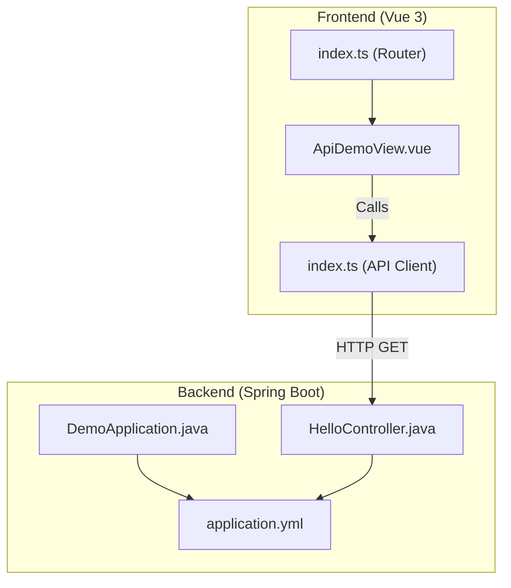
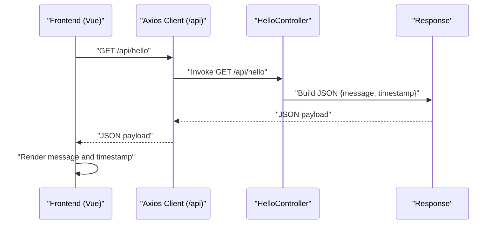
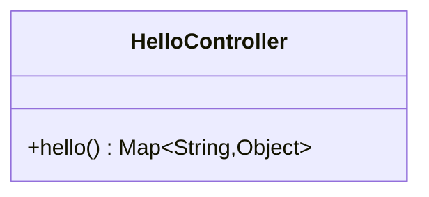
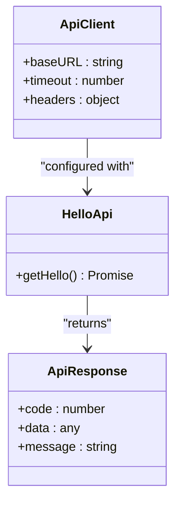
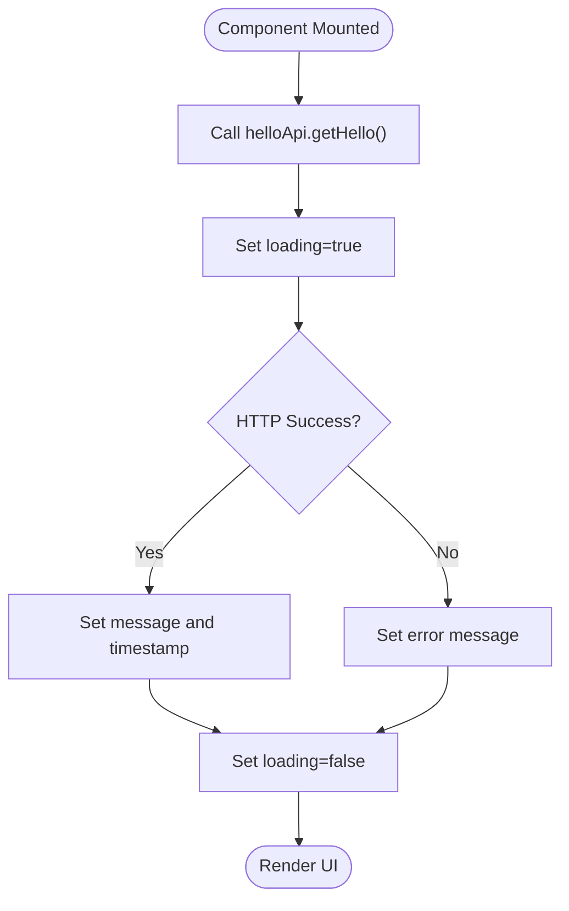
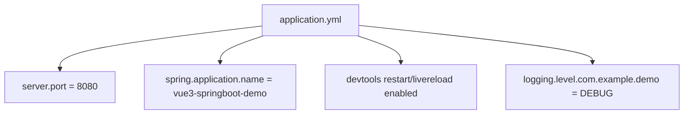
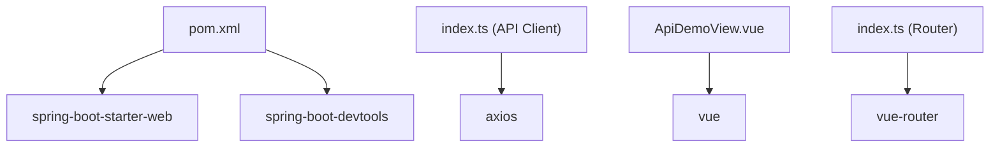

# REST API Endpoints

<cite>
**Referenced Files in This Document**
- [HelloController.java](file://springboot3-demo/src/main/java/com/example/demo/controller/HelloController.java)
- [application.yml](file://springboot3-demo/src/main/resources/application.yml)
- [DemoApplication.java](file://springboot3-demo/src/main/java/com/example/demo/DemoApplication.java)
- [index.ts](file://vue3-springboot-demo/src/api/index.ts)
- [ApiDemoView.vue](file://vue3-springboot-demo/src/views/ApiDemoView.vue)
- [index.ts](file://vue3-springboot-demo/src/router/index.ts)
- [pom.xml](file://springboot3-demo/pom.xml)
</cite>

## Table of Contents
1. [Introduction](#introduction)
2. [Project Structure](#project-structure)
3. [Core Components](#core-components)
4. [Architecture Overview](#architecture-overview)
5. [Detailed Component Analysis](#detailed-component-analysis)
6. [Dependency Analysis](#dependency-analysis)
7. [Performance Considerations](#performance-considerations)
8. [Troubleshooting Guide](#troubleshooting-guide)
9. [Conclusion](#conclusion)
10. [Appendices](#appendices)

## Introduction
This document provides comprehensive API documentation for the REST API endpoints in the Spring Boot 3 demo application. It focuses on the /api/hello endpoint, detailing HTTP methods, URL patterns, request/response schemas, and response formats. It also explains the controller implementation, response object structure with message and timestamp fields, error handling strategies, and practical examples of API consumption using curl commands and integration patterns. Additionally, it documents the application.yml configuration for server settings and port configuration, and provides guidelines for extending the API with additional endpoints while adhering to RESTful design principles.

## Project Structure
The project consists of two primary parts:
- Backend (Spring Boot 3): Provides the REST API endpoints and serves as the backend service.
- Frontend (Vue 3 + TypeScript): Consumes the backend API and demonstrates integration patterns.

Key components:
- Backend controller: Exposes the /api/hello endpoint.
- Application configuration: Defines server port and logging settings.
- Frontend API client: Configures base URL and defines typed API responses.
- Frontend view: Demonstrates fetching and displaying data from the backend.

**Diagram sources**
- [DemoApplication.java:1-14](file://springboot3-demo/src/main/java/com/example/demo/DemoApplication.java#L1-L14)
- [HelloController.java:11-23](file://springboot3-demo/src/main/java/com/example/demo/controller/HelloController.java#L11-L23)
- [application.yml:1-16](file://springboot3-demo/src/main/resources/application.yml#L1-L16)
- [index.ts:1-22](file://vue3-springboot-demo/src/api/index.ts#L1-L22)
- [ApiDemoView.vue:1-100](file://vue3-springboot-demo/src/views/ApiDemoView.vue#L1-L100)
- [index.ts:1-26](file://vue3-springboot-demo/src/router/index.ts#L1-L26)

**Section sources**
- [DemoApplication.java:1-14](file://springboot3-demo/src/main/java/com/example/demo/DemoApplication.java#L1-L14)
- [HelloController.java:11-23](file://springboot3-demo/src/main/java/com/example/demo/controller/HelloController.java#L11-L23)
- [application.yml:1-16](file://springboot3-demo/src/main/resources/application.yml#L1-L16)
- [index.ts:1-22](file://vue3-springboot-demo/src/api/index.ts#L1-L22)
- [ApiDemoView.vue:1-100](file://vue3-springboot-demo/src/views/ApiDemoView.vue#L1-L100)
- [index.ts:1-26](file://vue3-springboot-demo/src/router/index.ts#L1-L26)

## Core Components
This section documents the /api/hello endpoint and related components.

- Endpoint: /api/hello
- HTTP Method: GET
- URL Pattern: /api/hello
- Request Schema: No body required; no query parameters used.
- Response Schema:
  - message: string
  - timestamp: number (milliseconds since epoch)
- Response Format: JSON object containing message and timestamp fields.
- Controller Implementation:
  - Uses @RestController and @RequestMapping("/api") to define the base path.
  - Uses @GetMapping("/hello") to handle GET requests.
  - Returns a Map<String, Object> with message and timestamp fields populated at runtime.
- CORS Configuration:
  - Cross-origin requests are allowed from http://localhost:5173.

Practical examples of API consumption:
- Using curl:
  - curl -X GET http://localhost:8080/api/hello
- Using JavaScript (frontend):
  - The frontend API client calls /api/hello and expects a JSON response with message and timestamp fields.

Integration patterns:
- Frontend uses axios with baseURL set to "/api".
- The Vue component fetches data on mount and displays the message and timestamp.

**Section sources**
- [HelloController.java:11-23](file://springboot3-demo/src/main/java/com/example/demo/controller/HelloController.java#L11-L23)
- [application.yml:1-16](file://springboot3-demo/src/main/resources/application.yml#L1-L16)
- [index.ts:1-22](file://vue3-springboot-demo/src/api/index.ts#L1-L22)
- [ApiDemoView.vue:10-26](file://vue3-springboot-demo/src/views/ApiDemoView.vue#L10-L26)

## Architecture Overview
The system follows a classic client-server architecture:
- The frontend (Vue 3) acts as the client and communicates with the backend (Spring Boot) via HTTP.
- The backend exposes a single GET endpoint at /api/hello.
- The frontend consumes the endpoint using an axios client configured with a base URL of "/api".

**Diagram sources**
- [HelloController.java:16-22](file://springboot3-demo/src/main/java/com/example/demo/controller/HelloController.java#L16-L22)
- [index.ts:17-19](file://vue3-springboot-demo/src/api/index.ts#L17-L19)
- [ApiDemoView.vue:10-22](file://vue3-springboot-demo/src/views/ApiDemoView.vue#L10-L22)

## Detailed Component Analysis

### Backend Controller: HelloController
The controller is responsible for handling the /api/hello endpoint:
- Annotation-based configuration:
  - @RestController indicates it is a REST controller returning JSON.
  - @RequestMapping("/api") sets the base path for all endpoints in this controller.
  - @CrossOrigin allows requests from http://localhost:5173 for development.
- Endpoint definition:
  - @GetMapping("/hello") maps the GET method to /api/hello.
- Response construction:
  - Returns a Map<String, Object> with:
    - message: a fixed string indicating the backend response.
    - timestamp: the current time in milliseconds since epoch.

**Diagram sources**
- [HelloController.java:11-23](file://springboot3-demo/src/main/java/com/example/demo/controller/HelloController.java#L11-L23)

**Section sources**
- [HelloController.java:11-23](file://springboot3-demo/src/main/java/com/example/demo/controller/HelloController.java#L11-L23)

### Frontend API Client: Axios Configuration
The frontend defines an axios client with:
- baseURL: "/api"
- timeout: 10000 ms
- Content-Type: application/json
- A typed interface ApiResponse<T> for consistent response handling.
- A convenience method helloApi.getHello() to call /api/hello.

**Diagram sources**
- [index.ts:3-9](file://vue3-springboot-demo/src/api/index.ts#L3-L9)
- [index.ts:11-15](file://vue3-springboot-demo/src/api/index.ts#L11-L15)
- [index.ts:17-19](file://vue3-springboot-demo/src/api/index.ts#L17-L19)

**Section sources**
- [index.ts:1-22](file://vue3-springboot-demo/src/api/index.ts#L1-L22)

### Frontend View: ApiDemoView
The Vue component demonstrates:
- Fetching data on mount using helloApi.getHello().
- Handling loading, success, and error states.
- Rendering message and timestamp from the response.

**Diagram sources**
- [ApiDemoView.vue:10-26](file://vue3-springboot-demo/src/views/ApiDemoView.vue#L10-L26)

**Section sources**
- [ApiDemoView.vue:1-100](file://vue3-springboot-demo/src/views/ApiDemoView.vue#L1-L100)

### Application Configuration: application.yml
The configuration defines:
- Server port: 8080
- Application name: vue3-springboot-demo
- Devtools settings: restart and livereload enabled
- Logging level for the demo package set to DEBUG

**Diagram sources**
- [application.yml:1-16](file://springboot3-demo/src/main/resources/application.yml#L1-L16)

**Section sources**
- [application.yml:1-16](file://springboot3-demo/src/main/resources/application.yml#L1-L16)

## Dependency Analysis
The backend depends on Spring Boot Web for REST capabilities. The frontend depends on axios for HTTP communication and Vue 3 for UI rendering. The frontend router enables navigation to the API demo page.

**Diagram sources**
- [pom.xml:25-48](file://springboot3-demo/pom.xml#L25-L48)
- [index.ts:1-22](file://vue3-springboot-demo/src/api/index.ts#L1-L22)
- [ApiDemoView.vue:1-100](file://vue3-springboot-demo/src/views/ApiDemoView.vue#L1-L100)
- [index.ts:1-26](file://vue3-springboot-demo/src/router/index.ts#L1-L26)

**Section sources**
- [pom.xml:25-48](file://springboot3-demo/pom.xml#L25-L48)
- [index.ts:1-22](file://vue3-springboot-demo/src/api/index.ts#L1-L22)
- [ApiDemoView.vue:1-100](file://vue3-springboot-demo/src/views/ApiDemoView.vue#L1-L100)
- [index.ts:1-26](file://vue3-springboot-demo/src/router/index.ts#L1-L26)

## Performance Considerations
- Response size: The response is minimal, containing only two fields, reducing bandwidth usage.
- Caching: No caching mechanism is implemented; consider adding cache-control headers if appropriate.
- Timeout: The frontend axios client has a 10-second timeout, balancing responsiveness with reliability.
- CORS: Cross-origin requests are restricted to localhost:5173, minimizing unnecessary traffic.

[No sources needed since this section provides general guidance]

## Troubleshooting Guide
Common issues and resolutions:
- Backend not running:
  - Ensure the Spring Boot application is started and listening on port 8080.
  - Verify the application.yml configuration for server.port.
- Frontend cannot reach backend:
  - Confirm the frontend axios baseURL is set to "/api".
  - Ensure the backend controller is mapped under "/api".
- CORS errors:
  - Verify @CrossOrigin is configured for http://localhost:5173.
- Response parsing errors:
  - Ensure the frontend expects message and timestamp fields in the response.
  - Check that the response format matches the documented schema.

**Section sources**
- [application.yml:1-16](file://springboot3-demo/src/main/resources/application.yml#L1-L16)
- [HelloController.java:13-22](file://springboot3-demo/src/main/java/com/example/demo/controller/HelloController.java#L13-L22)
- [index.ts:3-9](file://vue3-springboot-demo/src/api/index.ts#L3-L9)

## Conclusion
The /api/hello endpoint provides a simple yet complete example of a REST API built with Spring Boot 3 and consumed by a Vue 3 frontend. It demonstrates proper endpoint design, response formatting, CORS configuration, and frontend integration patterns. The project’s configuration and structure support easy extension to additional endpoints following RESTful principles.

[No sources needed since this section summarizes without analyzing specific files]

## Appendices

### API Definition: /api/hello
- Method: GET
- URL: /api/hello
- Request: No body required
- Response:
  - message: string
  - timestamp: number (milliseconds since epoch)
- Example curl command:
  - curl -X GET http://localhost:8080/api/hello

**Section sources**
- [HelloController.java:16-22](file://springboot3-demo/src/main/java/com/example/demo/controller/HelloController.java#L16-L22)
- [application.yml:1-16](file://springboot3-demo/src/main/resources/application.yml#L1-L16)

### Guidelines for Extending the API
- Follow RESTful design principles:
  - Use nouns for resource names (e.g., /api/users).
  - Use HTTP methods semantically (GET for retrieval, POST for creation, PUT for updates, DELETE for removal).
  - Return appropriate HTTP status codes (200 OK, 201 Created, 4xx/5xx for errors).
- Keep endpoints stateless and idempotent where possible.
- Use consistent response schemas and error handling patterns.
- Add validation and input sanitization for POST/PUT endpoints.
- Document new endpoints with clear descriptions and examples.

[No sources needed since this section provides general guidance]