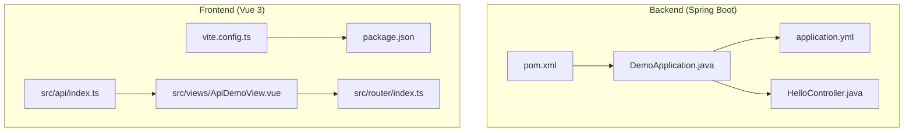
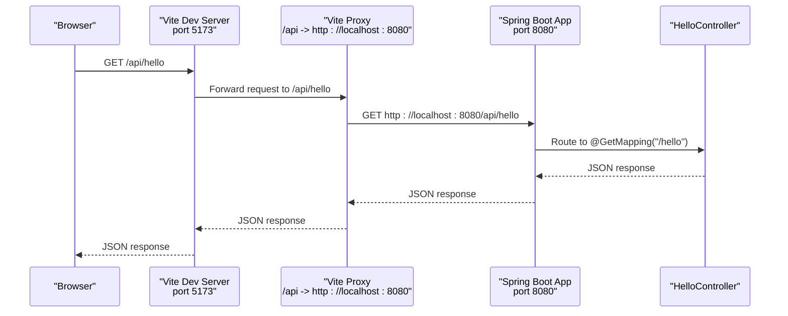
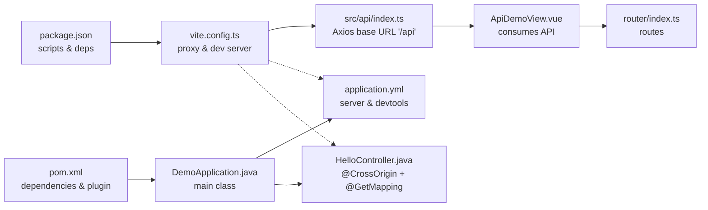

# Development Workflow

<cite>
**Referenced Files in This Document**
- [pom.xml](file://springboot3-demo/pom.xml)
- [application.yml](file://springboot3-demo/src/main/resources/application.yml)
- [DemoApplication.java](file://springboot3-demo/src/main/java/com/example/demo/DemoApplication.java)
- [HelloController.java](file://springboot3-demo/src/main/java/com/example/demo/controller/HelloController.java)
- [package.json](file://vue3-springboot-demo/package.json)
- [vite.config.ts](file://vue3-springboot-demo/vite.config.ts)
- [index.ts](file://vue3-springboot-demo/src/api/index.ts)
- [ApiDemoView.vue](file://vue3-springboot-demo/src/views/ApiDemoView.vue)
- [index.ts](file://vue3-springboot-demo/src/router/index.ts)
</cite>

## Table of Contents
1. [Introduction](#introduction)
2. [Project Structure](#project-structure)
3. [Core Components](#core-components)
4. [Architecture Overview](#architecture-overview)
5. [Detailed Component Analysis](#detailed-component-analysis)
6. [Dependency Analysis](#dependency-analysis)
7. [Performance Considerations](#performance-considerations)
8. [Troubleshooting Guide](#troubleshooting-guide)
9. [Conclusion](#conclusion)
10. [Appendices](#appendices)

## Introduction
This document describes the integrated development experience for the full-stack Vue 3 + Spring Boot 3 application. It covers environment setup, hot reloading, proxy configuration for seamless frontend-backend communication, build processes, development server configurations, CORS setup, development workflow patterns, debugging approaches, testing strategies, and collaborative development practices. The goal is to enable efficient local development with minimal friction between frontend and backend teams.

## Project Structure
The repository contains two primary modules:
- Backend: Spring Boot 3 Maven project with devtools and a simple REST controller.
- Frontend: Vue 3 Vite application with TypeScript, Vue Router, Pinia, and Axios for API consumption.

**Diagram sources**
- [pom.xml:1-68](file://springboot3-demo/pom.xml#L1-L68)
- [DemoApplication.java:1-14](file://springboot3-demo/src/main/java/com/example/demo/DemoApplication.java#L1-L14)
- [application.yml:1-16](file://springboot3-demo/src/main/resources/application.yml#L1-L16)
- [HelloController.java:1-24](file://springboot3-demo/src/main/java/com/example/demo/controller/HelloController.java#L1-L24)
- [package.json:1-49](file://vue3-springboot-demo/package.json#L1-L49)
- [vite.config.ts:1-28](file://vue3-springboot-demo/vite.config.ts#L1-L28)
- [index.ts:1-22](file://vue3-springboot-demo/src/api/index.ts#L1-L22)
- [ApiDemoView.vue:1-100](file://vue3-springboot-demo/src/views/ApiDemoView.vue#L1-L100)
- [index.ts:1-26](file://vue3-springboot-demo/src/router/index.ts#L1-L26)

**Section sources**
- [pom.xml:1-68](file://springboot3-demo/pom.xml#L1-L68)
- [package.json:1-49](file://vue3-springboot-demo/package.json#L1-L49)

## Core Components
- Backend application entrypoint and configuration:
  - Application startup and devtools configuration for live reload.
  - REST controller exposing a "/api/hello" endpoint with CORS configured for the frontend origin.
- Frontend application:
  - Vite development server with proxy to backend.
  - Axios client configured with a base URL that aligns with the Vite proxy.
  - Vue Router with lazy-loaded views and navigation.
  - Example view consuming the backend API.

Key development features:
- Hot reloading for both frontend and backend via devtools.
- Proxy configuration to avoid CORS during local development.
- Unified script commands for building and testing.

**Section sources**
- [DemoApplication.java:1-14](file://springboot3-demo/src/main/java/com/example/demo/DemoApplication.java#L1-L14)
- [application.yml:1-16](file://springboot3-demo/src/main/resources/application.yml#L1-L16)
- [HelloController.java:1-24](file://springboot3-demo/src/main/java/com/example/demo/controller/HelloController.java#L1-L24)
- [package.json:1-49](file://vue3-springboot-demo/package.json#L1-L49)
- [vite.config.ts:1-28](file://vue3-springboot-demo/vite.config.ts#L1-L28)
- [index.ts:1-22](file://vue3-springboot-demo/src/api/index.ts#L1-L22)
- [ApiDemoView.vue:1-100](file://vue3-springboot-demo/src/views/ApiDemoView.vue#L1-L100)
- [index.ts:1-26](file://vue3-springboot-demo/src/router/index.ts#L1-L26)

## Architecture Overview
The development architecture enables seamless local integration between the Vue 3 frontend and Spring Boot backend using Vite’s proxy and Spring Boot’s devtools.

**Diagram sources**
- [vite.config.ts:18-26](file://vue3-springboot-demo/vite.config.ts#L18-L26)
- [HelloController.java:16-22](file://springboot3-demo/src/main/java/com/example/demo/controller/HelloController.java#L16-L22)

## Detailed Component Analysis

### Backend Development Environment
- Dependencies and devtools:
  - Devtools are enabled to support live reload and browser refresh.
  - Lombok is excluded from the final artifact via the Spring Boot Maven plugin.
- Application configuration:
  - Server runs on port 8080.
  - Devtools live reload is enabled.
  - Logging level for the demo package is set to debug.

Recommended setup steps:
- Ensure Java 17+ is installed and configured.
- Run the Spring Boot application using the standard main class entrypoint.
- Verify that the backend responds to the "/api/hello" endpoint.

**Section sources**
- [pom.xml:25-49](file://springboot3-demo/pom.xml#L25-L49)
- [application.yml:1-16](file://springboot3-demo/src/main/resources/application.yml#L1-L16)
- [DemoApplication.java:1-14](file://springboot3-demo/src/main/java/com/example/demo/DemoApplication.java#L1-L14)

### Frontend Development Environment
- Scripts and toolchain:
  - Development server, build, preview, unit tests, type checking, and linting scripts.
  - Node engine requirement is specified.
- Vite configuration:
  - Development server listens on port 5173.
  - Proxy configured for "/api" to forward requests to the backend at port 8080.
  - Vue plugin and Vue DevTools plugin are enabled.
  - Path alias "@/" resolves to the "src" directory.

Recommended setup steps:
- Install Node.js according to the engines specification.
- Install dependencies and start the Vite dev server.
- Access the app at the Vite server address and confirm the proxy forwards API requests to the backend.

**Section sources**
- [package.json:1-49](file://vue3-springboot-demo/package.json#L1-L49)
- [vite.config.ts:1-28](file://vue3-springboot-demo/vite.config.ts#L1-L28)

### API Client and View Integration
- Axios client:
  - Base URL is set to "/api" to leverage the Vite proxy.
  - Timeout and content-type headers are configured.
- API module:
  - Exposes a typed response interface and a convenience method for fetching the greeting.
- Example view:
  - Uses the API client to fetch data on mount.
  - Handles loading, success, and error states.

Development workflow:
- Make API calls from the frontend using the configured base URL.
- The Vite proxy ensures requests reach the backend without CORS issues locally.

**Section sources**
- [index.ts:1-22](file://vue3-springboot-demo/src/api/index.ts#L1-L22)
- [ApiDemoView.vue:1-100](file://vue3-springboot-demo/src/views/ApiDemoView.vue#L1-L100)

### Routing and Navigation
- Vue Router:
  - History mode with base URL from environment.
  - Routes include lazy-loaded components for performance.
  - Navigation links include an API demo route that triggers backend calls.

Development workflow:
- Add new routes as needed and ensure lazy-loading for optimal bundle size.
- Use router links to navigate between views during development.

**Section sources**
- [index.ts:1-26](file://vue3-springboot-demo/src/router/index.ts#L1-L26)

### CORS Configuration
- Backend CORS:
  - The controller is annotated with CrossOrigin targeting the frontend origin.
  - This allows the frontend to call the backend without manual preflight handling in development.

Development workflow:
- Keep the origin aligned with the Vite server address.
- Adjust origins if the frontend port changes.

**Section sources**
- [HelloController.java:13-13](file://springboot3-demo/src/main/java/com/example/demo/controller/HelloController.java#L13-L13)

### Build Processes
- Backend:
  - Maven build integrates with Spring Boot plugin to package the application.
  - Lombok exclusion is configured in the plugin.
- Frontend:
  - Build script compiles TypeScript and bundles the app.
  - Preview script serves the production build locally for verification.

Development workflow:
- Use the provided scripts to build and preview artifacts locally.
- For production deployments, deploy the backend JAR and serve the frontend static assets accordingly.

**Section sources**
- [pom.xml:51-66](file://springboot3-demo/pom.xml#L51-L66)
- [package.json:6-16](file://vue3-springboot-demo/package.json#L6-L16)

### Testing Strategies
- Backend:
  - Spring Boot Test starter is included for integration testing.
  - Tests can validate controller endpoints and application context.
- Frontend:
  - Unit tests are supported via Vitest.
  - Type checking is part of the build pipeline.

Development workflow:
- Write unit tests alongside components and API modules.
- Use Vitest for isolated component and utility tests.
- Run type checks and linters as part of the development process.

**Section sources**
- [pom.xml:44-48](file://springboot3-demo/pom.xml#L44-L48)
- [package.json:10-15](file://vue3-springboot-demo/package.json#L10-L15)

## Dependency Analysis
The frontend and backend share a coordinated development workflow through the Vite proxy and backend CORS configuration.

**Diagram sources**
- [package.json:1-49](file://vue3-springboot-demo/package.json#L1-L49)
- [vite.config.ts:1-28](file://vue3-springboot-demo/vite.config.ts#L1-L28)
- [index.ts:1-22](file://vue3-springboot-demo/src/api/index.ts#L1-L22)
- [ApiDemoView.vue:1-100](file://vue3-springboot-demo/src/views/ApiDemoView.vue#L1-L100)
- [index.ts:1-26](file://vue3-springboot-demo/src/router/index.ts#L1-L26)
- [pom.xml:1-68](file://springboot3-demo/pom.xml#L1-L68)
- [DemoApplication.java:1-14](file://springboot3-demo/src/main/java/com/example/demo/DemoApplication.java#L1-L14)
- [application.yml:1-16](file://springboot3-demo/src/main/resources/application.yml#L1-L16)
- [HelloController.java:1-24](file://springboot3-demo/src/main/java/com/example/demo/controller/HelloController.java#L1-L24)

**Section sources**
- [package.json:1-49](file://vue3-springboot-demo/package.json#L1-L49)
- [vite.config.ts:1-28](file://vue3-springboot-demo/vite.config.ts#L1-L28)
- [index.ts:1-22](file://vue3-springboot-demo/src/api/index.ts#L1-L22)
- [ApiDemoView.vue:1-100](file://vue3-springboot-demo/src/views/ApiDemoView.vue#L1-L100)
- [index.ts:1-26](file://vue3-springboot-demo/src/router/index.ts#L1-L26)
- [pom.xml:1-68](file://springboot3-demo/pom.xml#L1-L68)
- [DemoApplication.java:1-14](file://springboot3-demo/src/main/java/com/example/demo/DemoApplication.java#L1-L14)
- [application.yml:1-16](file://springboot3-demo/src/main/resources/application.yml#L1-L16)
- [HelloController.java:1-24](file://springboot3-demo/src/main/java/com/example/demo/controller/HelloController.java#L1-L24)

## Performance Considerations
- Lazy-load routes and components to reduce initial bundle size.
- Use Vue DevTools for profiling and inspecting component performance.
- Enable devtools in the backend for automatic restarts without manual intervention.
- Keep proxy targets minimal and specific to avoid unnecessary traffic.

[No sources needed since this section provides general guidance]

## Troubleshooting Guide
Common development issues and resolutions:

- Backend does not restart on changes:
  - Confirm devtools are enabled in the application configuration.
  - Ensure the devtools plugin is present in the backend build configuration.

- Frontend cannot reach backend endpoints:
  - Verify the Vite proxy target matches the backend port.
  - Confirm the API base URL in the frontend matches the proxy path.
  - Check that the backend CORS origin includes the frontend address.

- Port conflicts:
  - Change the Vite server port in the frontend configuration.
  - Change the Spring Boot server port in the backend configuration.

- CORS errors in development:
  - Ensure the controller’s CrossOrigin annotation includes the frontend origin.
  - Align the proxy target with the backend port.

- Node version mismatch:
  - Install a compatible Node.js version per the engines specification.
  - Clear caches and reinstall dependencies if necessary.

**Section sources**
- [application.yml:7-11](file://springboot3-demo/src/main/resources/application.yml#L7-L11)
- [pom.xml:33-36](file://springboot3-demo/pom.xml#L33-L36)
- [vite.config.ts:18-26](file://vue3-springboot-demo/vite.config.ts#L18-L26)
- [index.ts:3-9](file://vue3-springboot-demo/src/api/index.ts#L3-L9)
- [HelloController.java:13-13](file://springboot3-demo/src/main/java/com/example/demo/controller/HelloController.java#L13-L13)
- [package.json:45-47](file://vue3-springboot-demo/package.json#L45-L47)

## Conclusion
The development workflow integrates a Vue 3 frontend with a Spring Boot backend through Vite’s proxy and Spring Boot’s devtools. This setup enables hot reloading, seamless API communication, and a streamlined development experience. By following the scripts, configurations, and best practices outlined here, developers can efficiently collaborate on both frontend and backend components while maintaining a consistent and predictable development environment.

[No sources needed since this section summarizes without analyzing specific files]

## Appendices

### Development Environment Setup Checklist
- Backend:
  - Install Java 17+.
  - Run the Spring Boot application entrypoint.
  - Confirm the "/api/hello" endpoint responds.
- Frontend:
  - Install Node.js per the engines specification.
  - Install dependencies and start the Vite dev server.
  - Access the app and verify the API demo page loads data.

**Section sources**
- [DemoApplication.java:9-11](file://springboot3-demo/src/main/java/com/example/demo/DemoApplication.java#L9-L11)
- [package.json:6-7](file://vue3-springboot-demo/package.json#L6-L7)
- [vite.config.ts:18-26](file://vue3-springboot-demo/vite.config.ts#L18-L26)

### Development Workflow Patterns
- Frontend-first development:
  - Implement UI components and routing.
  - Mock or integrate with backend APIs via the proxy.
- Backend-first development:
  - Define endpoints and data models.
  - Expose endpoints with appropriate CORS configuration.
- Pair programming:
  - Share the same proxy and CORS origins for consistent local environments.
  - Use version-controlled scripts and configurations to minimize drift.

[No sources needed since this section provides general guidance]