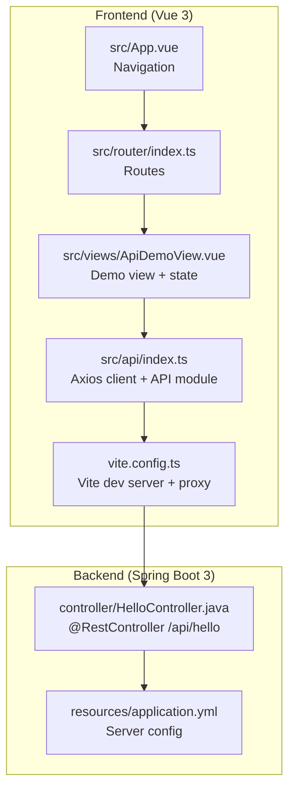
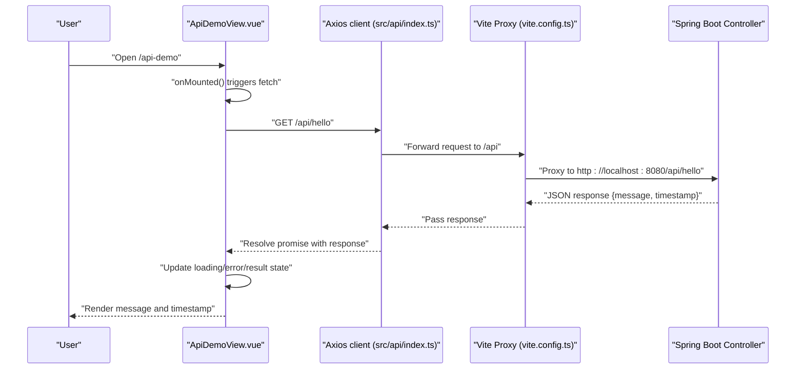
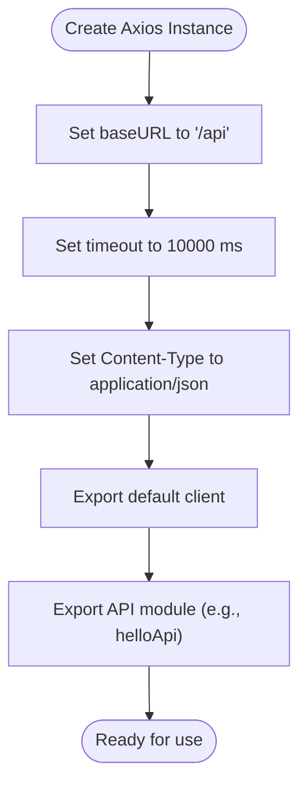
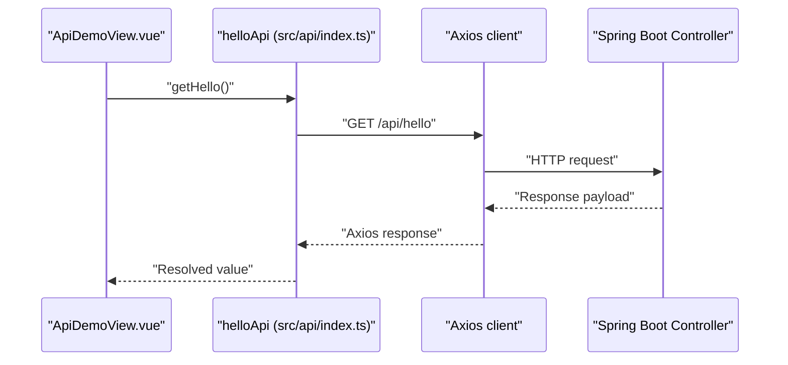
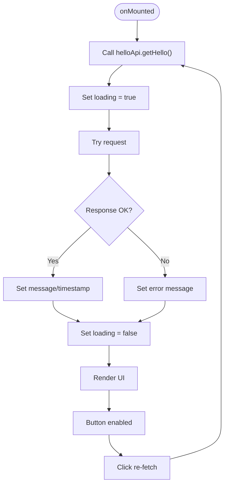
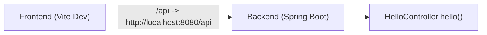
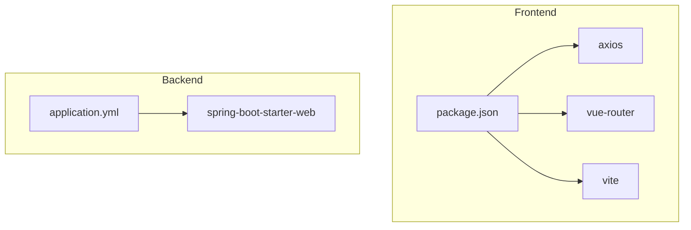

# API Integration

<cite>
**Referenced Files in This Document**
- [index.ts](file://vue3-springboot-demo/src/api/index.ts)
- [ApiDemoView.vue](file://vue3-springboot-demo/src/views/ApiDemoView.vue)
- [index.ts](file://vue3-springboot-demo/src/router/index.ts)
- [App.vue](file://vue3-springboot-demo/src/App.vue)
- [vite.config.ts](file://vue3-springboot-demo/vite.config.ts)
- [HelloController.java](file://springboot3-demo/src/main/java/com/example/demo/controller/HelloController.java)
- [application.yml](file://springboot3-demo/src/main/resources/application.yml)
- [package.json](file://vue3-springboot-demo/package.json)
</cite>

## Table of Contents
1. [Introduction](#introduction)
2. [Project Structure](#project-structure)
3. [Core Components](#core-components)
4. [Architecture Overview](#architecture-overview)
5. [Detailed Component Analysis](#detailed-component-analysis)
6. [Dependency Analysis](#dependency-analysis)
7. [Performance Considerations](#performance-considerations)
8. [Troubleshooting Guide](#troubleshooting-guide)
9. [Conclusion](#conclusion)
10. [Appendices](#appendices)

## Introduction
This document explains the frontend-backend API integration for the Vue 3 + Spring Boot 3 demo. It focuses on the centralized Axios client configuration, HTTP request patterns, response handling strategies, and the API demo view implementation. It also covers loading states, user feedback, authentication considerations, request cancellation, retry strategies, and guidelines for extending API functionality.

## Project Structure
The integration spans two repositories:
- Frontend (Vue 3): Centralized API client, API service module, demo view, routing, and Vite proxy configuration.
- Backend (Spring Boot 3): REST controller exposing a single endpoint under /api/hello.

**Diagram sources**
- [index.ts:1-22](file://vue3-springboot-demo/src/api/index.ts#L1-L22)
- [ApiDemoView.vue:1-100](file://vue3-springboot-demo/src/views/ApiDemoView.vue#L1-L100)
- [index.ts:1-26](file://vue3-springboot-demo/src/router/index.ts#L1-L26)
- [App.vue:1-87](file://vue3-springboot-demo/src/App.vue#L1-L87)
- [vite.config.ts:1-28](file://vue3-springboot-demo/vite.config.ts#L1-L28)
- [HelloController.java:1-24](file://springboot3-demo/src/main/java/com/example/demo/controller/HelloController.java#L1-L24)
- [application.yml:1-16](file://springboot3-demo/src/main/resources/application.yml#L1-L16)

**Section sources**
- [index.ts:1-22](file://vue3-springboot-demo/src/api/index.ts#L1-L22)
- [ApiDemoView.vue:1-100](file://vue3-springboot-demo/src/views/ApiDemoView.vue#L1-L100)
- [index.ts:1-26](file://vue3-springboot-demo/src/router/index.ts#L1-L26)
- [App.vue:1-87](file://vue3-springboot-demo/src/App.vue#L1-L87)
- [vite.config.ts:1-28](file://vue3-springboot-demo/vite.config.ts#L1-L28)
- [HelloController.java:1-24](file://springboot3-demo/src/main/java/com/example/demo/controller/HelloController.java#L1-L24)
- [application.yml:1-16](file://springboot3-demo/src/main/resources/application.yml#L1-L16)

## Core Components
- Centralized Axios client:
  - Base URL configured to "/api".
  - Timeout set to 10 seconds.
  - Content-Type header defaults to application/json.
  - Exported as the default export for general use and as a typed API module for domain-specific endpoints.
- API module:
  - Provides a typed contract for backend endpoints (e.g., getHello).
  - Encapsulates HTTP verbs and endpoint paths.
- API demo view:
  - Demonstrates loading, error, and success states.
  - Triggers API calls on mount and via user action.
  - Displays response data and provides user feedback.
- Routing:
  - Exposes a dedicated route for the API demo view.
- Vite proxy:
  - Proxies requests from "/api" to the Spring Boot backend running on localhost:8080.
- Backend controller:
  - Serves GET /api/hello with CORS allowed for the frontend origin.

**Section sources**
- [index.ts:1-22](file://vue3-springboot-demo/src/api/index.ts#L1-L22)
- [ApiDemoView.vue:1-100](file://vue3-springboot-demo/src/views/ApiDemoView.vue#L1-L100)
- [index.ts:1-26](file://vue3-springboot-demo/src/router/index.ts#L1-L26)
- [vite.config.ts:18-26](file://vue3-springboot-demo/vite.config.ts#L18-L26)
- [HelloController.java:11-23](file://springboot3-demo/src/main/java/com/example/demo/controller/HelloController.java#L11-L23)

## Architecture Overview
The frontend makes HTTP requests to the backend through a centralized Axios client. During development, Vite’s proxy forwards "/api" requests to the Spring Boot server. The backend responds with JSON data that the frontend consumes and renders in the demo view.

**Diagram sources**
- [ApiDemoView.vue:10-26](file://vue3-springboot-demo/src/views/ApiDemoView.vue#L10-L26)
- [index.ts:3-9](file://vue3-springboot-demo/src/api/index.ts#L3-L9)
- [vite.config.ts:20-25](file://vue3-springboot-demo/vite.config.ts#L20-L25)
- [HelloController.java:16-22](file://springboot3-demo/src/main/java/com/example/demo/controller/HelloController.java#L16-L22)

## Detailed Component Analysis

### Centralized Axios Client
- Purpose: Provide a single configuration surface for HTTP requests across the app.
- Configuration highlights:
  - Base URL: "/api" enables path-based routing to the backend.
  - Timeout: 10000 ms to prevent hanging requests.
  - Headers: Defaults to application/json for consistent content negotiation.
- Export pattern:
  - Default export for general Axios usage.
  - Named API module (e.g., helloApi) for domain-specific endpoints.

**Diagram sources**
- [index.ts:3-9](file://vue3-springboot-demo/src/api/index.ts#L3-L9)
- [index.ts:17-19](file://vue3-springboot-demo/src/api/index.ts#L17-L19)

**Section sources**
- [index.ts:1-22](file://vue3-springboot-demo/src/api/index.ts#L1-L22)

### API Module: helloApi
- Purpose: Encapsulate endpoint definitions and HTTP verbs.
- Example endpoint:
  - getHello: Performs a GET request to "/hello" using the configured baseURL.
- Extensibility:
  - Add new endpoints by extending the API module with typed methods.
  - Keep endpoint paths consistent with backend routes.

**Diagram sources**
- [ApiDemoView.vue:10-22](file://vue3-springboot-demo/src/views/ApiDemoView.vue#L10-L22)
- [index.ts:17-19](file://vue3-springboot-demo/src/api/index.ts#L17-L19)
- [HelloController.java:16-22](file://springboot3-demo/src/main/java/com/example/demo/controller/HelloController.java#L16-L22)

**Section sources**
- [index.ts:17-19](file://vue3-springboot-demo/src/api/index.ts#L17-L19)
- [ApiDemoView.vue:10-22](file://vue3-springboot-demo/src/views/ApiDemoView.vue#L10-L22)

### API Demo View: Loading, Error, and Success States
- State management:
  - Reactive refs for message, timestamp, loading, and error.
- Lifecycle:
  - Calls the API on mount to prepopulate data.
- Error handling:
  - Catches exceptions and sets an error message.
- User feedback:
  - Shows a loading indicator while fetching.
  - Displays error messages when present.
  - Renders success data otherwise.
- Interaction:
  - Provides a button to re-fetch data with disabled state during loading.

**Diagram sources**
- [ApiDemoView.vue:10-26](file://vue3-springboot-demo/src/views/ApiDemoView.vue#L10-L26)

**Section sources**
- [ApiDemoView.vue:1-100](file://vue3-springboot-demo/src/views/ApiDemoView.vue#L1-L100)

### Routing and Navigation
- Routes:
  - Home, About, and API Demo pages are defined.
- Navigation:
  - App header links to all pages, including the API Demo route.

**Section sources**
- [index.ts:1-26](file://vue3-springboot-demo/src/router/index.ts#L1-L26)
- [App.vue:13-18](file://vue3-springboot-demo/src/App.vue#L13-L18)

### Backend Controller and Proxy Configuration
- Backend:
  - Controller exposes GET /api/hello with a message and timestamp.
  - CORS is configured to allow the frontend origin.
- Proxy:
  - Vite dev server proxies "/api" to http://localhost:8080 during development.

**Diagram sources**
- [vite.config.ts:20-25](file://vue3-springboot-demo/vite.config.ts#L20-L25)
- [HelloController.java:12-22](file://springboot3-demo/src/main/java/com/example/demo/controller/HelloController.java#L12-L22)

**Section sources**
- [HelloController.java:11-23](file://springboot3-demo/src/main/java/com/example/demo/controller/HelloController.java#L11-L23)
- [vite.config.ts:18-26](file://vue3-springboot-demo/vite.config.ts#L18-L26)
- [application.yml:1-16](file://springboot3-demo/src/main/resources/application.yml#L1-L16)

## Dependency Analysis
- Frontend dependencies relevant to API integration:
  - axios: HTTP client library.
  - vue-router: Navigation and route exposure for the demo view.
  - vite: Development server with proxy configuration.
- Backend dependencies:
  - spring-boot-starter-web: Web MVC and REST support.
  - Cross-origin configuration allows the frontend origin.

**Diagram sources**
- [package.json:17-22](file://vue3-springboot-demo/package.json#L17-L22)
- [application.yml:1-16](file://springboot3-demo/src/main/resources/application.yml#L1-L16)

**Section sources**
- [package.json:17-22](file://vue3-springboot-demo/package.json#L17-L22)
- [application.yml:1-16](file://springboot3-demo/src/main/resources/application.yml#L1-L16)

## Performance Considerations
- Timeout configuration: The Axios client enforces a 10-second timeout to avoid long-hanging requests.
- Proxy latency: Development proxy introduces minimal overhead but should be considered in local testing.
- UI responsiveness: Loading states and disabled buttons prevent redundant requests and improve perceived performance.

[No sources needed since this section provides general guidance]

## Troubleshooting Guide
- No response or blank screen after navigation:
  - Verify the backend is running on the expected port and the proxy target matches the backend host/port.
  - Confirm the route to the API demo view is correct and accessible.
- CORS errors:
  - Ensure the backend allows the frontend origin in CORS configuration.
- Timeout errors:
  - Check network connectivity and backend health; consider adjusting the Axios timeout if needed.
- Unexpected empty data:
  - Inspect the response shape and ensure the frontend expects the correct fields.

**Section sources**
- [vite.config.ts:20-25](file://vue3-springboot-demo/vite.config.ts#L20-L25)
- [HelloController.java:13-13](file://springboot3-demo/src/main/java/com/example/demo/controller/HelloController.java#L13-L13)
- [index.ts:5-5](file://vue3-springboot-demo/src/api/index.ts#L5-L5)

## Conclusion
The frontend uses a centralized Axios client with a clean API module to communicate with the Spring Boot backend. The demo view demonstrates robust state management, loading indicators, and error handling. The Vite proxy simplifies local development by routing "/api" traffic to the backend. This foundation supports scalable extension with additional endpoints and advanced features like interceptors, cancellation, and retries.

[No sources needed since this section summarizes without analyzing specific files]

## Appendices

### Authentication Patterns
- Current state: The backend controller does not require authentication.
- Recommendations for future use:
  - Add bearer token extraction in the backend.
  - Configure Axios interceptors to attach Authorization headers.
  - Implement token storage and refresh strategies in the frontend.

[No sources needed since this section provides general guidance]

### Request Cancellation and Retry Strategies
- Cancellation:
  - Use AbortController to cancel in-flight requests when components unmount or when new requests supersede previous ones.
- Retries:
  - Implement exponential backoff with jitter for transient failures.
  - Limit total retry attempts and differentiate between retryable and fatal errors.

[No sources needed since this section provides general guidance]

### Extending API Functionality
- Add new endpoints:
  - Extend the API module with new methods mirroring backend routes.
  - Keep endpoint paths consistent with the backend.
- Centralized configuration:
  - Add interceptors for logging, metrics, or auth tokens.
  - Introduce a unified response wrapper if the backend evolves to a standardized envelope.

[No sources needed since this section provides general guidance]