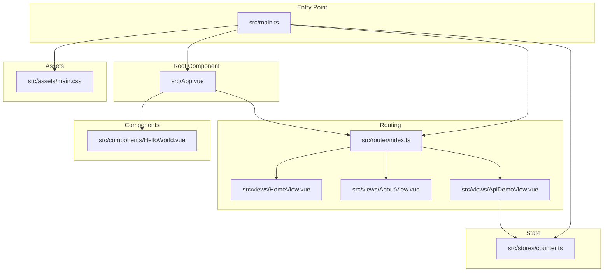
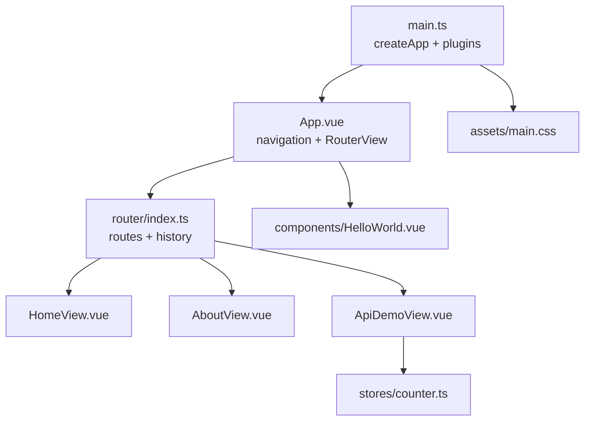
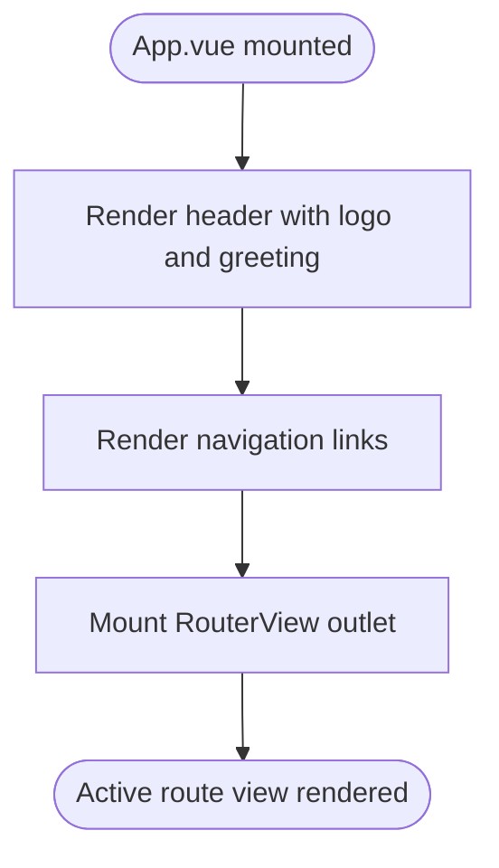
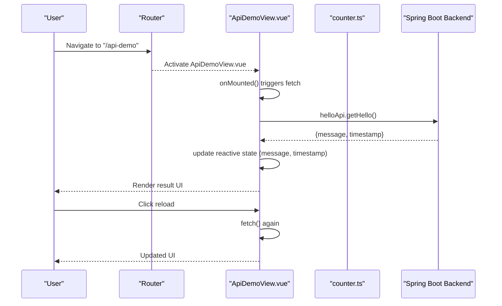
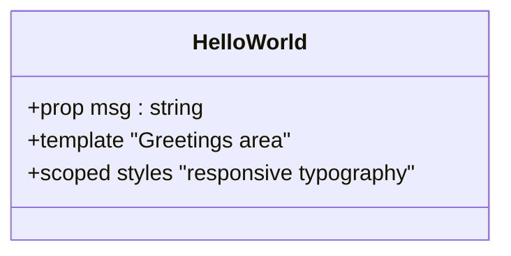
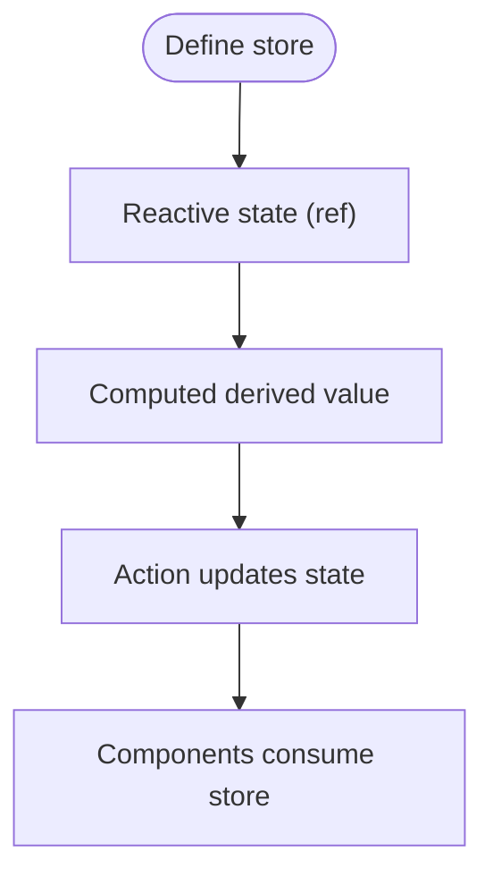
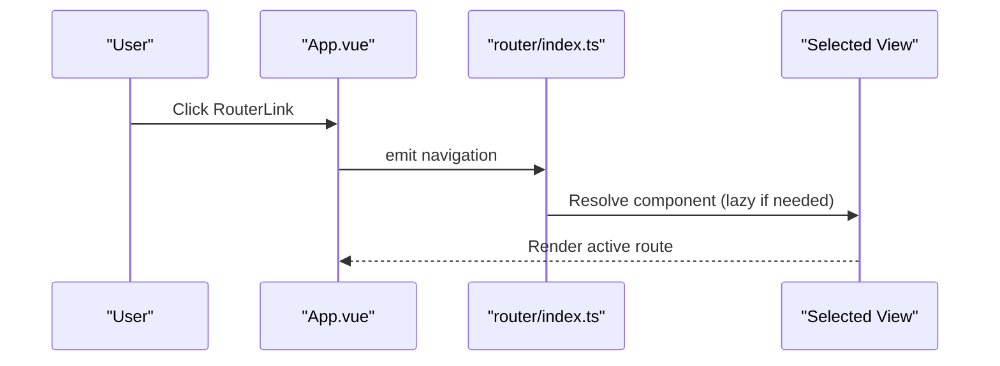
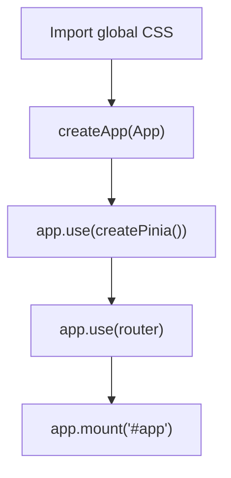
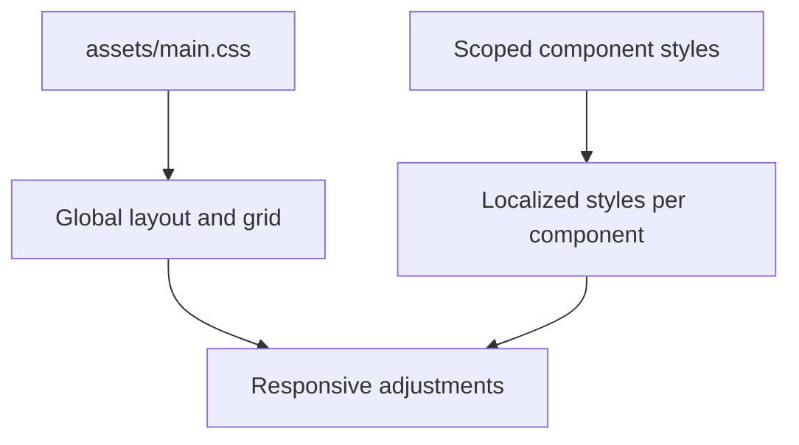
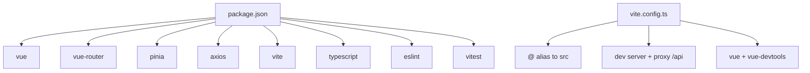

# Application Architecture

<cite>
**Referenced Files in This Document**
- [main.ts](file://vue3-springboot-demo/src/main.ts)
- [App.vue](file://vue3-springboot-demo/src/App.vue)
- [router/index.ts](file://vue3-springboot-demo/src/router/index.ts)
- [views/HomeView.vue](file://vue3-springboot-demo/src/views/HomeView.vue)
- [views/AboutView.vue](file://vue3-springboot-demo/src/views/AboutView.vue)
- [views/ApiDemoView.vue](file://vue3-springboot-demo/src/views/ApiDemoView.vue)
- [components/HelloWorld.vue](file://vue3-springboot-demo/src/components/HelloWorld.vue)
- [stores/counter.ts](file://vue3-springboot-demo/src/stores/counter.ts)
- [assets/main.css](file://vue3-springboot-demo/src/assets/main.css)
- [vite.config.ts](file://vue3-springboot-demo/vite.config.ts)
- [package.json](file://vue3-springboot-demo/package.json)
</cite>

## Table of Contents
1. [Introduction](#introduction)
2. [Project Structure](#project-structure)
3. [Core Components](#core-components)
4. [Architecture Overview](#architecture-overview)
5. [Detailed Component Analysis](#detailed-component-analysis)
6. [Dependency Analysis](#dependency-analysis)
7. [Performance Considerations](#performance-considerations)
8. [Troubleshooting Guide](#troubleshooting-guide)
9. [Conclusion](#conclusion)

## Introduction
This document explains the Vue 3 application architecture for a modern frontend integrated with Spring Boot backend. It covers the component-based design, project layout, Vue 3 Composition API usage, routing, state management, and responsive styling. It also documents the application lifecycle from the entry point to rendered components, and demonstrates practical patterns for component composition, props, events, and API integration.

## Project Structure
The project follows a conventional Vue 3 + Vite setup with TypeScript. Key directories and files:
- src/main.ts: Application bootstrap and plugin registration
- src/App.vue: Root component with navigation and RouterView outlet
- src/router/index.ts: Router configuration with route guards and lazy-loaded views
- src/views/: Route-backed page components
- src/components/: Reusable UI components
- src/stores/: Pinia stores for state management
- src/assets/: Global styles and base CSS
- vite.config.ts: Vite configuration with aliases, dev server, and proxy
- package.json: Dependencies and scripts

**Diagram sources**
- [main.ts:1-15](file://vue3-springboot-demo/src/main.ts#L1-L15)
- [App.vue:1-87](file://vue3-springboot-demo/src/App.vue#L1-L87)
- [router/index.ts:1-26](file://vue3-springboot-demo/src/router/index.ts#L1-L26)
- [views/HomeView.vue:1-10](file://vue3-springboot-demo/src/views/HomeView.vue#L1-L10)
- [views/AboutView.vue:1-16](file://vue3-springboot-demo/src/views/AboutView.vue#L1-L16)
- [views/ApiDemoView.vue:1-100](file://vue3-springboot-demo/src/views/ApiDemoView.vue#L1-L100)
- [components/HelloWorld.vue:1-42](file://vue3-springboot-demo/src/components/HelloWorld.vue#L1-L42)
- [stores/counter.ts:1-13](file://vue3-springboot-demo/src/stores/counter.ts#L1-L13)
- [assets/main.css:1-36](file://vue3-springboot-demo/src/assets/main.css#L1-L36)

**Section sources**
- [main.ts:1-15](file://vue3-springboot-demo/src/main.ts#L1-L15)
- [App.vue:1-87](file://vue3-springboot-demo/src/App.vue#L1-L87)
- [router/index.ts:1-26](file://vue3-springboot-demo/src/router/index.ts#L1-L26)
- [views/HomeView.vue:1-10](file://vue3-springboot-demo/src/views/HomeView.vue#L1-L10)
- [views/AboutView.vue:1-16](file://vue3-springboot-demo/src/views/AboutView.vue#L1-L16)
- [views/ApiDemoView.vue:1-100](file://vue3-springboot-demo/src/views/ApiDemoView.vue#L1-L100)
- [components/HelloWorld.vue:1-42](file://vue3-springboot-demo/src/components/HelloWorld.vue#L1-L42)
- [stores/counter.ts:1-13](file://vue3-springboot-demo/src/stores/counter.ts#L1-L13)
- [assets/main.css:1-36](file://vue3-springboot-demo/src/assets/main.css#L1-L36)
- [vite.config.ts:1-28](file://vue3-springboot-demo/vite.config.ts#L1-L28)
- [package.json:1-49](file://vue3-springboot-demo/package.json#L1-L49)

## Core Components
- Root application component (App.vue): Declares global navigation via RouterLink, renders child components, and hosts RouterView for routed views. Uses scoped styles for layout and responsiveness.
- View components: HomeView, AboutView, ApiDemoView represent distinct pages. They import and render shared components and encapsulate page-specific logic.
- Reusable component: HelloWorld demonstrates typed props and scoped styling.
- State store: counter store illustrates Pinia Composition API usage with refs and computed values.
- Entry point: main.ts initializes the app, registers Pinia and Router, and mounts to the DOM.

Key patterns:
- Composition API: Used in App.vue, ApiDemoView.vue, and stores/counter.ts for reactive state and lifecycle hooks.
- Router integration: RouterView outlet renders matched views; RouterLink navigates between routes.
- Scoped styling: Components apply scoped CSS to avoid global leakage and support responsive media queries.

**Section sources**
- [App.vue:1-87](file://vue3-springboot-demo/src/App.vue#L1-L87)
- [views/HomeView.vue:1-10](file://vue3-springboot-demo/src/views/HomeView.vue#L1-L10)
- [views/AboutView.vue:1-16](file://vue3-springboot-demo/src/views/AboutView.vue#L1-L16)
- [views/ApiDemoView.vue:1-100](file://vue3-springboot-demo/src/views/ApiDemoView.vue#L1-L100)
- [components/HelloWorld.vue:1-42](file://vue3-springboot-demo/src/components/HelloWorld.vue#L1-L42)
- [stores/counter.ts:1-13](file://vue3-springboot-demo/src/stores/counter.ts#L1-L13)
- [main.ts:1-15](file://vue3-springboot-demo/src/main.ts#L1-L15)

## Architecture Overview
The application follows a layered architecture:
- Entry and bootstrapping: main.ts creates the Vue app, installs Pinia and Router, and mounts to #app.
- Routing: router/index.ts defines routes and lazy-loads views for performance.
- Presentation: App.vue orchestrates navigation and renders the active view via RouterView.
- Views: Page-level components encapsulate UI and page logic.
- Shared components: Reusable components like HelloWorld are composed within views.
- State: Pinia stores manage application-wide state.
- Styling: Global base styles and scoped component styles provide consistent look-and-feel and responsiveness.

**Diagram sources**
- [main.ts:1-15](file://vue3-springboot-demo/src/main.ts#L1-L15)
- [App.vue:1-87](file://vue3-springboot-demo/src/App.vue#L1-L87)
- [router/index.ts:1-26](file://vue3-springboot-demo/src/router/index.ts#L1-L26)
- [views/HomeView.vue:1-10](file://vue3-springboot-demo/src/views/HomeView.vue#L1-L10)
- [views/AboutView.vue:1-16](file://vue3-springboot-demo/src/views/AboutView.vue#L1-L16)
- [views/ApiDemoView.vue:1-100](file://vue3-springboot-demo/src/views/ApiDemoView.vue#L1-L100)
- [components/HelloWorld.vue:1-42](file://vue3-springboot-demo/src/components/HelloWorld.vue#L1-L42)
- [stores/counter.ts:1-13](file://vue3-springboot-demo/src/stores/counter.ts#L1-L13)
- [assets/main.css:1-36](file://vue3-springboot-demo/src/assets/main.css#L1-L36)

## Detailed Component Analysis

### Root Application Component (App.vue)
- Template organization: Header with brand logo, composed HelloWorld component, navigation links, and RouterView outlet.
- Script setup: Imports RouterLink and RouterView from vue-router and HelloWorld component.
- Scoped styling: Responsive layout for small and large screens; navigation bar styling and active link highlighting.

**Diagram sources**
- [App.vue:6-22](file://vue3-springboot-demo/src/App.vue#L6-L22)

**Section sources**
- [App.vue:1-87](file://vue3-springboot-demo/src/App.vue#L1-L87)

### View Components
- HomeView.vue: Minimal page that renders TheWelcome component.
- AboutView.vue: Static about page with responsive container behavior.
- ApiDemoView.vue: Demonstrates Composition API usage, async data fetching, and loading/error states.

**Diagram sources**
- [router/index.ts:17-22](file://vue3-springboot-demo/src/router/index.ts#L17-L22)
- [views/ApiDemoView.vue:10-26](file://vue3-springboot-demo/src/views/ApiDemoView.vue#L10-L26)
- [stores/counter.ts:1-13](file://vue3-springboot-demo/src/stores/counter.ts#L1-L13)

**Section sources**
- [views/HomeView.vue:1-10](file://vue3-springboot-demo/src/views/HomeView.vue#L1-L10)
- [views/AboutView.vue:1-16](file://vue3-springboot-demo/src/views/AboutView.vue#L1-L16)
- [views/ApiDemoView.vue:1-100](file://vue3-springboot-demo/src/views/ApiDemoView.vue#L1-L100)

### Reusable Component (HelloWorld.vue)
- Props definition: Typed props enable compile-time safety and IDE support.
- Scoped styling: Responsive typography and alignment adjustments across breakpoints.

**Diagram sources**
- [components/HelloWorld.vue:1-42](file://vue3-springboot-demo/src/components/HelloWorld.vue#L1-L42)

**Section sources**
- [components/HelloWorld.vue:1-42](file://vue3-springboot-demo/src/components/HelloWorld.vue#L1-L42)

### State Management (Pinia Store)
- Composition API store: Exposes reactive state (count), computed values (doubleCount), and actions (increment).
- Integration: Can be consumed by views and components to share state.

**Diagram sources**
- [stores/counter.ts:4-12](file://vue3-springboot-demo/src/stores/counter.ts#L4-L12)

**Section sources**
- [stores/counter.ts:1-13](file://vue3-springboot-demo/src/stores/counter.ts#L1-L13)

### Routing and Navigation
- Router configuration: Creates router with history mode and route records for home, about, and API demo.
- Lazy loading: About and API demo views are imported lazily to optimize initial load.
- Navigation: RouterLink components in App.vue navigate to respective routes; RouterView renders the active route.

**Diagram sources**
- [App.vue:13-18](file://vue3-springboot-demo/src/App.vue#L13-L18)
- [router/index.ts:4-23](file://vue3-springboot-demo/src/router/index.ts#L4-L23)

**Section sources**
- [router/index.ts:1-26](file://vue3-springboot-demo/src/router/index.ts#L1-L26)
- [App.vue:1-87](file://vue3-springboot-demo/src/App.vue#L1-L87)

### Entry Point and Initialization (main.ts)
- Global imports: main.css is imported for baseline styles.
- Application creation: createApp is called with the root component.
- Plugin installation: Pinia and Router are installed on the app instance.
- Mounting: The app is mounted to the DOM element #app.

**Diagram sources**
- [main.ts:1-15](file://vue3-springboot-demo/src/main.ts#L1-L15)

**Section sources**
- [main.ts:1-15](file://vue3-springboot-demo/src/main.ts#L1-L15)

### Styling and Responsiveness
- Global styles: assets/main.css sets base layout, typography, and responsive grid for larger screens.
- Scoped component styles: Components apply scoped CSS to keep styles local and support media queries for responsive behavior.
- Responsive patterns: Media queries adjust layout, spacing, and alignment across breakpoints.

**Diagram sources**
- [assets/main.css:1-36](file://vue3-springboot-demo/src/assets/main.css#L1-L36)
- [App.vue:24-86](file://vue3-springboot-demo/src/App.vue#L24-L86)
- [views/ApiDemoView.vue:49-99](file://vue3-springboot-demo/src/views/ApiDemoView.vue#L49-L99)

**Section sources**
- [assets/main.css:1-36](file://vue3-springboot-demo/src/assets/main.css#L1-L36)
- [App.vue:24-86](file://vue3-springboot-demo/src/App.vue#L24-L86)
- [views/ApiDemoView.vue:49-99](file://vue3-springboot-demo/src/views/ApiDemoView.vue#L49-L99)

## Dependency Analysis
External dependencies and tooling:
- Runtime: vue, vue-router, pinia, axios
- Build and development: vite, @vitejs/plugin-vue, vite-plugin-vue-devtools, TypeScript, ESLint, Vitest
- Vite configuration: Aliases (@ -> src), dev server, proxy for /api to backend

**Diagram sources**
- [package.json:17-44](file://vue3-springboot-demo/package.json#L17-L44)
- [vite.config.ts:8-27](file://vue3-springboot-demo/vite.config.ts#L8-L27)

**Section sources**
- [package.json:1-49](file://vue3-springboot-demo/package.json#L1-L49)
- [vite.config.ts:1-28](file://vue3-springboot-demo/vite.config.ts#L1-L28)

## Performance Considerations
- Lazy-loading routes: Using dynamic imports for views reduces initial bundle size.
- Scoped styles: Limiting CSS scope prevents unnecessary reflows and improves maintainability.
- Reactive primitives: Using refs and computed minimizes unnecessary computations.
- Devtools: Vite DevTools plugin aids in inspecting component trees and performance during development.

## Troubleshooting Guide
- Navigation issues: Verify RouterLink paths match route definitions and that RouterView is present in App.vue.
- API requests failing: Check proxy configuration in vite.config.ts and ensure backend is running at the configured target.
- Styles not applying: Confirm scoped vs. global styles and media query breakpoints.
- State not updating: Ensure store actions are invoked and components are consuming the store correctly.

**Section sources**
- [router/index.ts:4-23](file://vue3-springboot-demo/src/router/index.ts#L4-L23)
- [vite.config.ts:18-26](file://vue3-springboot-demo/vite.config.ts#L18-L26)
- [views/ApiDemoView.vue:10-26](file://vue3-springboot-demo/src/views/ApiDemoView.vue#L10-L26)
- [stores/counter.ts:4-12](file://vue3-springboot-demo/src/stores/counter.ts#L4-L12)

## Conclusion
This Vue 3 application demonstrates a clean, modular architecture leveraging the Composition API, Vue Router, and Pinia. The component-based design promotes reusability, while scoped styling and responsive patterns ensure a consistent UI. The entry point and Vite configuration streamline development and deployment, and the integration with a Spring Boot backend is facilitated by the proxy configuration. Following the documented patterns enables scalable enhancements and maintainable code.