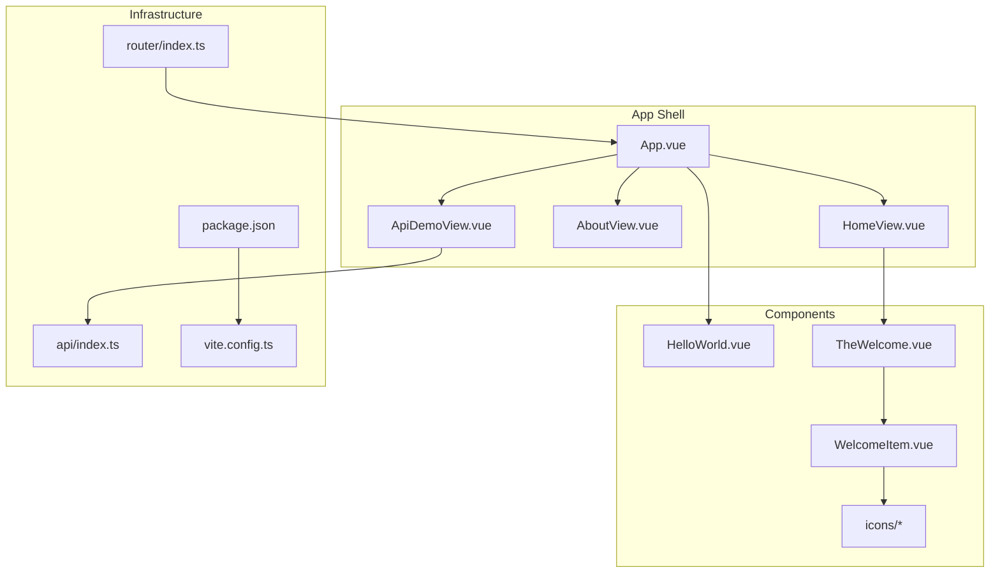
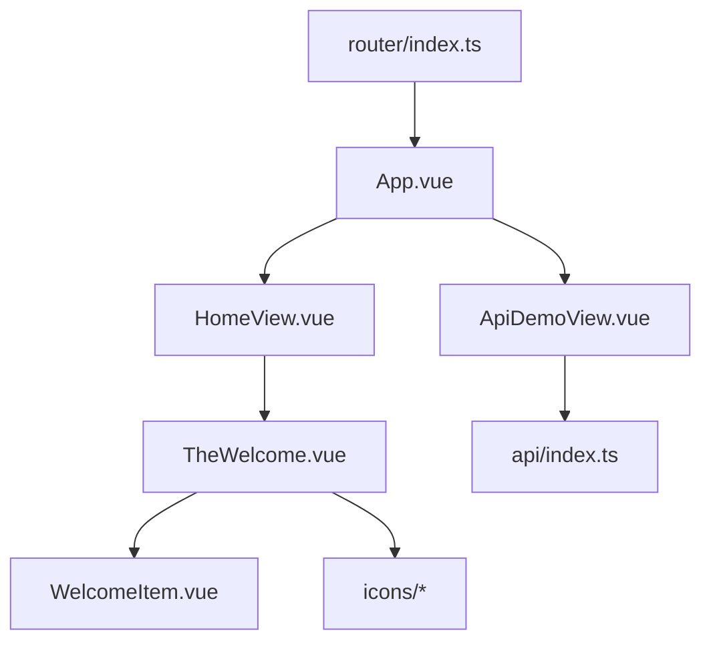
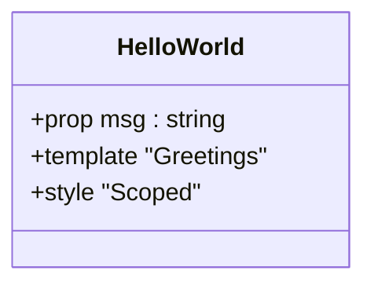
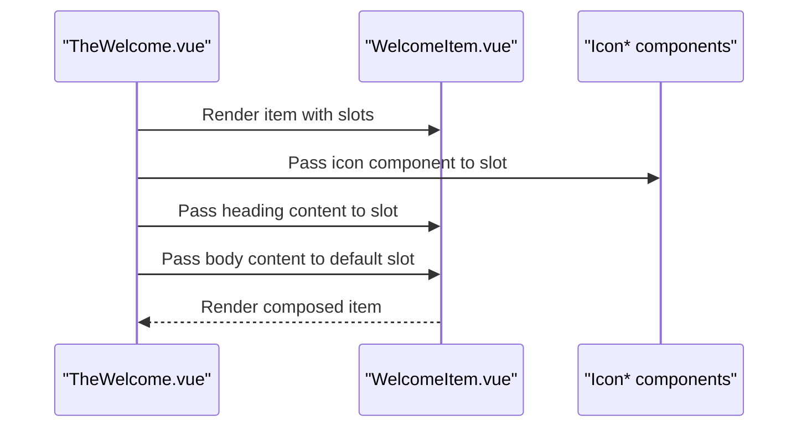
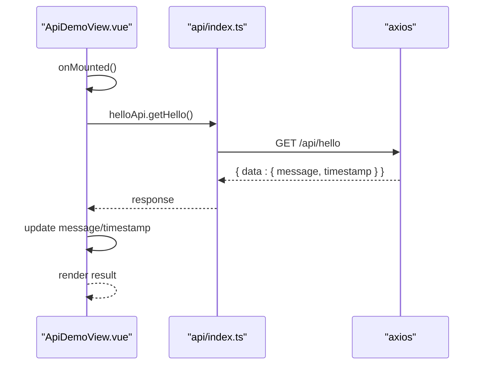
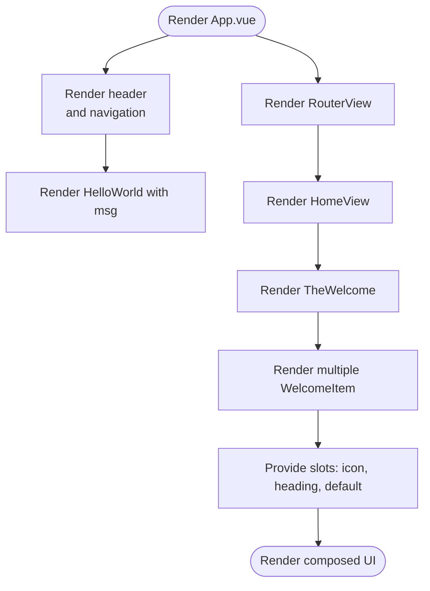
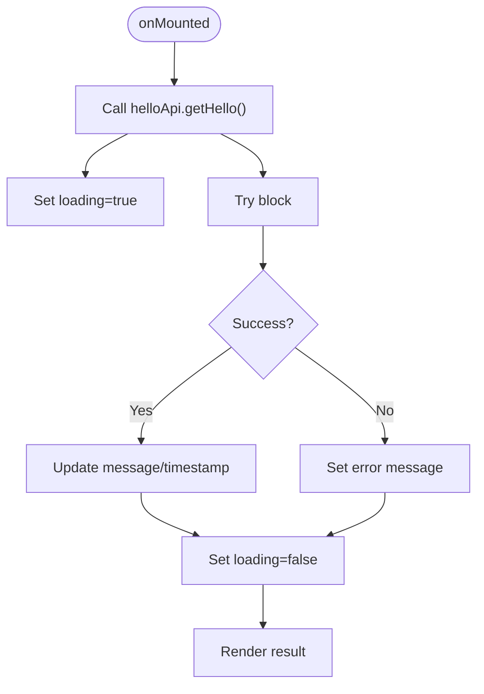
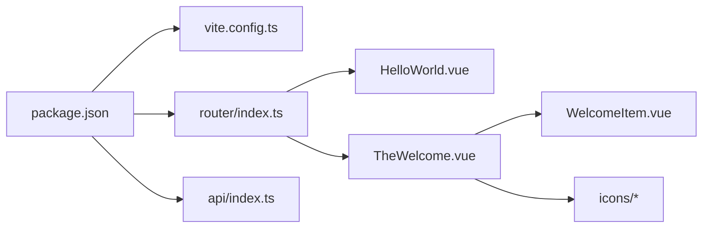

# Component Development

<cite>
**Referenced Files in This Document**
- [App.vue](file://vue3-springboot-demo/src/App.vue)
- [HelloWorld.vue](file://vue3-springboot-demo/src/components/HelloWorld.vue)
- [TheWelcome.vue](file://vue3-springboot-demo/src/components/TheWelcome.vue)
- [WelcomeItem.vue](file://vue3-springboot-demo/src/components/WelcomeItem.vue)
- [IconCommunity.vue](file://vue3-springboot-demo/src/components/icons/IconCommunity.vue)
- [IconDocumentation.vue](file://vue3-springboot-demo/src/components/icons/IconDocumentation.vue)
- [IconEcosystem.vue](file://vue3-springboot-demo/src/components/icons/IconEcosystem.vue)
- [IconSupport.vue](file://vue3-springboot-demo/src/components/icons/IconSupport.vue)
- [IconTooling.vue](file://vue3-springboot-demo/src/components/icons/IconTooling.vue)
- [ApiDemoView.vue](file://vue3-springboot-demo/src/views/ApiDemoView.vue)
- [HomeView.vue](file://vue3-springboot-demo/src/views/HomeView.vue)
- [AboutView.vue](file://vue3-springboot-demo/src/views/AboutView.vue)
- [index.ts](file://vue3-springboot-demo/src/api/index.ts)
- [index.ts](file://vue3-springboot-demo/src/router/index.ts)
- [package.json](file://vue3-springboot-demo/package.json)
- [vite.config.ts](file://vue3-springboot-demo/vite.config.ts)
</cite>

## Table of Contents
1. [Introduction](#introduction)
2. [Project Structure](#project-structure)
3. [Core Components](#core-components)
4. [Architecture Overview](#architecture-overview)
5. [Detailed Component Analysis](#detailed-component-analysis)
6. [Dependency Analysis](#dependency-analysis)
7. [Performance Considerations](#performance-considerations)
8. [Troubleshooting Guide](#troubleshooting-guide)
9. [Conclusion](#conclusion)
10. [Appendices](#appendices)

## Introduction
This document explains Vue 3 component development patterns demonstrated in the project. It focuses on component structure, Composition API usage, reusability principles, and practical examples such as the HelloWorld component, icon components organization, and welcome components functionality. It also covers prop definitions, event handling patterns, component composition, slots, state management, styling with scoped CSS, responsive design, and maintainable architecture guidelines.

## Project Structure
The project follows a clear separation of concerns:
- Application shell and routing live in the views and router modules.
- Reusable UI building blocks are organized under components, including welcome sections and icon components.
- API client utilities are centralized under api.
- Vite is configured for development and proxying backend requests.

**Diagram sources**
- [App.vue:1-87](file://vue3-springboot-demo/src/App.vue#L1-L87)
- [HomeView.vue:1-10](file://vue3-springboot-demo/src/views/HomeView.vue#L1-L10)
- [AboutView.vue:1-16](file://vue3-springboot-demo/src/views/AboutView.vue#L1-L16)
- [ApiDemoView.vue:1-100](file://vue3-springboot-demo/src/views/ApiDemoView.vue#L1-L100)
- [HelloWorld.vue:1-42](file://vue3-springboot-demo/src/components/HelloWorld.vue#L1-L42)
- [TheWelcome.vue:1-96](file://vue3-springboot-demo/src/components/TheWelcome.vue#L1-L96)
- [WelcomeItem.vue:1-88](file://vue3-springboot-demo/src/components/WelcomeItem.vue#L1-L88)
- [IconCommunity.vue:1-8](file://vue3-springboot-demo/src/components/icons/IconCommunity.vue#L1-L8)
- [IconDocumentation.vue:1-8](file://vue3-springboot-demo/src/components/icons/IconDocumentation.vue#L1-L8)
- [IconEcosystem.vue:1-8](file://vue3-springboot-demo/src/components/icons/IconEcosystem.vue#L1-L8)
- [IconSupport.vue:1-8](file://vue3-springboot-demo/src/components/icons/IconSupport.vue#L1-L8)
- [IconTooling.vue:1-20](file://vue3-springboot-demo/src/components/icons/IconTooling.vue#L1-L20)
- [index.ts:1-26](file://vue3-springboot-demo/src/router/index.ts#L1-L26)
- [index.ts:1-22](file://vue3-springboot-demo/src/api/index.ts#L1-L22)
- [package.json:1-49](file://vue3-springboot-demo/package.json#L1-L49)
- [vite.config.ts:1-28](file://vue3-springboot-demo/vite.config.ts#L1-L28)

**Section sources**
- [App.vue:1-87](file://vue3-springboot-demo/src/App.vue#L1-L87)
- [HomeView.vue:1-10](file://vue3-springboot-demo/src/views/HomeView.vue#L1-L10)
- [ApiDemoView.vue:1-100](file://vue3-springboot-demo/src/views/ApiDemoView.vue#L1-L100)
- [index.ts:1-26](file://vue3-springboot-demo/src/router/index.ts#L1-L26)
- [index.ts:1-22](file://vue3-springboot-demo/src/api/index.ts#L1-L22)
- [package.json:1-49](file://vue3-springboot-demo/package.json#L1-L49)
- [vite.config.ts:1-28](file://vue3-springboot-demo/vite.config.ts#L1-L28)

## Core Components
This section documents the primary reusable components and their roles.

- HelloWorld
  - Purpose: Displays a greeting and links to ecosystem resources.
  - Props: msg (string) passed from parent.
  - Slots: None.
  - Events: None.
  - Styling: Scoped styles with responsive adjustments.

- WelcomeItem
  - Purpose: A reusable card-like item with an icon slot, heading slot, and default slot.
  - Props: None.
  - Slots: icon, heading, default.
  - Events: None.
  - Styling: Scoped styles with responsive layout and decorative lines.

- TheWelcome
  - Purpose: Orchestrates multiple WelcomeItem entries, injecting icons and content via slots.
  - Props: None.
  - Slots: None.
  - Events: None.
  - Styling: Scoped styles with responsive grid-like layout.

- Icon components
  - Purpose: Pure SVG presentational components grouped under icons/.
  - Props: None.
  - Slots: None.
  - Events: None.
  - Styling: Inline SVG fills and sizing.

- ApiDemoView
  - Purpose: Demonstrates Composition API usage with reactive state and lifecycle hooks.
  - Props: None.
  - Slots: None.
  - Events: None.
  - Styling: Scoped styles for layout and button states.

**Section sources**
- [HelloWorld.vue:1-42](file://vue3-springboot-demo/src/components/HelloWorld.vue#L1-L42)
- [WelcomeItem.vue:1-88](file://vue3-springboot-demo/src/components/WelcomeItem.vue#L1-L88)
- [TheWelcome.vue:1-96](file://vue3-springboot-demo/src/components/TheWelcome.vue#L1-L96)
- [IconCommunity.vue:1-8](file://vue3-springboot-demo/src/components/icons/IconCommunity.vue#L1-L8)
- [IconDocumentation.vue:1-8](file://vue3-springboot-demo/src/components/icons/IconDocumentation.vue#L1-L8)
- [IconEcosystem.vue:1-8](file://vue3-springboot-demo/src/components/icons/IconEcosystem.vue#L1-L8)
- [IconSupport.vue:1-8](file://vue3-springboot-demo/src/components/icons/IconSupport.vue#L1-L8)
- [IconTooling.vue:1-20](file://vue3-springboot-demo/src/components/icons/IconTooling.vue#L1-L20)
- [ApiDemoView.vue:1-100](file://vue3-springboot-demo/src/views/ApiDemoView.vue#L1-L100)

## Architecture Overview
The app composes a shell (App.vue) that renders navigation and nested views. Views import and render components. The welcome section composes multiple items and icons. API demo view demonstrates reactive state and lifecycle usage.

**Diagram sources**
- [App.vue:1-87](file://vue3-springboot-demo/src/App.vue#L1-L87)
- [index.ts:1-26](file://vue3-springboot-demo/src/router/index.ts#L1-L26)
- [HomeView.vue:1-10](file://vue3-springboot-demo/src/views/HomeView.vue#L1-L10)
- [TheWelcome.vue:1-96](file://vue3-springboot-demo/src/components/TheWelcome.vue#L1-L96)
- [WelcomeItem.vue:1-88](file://vue3-springboot-demo/src/components/WelcomeItem.vue#L1-L88)
- [IconCommunity.vue:1-8](file://vue3-springboot-demo/src/components/icons/IconCommunity.vue#L1-L8)
- [ApiDemoView.vue:1-100](file://vue3-springboot-demo/src/views/ApiDemoView.vue#L1-L100)
- [index.ts:1-22](file://vue3-springboot-demo/src/api/index.ts#L1-L22)

## Detailed Component Analysis

### HelloWorld Component
- Structure
  - SFC with script setup and template/style sections.
  - Uses defineProps to accept msg prop.
- Composition API usage
  - No reactive refs or computed; props are declared statically.
- Reusability
  - Stateless and self-contained; can be reused anywhere with different messages.
- Styling
  - Scoped styles adjust typography and alignment responsively.

**Diagram sources**
- [HelloWorld.vue:1-42](file://vue3-springboot-demo/src/components/HelloWorld.vue#L1-L42)

**Section sources**
- [HelloWorld.vue:1-42](file://vue3-springboot-demo/src/components/HelloWorld.vue#L1-L42)
- [App.vue:3-11](file://vue3-springboot-demo/src/App.vue#L3-L11)

### Welcome Components Organization
- TheWelcome composes multiple WelcomeItem instances and injects icons and content via named slots.
- WelcomeItem defines three slots: icon, heading, and default content.
- Icons are pure SVG components under icons/.

**Diagram sources**
- [TheWelcome.vue:1-96](file://vue3-springboot-demo/src/components/TheWelcome.vue#L1-L96)
- [WelcomeItem.vue:1-88](file://vue3-springboot-demo/src/components/WelcomeItem.vue#L1-L88)
- [IconCommunity.vue:1-8](file://vue3-springboot-demo/src/components/icons/IconCommunity.vue#L1-L8)
- [IconDocumentation.vue:1-8](file://vue3-springboot-demo/src/components/icons/IconDocumentation.vue#L1-L8)
- [IconEcosystem.vue:1-8](file://vue3-springboot-demo/src/components/icons/IconEcosystem.vue#L1-L8)
- [IconSupport.vue:1-8](file://vue3-springboot-demo/src/components/icons/IconSupport.vue#L1-L8)
- [IconTooling.vue:1-20](file://vue3-springboot-demo/src/components/icons/IconTooling.vue#L1-L20)

**Section sources**
- [TheWelcome.vue:1-96](file://vue3-springboot-demo/src/components/TheWelcome.vue#L1-L96)
- [WelcomeItem.vue:1-88](file://vue3-springboot-demo/src/components/WelcomeItem.vue#L1-L88)
- [IconCommunity.vue:1-8](file://vue3-springboot-demo/src/components/icons/IconCommunity.vue#L1-L8)
- [IconDocumentation.vue:1-8](file://vue3-springboot-demo/src/components/icons/IconDocumentation.vue#L1-L8)
- [IconEcosystem.vue:1-8](file://vue3-springboot-demo/src/components/icons/IconEcosystem.vue#L1-L8)
- [IconSupport.vue:1-8](file://vue3-springboot-demo/src/components/icons/IconSupport.vue#L1-L8)
- [IconTooling.vue:1-20](file://vue3-springboot-demo/src/components/icons/IconTooling.vue#L1-L20)

### ApiDemoView Component
- Purpose: Demonstrates Composition API patterns for fetching data and managing loading/error states.
- Reactive state: message, timestamp, loading, error.
- Lifecycle: onMounted triggers initial fetch.
- Event handling: Button click triggers fetch; disabled during loading.
- API integration: Uses axios client configured with base URL and interceptors.

**Diagram sources**
- [ApiDemoView.vue:1-100](file://vue3-springboot-demo/src/views/ApiDemoView.vue#L1-L100)
- [index.ts:1-22](file://vue3-springboot-demo/src/api/index.ts#L1-L22)

**Section sources**
- [ApiDemoView.vue:1-100](file://vue3-springboot-demo/src/views/ApiDemoView.vue#L1-L100)
- [index.ts:1-22](file://vue3-springboot-demo/src/api/index.ts#L1-L22)

### Prop Definitions and Event Handling Patterns
- Props
  - HelloWorld declares msg via defineProps.
  - Other components do not declare props in the analyzed files.
- Events
  - HelloWorld does not emit events.
  - ApiDemoView handles click events on a button and disables the button while loading.
  - TheWelcome uses a click handler to open a file in editor via a fetch call.

**Section sources**
- [HelloWorld.vue:1-42](file://vue3-springboot-demo/src/components/HelloWorld.vue#L1-L42)
- [ApiDemoView.vue:1-100](file://vue3-springboot-demo/src/views/ApiDemoView.vue#L1-L100)
- [TheWelcome.vue:1-96](file://vue3-springboot-demo/src/components/TheWelcome.vue#L1-L96)

### Component Composition and Slot Usage
- Composition
  - App.vue composes HelloWorld and navigational links.
  - HomeView.vue composes TheWelcome.
  - TheWelcome composes WelcomeItem and injects icons and content via slots.
- Slots
  - WelcomeItem defines icon, heading, and default slots.
  - TheWelcome passes icon and heading content to each item.

**Diagram sources**
- [App.vue:1-87](file://vue3-springboot-demo/src/App.vue#L1-L87)
- [HomeView.vue:1-10](file://vue3-springboot-demo/src/views/HomeView.vue#L1-L10)
- [TheWelcome.vue:1-96](file://vue3-springboot-demo/src/components/TheWelcome.vue#L1-L96)
- [WelcomeItem.vue:1-88](file://vue3-springboot-demo/src/components/WelcomeItem.vue#L1-L88)

**Section sources**
- [App.vue:1-87](file://vue3-springboot-demo/src/App.vue#L1-L87)
- [HomeView.vue:1-10](file://vue3-springboot-demo/src/views/HomeView.vue#L1-L10)
- [TheWelcome.vue:1-96](file://vue3-springboot-demo/src/components/TheWelcome.vue#L1-L96)
- [WelcomeItem.vue:1-88](file://vue3-springboot-demo/src/components/WelcomeItem.vue#L1-L88)

### State Management Within Components
- ApiDemoView uses ref for message, timestamp, loading, and error, updating them in response to asynchronous operations.
- Lifecycle hook onMounted triggers initial data load.
- Conditional rendering displays loading, error, or result states.

**Diagram sources**
- [ApiDemoView.vue:1-100](file://vue3-springboot-demo/src/views/ApiDemoView.vue#L1-L100)
- [index.ts:1-22](file://vue3-springboot-demo/src/api/index.ts#L1-L22)

**Section sources**
- [ApiDemoView.vue:1-100](file://vue3-springboot-demo/src/views/ApiDemoView.vue#L1-L100)

### Styling, Scoped CSS, and Responsive Design
- Scoped styles
  - HelloWorld, WelcomeItem, ApiDemoView, and App.vue use scoped styles to avoid global leakage.
- Responsive design
  - Media queries adjust layouts for larger screens.
  - Flexbox and grid-like spacing improve readability and alignment.

**Section sources**
- [HelloWorld.vue:18-41](file://vue3-springboot-demo/src/components/HelloWorld.vue#L18-L41)
- [WelcomeItem.vue:15-87](file://vue3-springboot-demo/src/components/WelcomeItem.vue#L15-L87)
- [ApiDemoView.vue:49-99](file://vue3-springboot-demo/src/views/ApiDemoView.vue#L49-L99)
- [App.vue:24-86](file://vue3-springboot-demo/src/App.vue#L24-L86)

## Dependency Analysis
- Runtime dependencies
  - Vue 3, Vue Router, Pinia, Axios are declared in package.json.
- Build-time dependencies
  - Vite, TypeScript, ESLint, Vitest, and Vue tooling are configured.
- Routing
  - Router creates routes for home, about, and API demo views.
- Proxy configuration
  - Vite proxies /api to the Spring Boot backend.

**Diagram sources**
- [package.json:1-49](file://vue3-springboot-demo/package.json#L1-L49)
- [vite.config.ts:1-28](file://vue3-springboot-demo/vite.config.ts#L1-L28)
- [index.ts:1-26](file://vue3-springboot-demo/src/router/index.ts#L1-L26)
- [index.ts:1-22](file://vue3-springboot-demo/src/api/index.ts#L1-L22)
- [HelloWorld.vue:1-42](file://vue3-springboot-demo/src/components/HelloWorld.vue#L1-L42)
- [TheWelcome.vue:1-96](file://vue3-springboot-demo/src/components/TheWelcome.vue#L1-L96)
- [WelcomeItem.vue:1-88](file://vue3-springboot-demo/src/components/WelcomeItem.vue#L1-L88)
- [IconCommunity.vue:1-8](file://vue3-springboot-demo/src/components/icons/IconCommunity.vue#L1-L8)

**Section sources**
- [package.json:1-49](file://vue3-springboot-demo/package.json#L1-L49)
- [vite.config.ts:1-28](file://vue3-springboot-demo/vite.config.ts#L1-L28)
- [index.ts:1-26](file://vue3-springboot-demo/src/router/index.ts#L1-L26)
- [index.ts:1-22](file://vue3-springboot-demo/src/api/index.ts#L1-L22)

## Performance Considerations
- Prefer lightweight presentational components (icons) to minimize overhead.
- Use scoped styles judiciously; avoid excessive nesting that complicates specificity.
- Keep components small and focused to improve render performance and testability.
- Defer heavy computations to composables or workers when applicable.

## Troubleshooting Guide
- API errors
  - ApiDemoView sets an error message on failures and clears loading state in finally.
  - Ensure the backend is running and Vite proxy is configured to forward /api requests.
- Routing issues
  - Verify router configuration and lazy-loaded routes.
- Styling conflicts
  - Confirm styles are scoped and media queries are correctly applied.

**Section sources**
- [ApiDemoView.vue:10-26](file://vue3-springboot-demo/src/views/ApiDemoView.vue#L10-L26)
- [index.ts:17-21](file://vue3-springboot-demo/src/router/index.ts#L17-L21)
- [vite.config.ts:20-25](file://vue3-springboot-demo/vite.config.ts#L20-L25)

## Conclusion
The project demonstrates clean Vue 3 patterns: Composition API for state and lifecycle, reusable components with slots, and scoped CSS with responsive design. The welcome section exemplifies composition through slot injection, while the API demo showcases practical reactive state management. Following the outlined guidelines ensures maintainability and scalability.

## Appendices
- Best practices summary
  - Naming: Use PascalCase for component filenames and kebab-case for HTML tags.
  - Folder organization: Group related components (e.g., icons/) under a dedicated directory.
  - Props: Define strict types with defineProps; keep components props-driven.
  - Events: Use emits for child-to-parent communication; prefer props for parent-to-child.
  - Slots: Provide flexible placeholders for content and icons.
  - Styling: Prefer scoped styles; leverage media queries for responsiveness.
  - State: Centralize shared state with Pinia; keep local state minimal.
  - Testing: Compose unit tests around component props, slots, and emitted events.