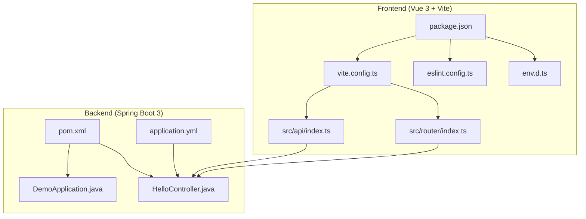
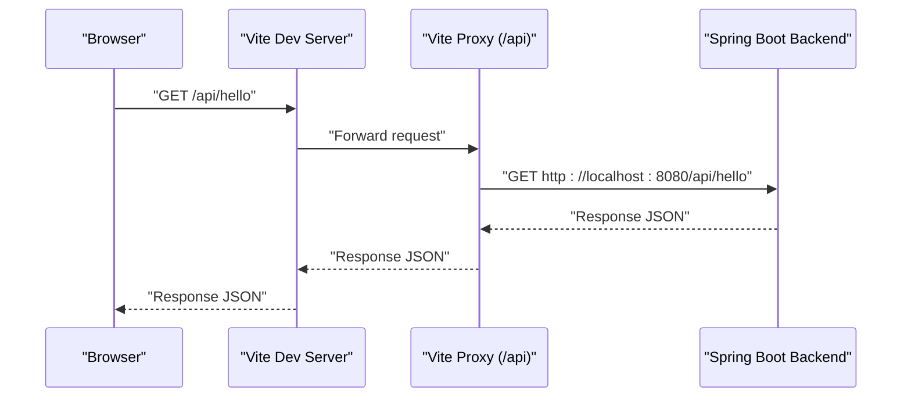
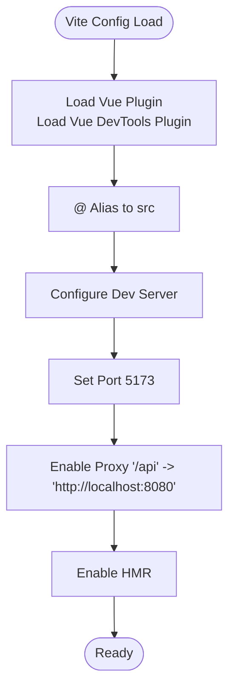
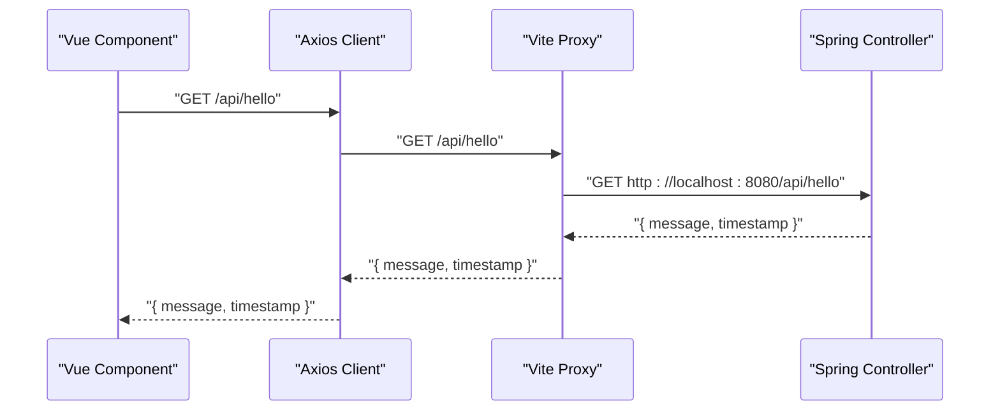
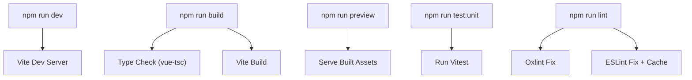
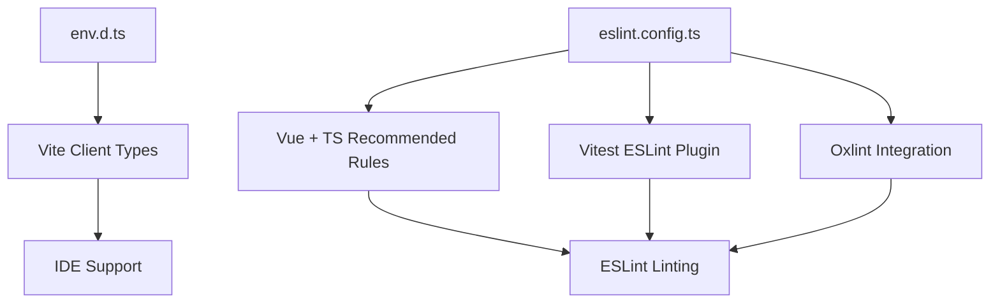
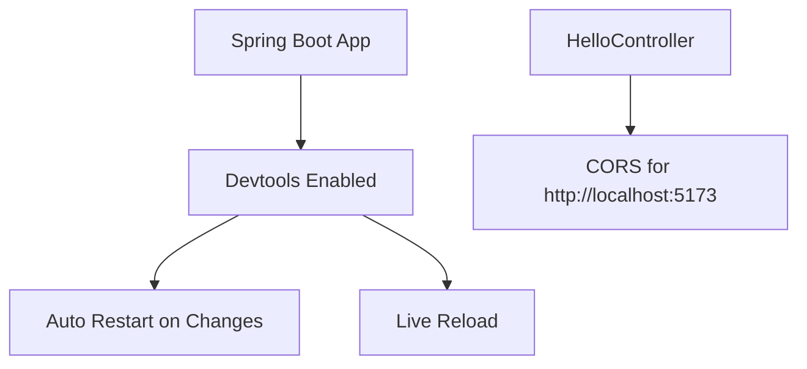
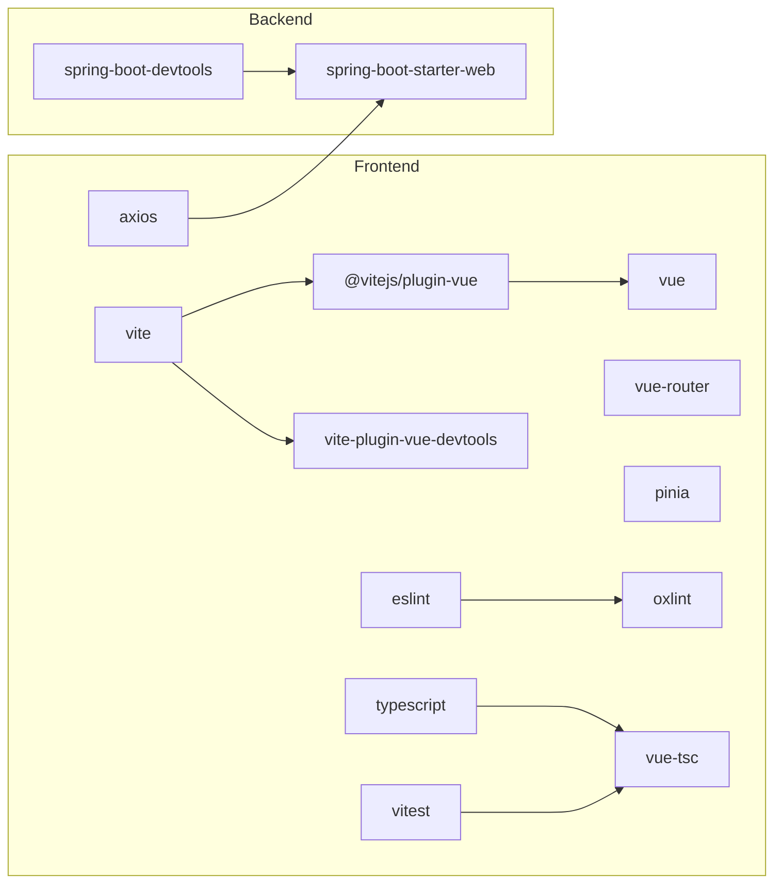

# Development Environment

<cite>
**Referenced Files in This Document**
- [package.json](file://vue3-springboot-demo/package.json)
- [vite.config.ts](file://vue3-springboot-demo/vite.config.ts)
- [env.d.ts](file://vue3-springboot-demo/env.d.ts)
- [eslint.config.ts](file://vue3-springboot-demo/eslint.config.ts)
- [src/api/index.ts](file://vue3-springboot-demo/src/api/index.ts)
- [src/router/index.ts](file://vue3-springboot-demo/src/router/index.ts)
- [springboot3-demo/pom.xml](file://springboot3-demo/pom.xml)
- [springboot3-demo/src/main/java/com/example/demo/DemoApplication.java](file://springboot3-demo/src/main/java/com/example/demo/DemoApplication.java)
- [springboot3-demo/src/main/java/com/example/demo/controller/HelloController.java](file://springboot3-demo/src/main/java/com/example/demo/controller/HelloController.java)
- [springboot3-demo/src/main/resources/application.yml](file://springboot3-demo/src/main/resources/application.yml)
</cite>

## Table of Contents
1. [Introduction](#introduction)
2. [Project Structure](#project-structure)
3. [Core Components](#core-components)
4. [Architecture Overview](#architecture-overview)
5. [Detailed Component Analysis](#detailed-component-analysis)
6. [Dependency Analysis](#dependency-analysis)
7. [Performance Considerations](#performance-considerations)
8. [Troubleshooting Guide](#troubleshooting-guide)
9. [Conclusion](#conclusion)
10. [Appendices](#appendices)

## Introduction
This document explains the Vite-powered frontend development environment for a Vue 3 + Spring Boot 3 full-stack demo. It covers configuration of the Vite development server, proxying to the backend, build scripts, TypeScript and ESLint integration, testing setup, and development best practices. It also documents how the frontend communicates with the backend via a proxy and how the backend enables hot reloading and cross-origin requests for local development.

## Project Structure
The repository contains two primary parts:
- Frontend (Vue 3 + Vite): Provides the UI, routing, API client, and development tooling.
- Backend (Spring Boot 3): Provides REST endpoints and devtools support for live reload.

Key frontend files relevant to development:
- Vite configuration defines plugins, aliases, server options, and proxy.
- Package scripts orchestrate dev, build, preview, linting, and testing.
- TypeScript and ESLint configs enable type checking and linting.
- API client and router integrate with the backend via the configured proxy.

Key backend files relevant to development:
- Maven build configuration and Spring Boot starter dependencies.
- Application properties enabling devtools and CORS for the Vite dev server origin.

**Diagram sources**
- [vite.config.ts:1-28](file://vue3-springboot-demo/vite.config.ts#L1-L28)
- [package.json:1-49](file://vue3-springboot-demo/package.json#L1-L49)
- [env.d.ts:1-2](file://vue3-springboot-demo/env.d.ts#L1-L2)
- [eslint.config.ts:1-30](file://vue3-springboot-demo/eslint.config.ts#L1-L30)
- [src/api/index.ts:1-22](file://vue3-springboot-demo/src/api/index.ts#L1-L22)
- [src/router/index.ts:1-26](file://vue3-springboot-demo/src/router/index.ts#L1-L26)
- [springboot3-demo/pom.xml:1-68](file://springboot3-demo/pom.xml#L1-L68)
- [springboot3-demo/src/main/java/com/example/demo/DemoApplication.java:1-14](file://springboot3-demo/src/main/java/com/example/demo/DemoApplication.java#L1-L14)
- [springboot3-demo/src/main/java/com/example/demo/controller/HelloController.java:1-24](file://springboot3-demo/src/main/java/com/example/demo/controller/HelloController.java#L1-L24)
- [springboot3-demo/src/main/resources/application.yml:1-16](file://springboot3-demo/src/main/resources/application.yml#L1-L16)

**Section sources**
- [vite.config.ts:1-28](file://vue3-springboot-demo/vite.config.ts#L1-L28)
- [package.json:1-49](file://vue3-springboot-demo/package.json#L1-L49)
- [springboot3-demo/pom.xml:1-68](file://springboot3-demo/pom.xml#L1-L68)

## Core Components
- Vite configuration
  - Plugins: Vue plugin and Vue DevTools plugin.
  - Path alias for imports starting with "@".
  - Development server: port, and proxy for "/api" to the backend.
- Package scripts
  - Development, build, preview, unit tests, type check, and linting.
- TypeScript and ESLint
  - Type checking with vue-tsc.
  - Linting with oxlint and ESLint; Vitest ESLint plugin included.
- API client and router
  - Axios client configured with a base URL that matches the Vite proxy.
  - Router history uses import.meta.env.BASE_URL.

**Section sources**
- [vite.config.ts:8-27](file://vue3-springboot-demo/vite.config.ts#L8-L27)
- [package.json:6-16](file://vue3-springboot-demo/package.json#L6-L16)
- [env.d.ts:1-2](file://vue3-springboot-demo/env.d.ts#L1-L2)
- [eslint.config.ts:12-29](file://vue3-springboot-demo/eslint.config.ts#L12-L29)
- [src/api/index.ts:3-9](file://vue3-springboot-demo/src/api/index.ts#L3-L9)
- [src/router/index.ts:4-6](file://vue3-springboot-demo/src/router/index.ts#L4-L6)

## Architecture Overview
The frontend runs on Vite’s dev server and proxies API calls under "/api" to the Spring Boot backend. The backend exposes a "/api/hello" endpoint and enables CORS for the frontend origin. Devtools in the backend support live reload during development.

**Diagram sources**
- [vite.config.ts:20-25](file://vue3-springboot-demo/vite.config.ts#L20-L25)
- [src/api/index.ts:17-19](file://vue3-springboot-demo/src/api/index.ts#L17-L19)
- [springboot3-demo/src/main/java/com/example/demo/controller/HelloController.java:16-22](file://springboot3-demo/src/main/java/com/example/demo/controller/HelloController.java#L16-L22)
- [springboot3-demo/src/main/resources/application.yml:7-11](file://springboot3-demo/src/main/resources/application.yml#L7-L11)

## Detailed Component Analysis

### Vite Configuration
- Plugins
  - Vue plugin enables SFC compilation and HMR.
  - Vue DevTools plugin integrates developer tools in the browser.
- Aliasing
  - "@" resolves to the "src" directory for concise imports.
- Server options
  - Port set to 5173.
  - Proxy:
    - "/api" forwards to "http://localhost:8080".
    - changeOrigin enabled to match host header expectations.
- Hot Module Replacement (HMR)
  - Enabled by default in Vite for fast feedback during development.

**Diagram sources**
- [vite.config.ts:8-27](file://vue3-springboot-demo/vite.config.ts#L8-L27)

**Section sources**
- [vite.config.ts:8-27](file://vue3-springboot-demo/vite.config.ts#L8-L27)

### API Client and Backend Integration
- The API client sets a base URL that aligns with the Vite proxy path "/api".
- The backend controller exposes "/api/hello" and enables CORS for the frontend origin.
- The frontend router uses HTML5 history mode with import.meta.env.BASE_URL.

**Diagram sources**
- [src/api/index.ts:3-9](file://vue3-springboot-demo/src/api/index.ts#L3-L9)
- [src/api/index.ts:17-19](file://vue3-springboot-demo/src/api/index.ts#L17-L19)
- [springboot3-demo/src/main/java/com/example/demo/controller/HelloController.java:16-22](file://springboot3-demo/src/main/java/com/example/demo/controller/HelloController.java#L16-L22)

**Section sources**
- [src/api/index.ts:3-9](file://vue3-springboot-demo/src/api/index.ts#L3-L9)
- [src/router/index.ts:4-6](file://vue3-springboot-demo/src/router/index.ts#L4-L6)
- [springboot3-demo/src/main/java/com/example/demo/controller/HelloController.java:12-14](file://springboot3-demo/src/main/java/com/example/demo/controller/HelloController.java#L12-L14)

### Scripts and Build Process
- Development: starts Vite dev server.
- Build: runs type checking and builds the app.
- Preview: serves built assets locally.
- Unit tests: runs Vitest.
- Linting: supports both oxlint and ESLint with caching and fixes.
- Type checking: ensures Vue and TS correctness.

**Diagram sources**
- [package.json:6-16](file://vue3-springboot-demo/package.json#L6-L16)

**Section sources**
- [package.json:6-16](file://vue3-springboot-demo/package.json#L6-L16)

### TypeScript and ESLint Setup
- env.d.ts references Vite’s client types for proper IDE support.
- ESLint config:
  - Uses @vue/eslint-config-typescript recommended rules.
  - Includes flat config composition with pluginVue and vitest plugin.
  - Integrates oxlint via a configuration file.
- Type checking is performed separately via vue-tsc to keep linting fast.

**Diagram sources**
- [env.d.ts:1-2](file://vue3-springboot-demo/env.d.ts#L1-L2)
- [eslint.config.ts:12-29](file://vue3-springboot-demo/eslint.config.ts#L12-L29)

**Section sources**
- [env.d.ts:1-2](file://vue3-springboot-demo/env.d.ts#L1-L2)
- [eslint.config.ts:12-29](file://vue3-springboot-demo/eslint.config.ts#L12-L29)

### Backend Development Tools and CORS
- Spring Boot devtools is enabled for automatic restarts and live reload.
- application.yml enables devtools restart and live reload.
- The backend controller enables CORS for the frontend origin to allow local development.

**Diagram sources**
- [springboot3-demo/pom.xml:33-36](file://springboot3-demo/pom.xml#L33-L36)
- [springboot3-demo/src/main/resources/application.yml:7-11](file://springboot3-demo/src/main/resources/application.yml#L7-L11)
- [springboot3-demo/src/main/java/com/example/demo/controller/HelloController.java](file://springboot3-demo/src/main/java/com/example/demo/controller/HelloController.java#L13)

**Section sources**
- [springboot3-demo/pom.xml:33-36](file://springboot3-demo/pom.xml#L33-L36)
- [springboot3-demo/src/main/resources/application.yml:7-11](file://springboot3-demo/src/main/resources/application.yml#L7-L11)
- [springboot3-demo/src/main/java/com/example/demo/controller/HelloController.java](file://springboot3-demo/src/main/java/com/example/demo/controller/HelloController.java#L13)

## Dependency Analysis
- Frontend dependencies include Vue 3, Vue Router, Pinia, and Axios.
- Vite and related plugins power the dev server and build pipeline.
- Dev dependencies include TypeScript, ESLint, oxlint, Vitest, and Vue tooling.
- Backend dependencies include Spring Web and devtools; devtools improve the development experience.

**Diagram sources**
- [package.json:17-44](file://vue3-springboot-demo/package.json#L17-L44)
- [springboot3-demo/pom.xml:25-49](file://springboot3-demo/pom.xml#L25-L49)

**Section sources**
- [package.json:17-44](file://vue3-springboot-demo/package.json#L17-L44)
- [springboot3-demo/pom.xml:25-49](file://springboot3-demo/pom.xml#L25-L49)

## Performance Considerations
- Keep the Vite dev server port consistent with the frontend origin to avoid unnecessary redirects.
- Use the proxy for API traffic to prevent CORS complications during development.
- Prefer lazy-loading routes and components to reduce initial bundle size.
- Use type checking and linting in CI to catch regressions early without slowing down local iteration.
- Enable devtools in the backend to speed up feedback loops.

## Troubleshooting Guide
- Proxy not working
  - Verify the proxy target matches the backend port and origin.
  - Confirm the backend allows CORS for the frontend origin.
- Hot reloading not triggered
  - Ensure devtools are enabled in the backend and live reload is active.
  - Check that the frontend dev server is running on the expected port.
- Linting errors
  - Run the lint scripts to apply fixes automatically.
  - Review ESLint and oxlint configurations for conflicts.
- Type errors
  - Run the type-check script to validate Vue and TypeScript definitions.

**Section sources**
- [vite.config.ts:18-26](file://vue3-springboot-demo/vite.config.ts#L18-L26)
- [springboot3-demo/src/main/java/com/example/demo/controller/HelloController.java](file://springboot3-demo/src/main/java/com/example/demo/controller/HelloController.java#L13)
- [springboot3-demo/src/main/resources/application.yml:7-11](file://springboot3-demo/src/main/resources/application.yml#L7-L11)
- [package.json:13-16](file://vue3-springboot-demo/package.json#L13-L16)
- [eslint.config.ts:12-29](file://vue3-springboot-demo/eslint.config.ts#L12-L29)

## Conclusion
The Vite development environment is configured to streamline local development with a clear proxy to the Spring Boot backend, robust linting and type checking, and integrated testing. By aligning the frontend proxy, backend CORS, and devtools, developers can achieve efficient hot reloading and a smooth workflow.

## Appendices

### Development Workflow Examples
- Start the backend
  - Use the Spring Boot runner or Maven goal to start the server on port 8080.
- Start the frontend
  - Run the development script to launch Vite on port 5173.
- Access the API
  - Call endpoints under "/api" from the frontend; Vite proxies them to the backend.
- Run tests
  - Execute the unit test script to run Vitest with ESLint integration.
- Lint and type check
  - Use the lint scripts to fix issues and the type-check script to validate TypeScript.

**Section sources**
- [package.json:6-16](file://vue3-springboot-demo/package.json#L6-L16)
- [springboot3-demo/src/main/resources/application.yml:1-16](file://springboot3-demo/src/main/resources/application.yml#L1-L16)
- [springboot3-demo/src/main/java/com/example/demo/DemoApplication.java:9-11](file://springboot3-demo/src/main/java/com/example/demo/DemoApplication.java#L9-L11)

### Customization Guidelines
- Customize Vite server port and proxy targets in the Vite config.
- Add environment-specific variables via Vite’s environment handling and ensure they are typed in env.d.ts.
- Extend ESLint rules by adjusting the ESLint flat config and adding oxlint overrides.
- Introduce additional Vite plugins (e.g., for static asset optimization) by updating the plugins array.
- Configure route-based lazy loading and code splitting in the router for performance.

**Section sources**
- [vite.config.ts:18-26](file://vue3-springboot-demo/vite.config.ts#L18-L26)
- [env.d.ts:1-2](file://vue3-springboot-demo/env.d.ts#L1-L2)
- [eslint.config.ts:12-29](file://vue3-springboot-demo/eslint.config.ts#L12-L29)
- [src/router/index.ts:17-21](file://vue3-springboot-demo/src/router/index.ts#L17-L21)