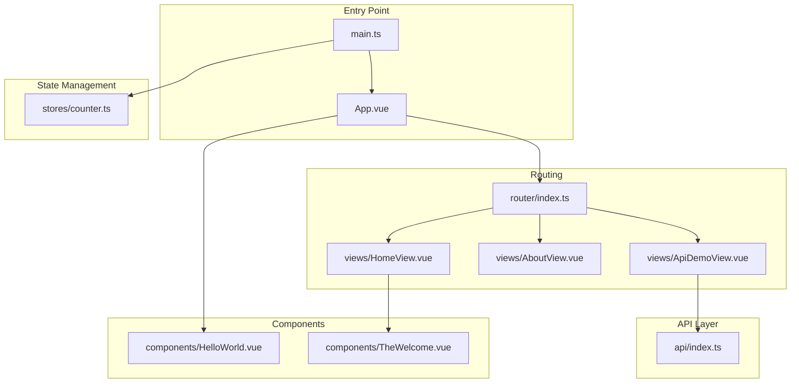
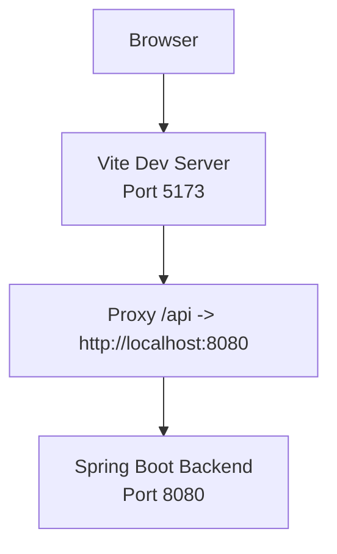
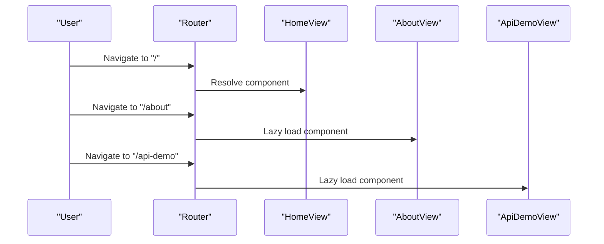
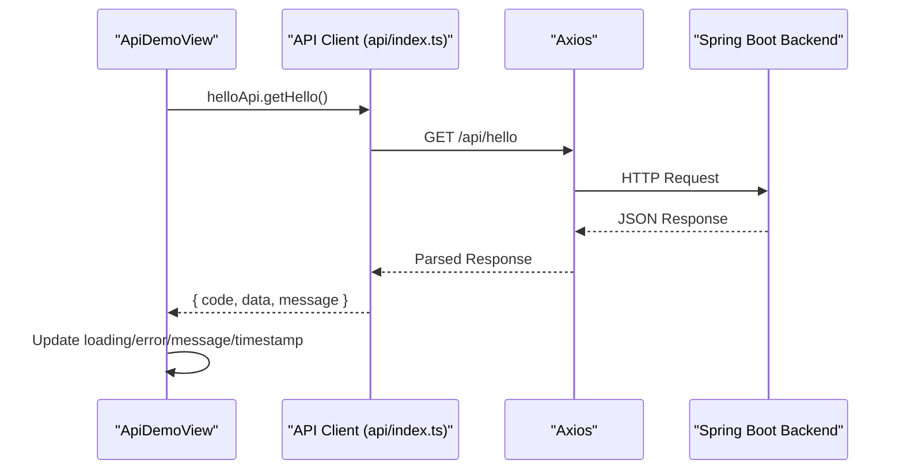
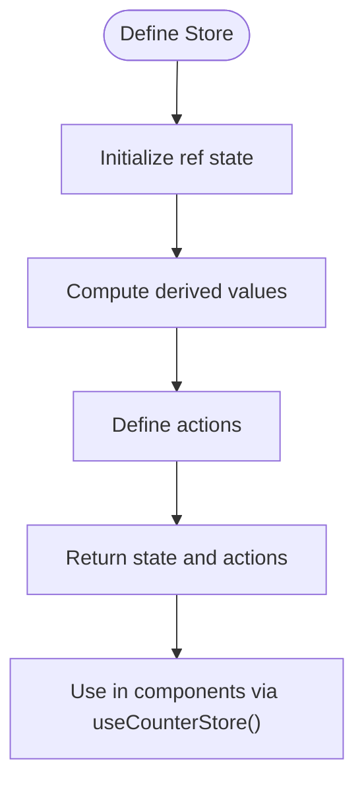
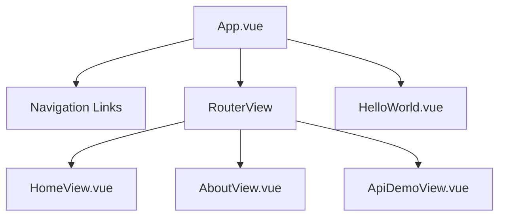
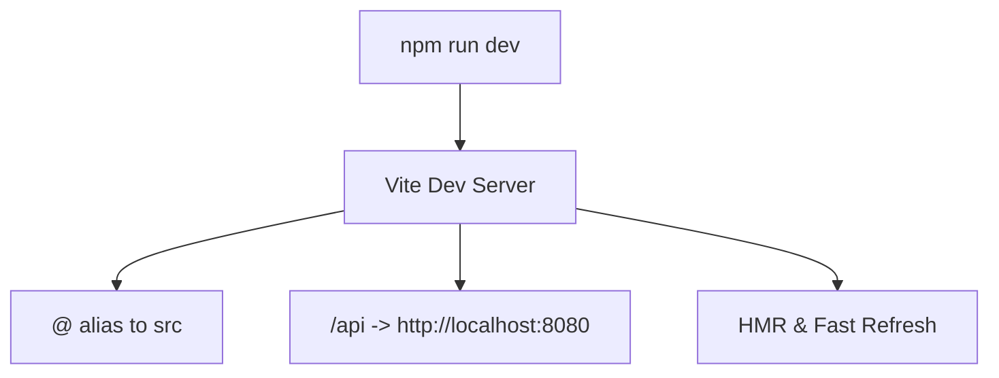
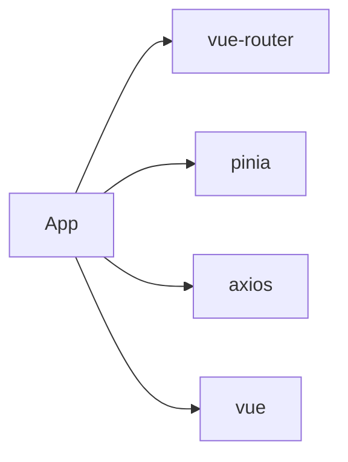

# Frontend Application (Vue 3)

<cite>
**Referenced Files in This Document**
- [App.vue](file://vue3-springboot-demo/src/App.vue)
- [main.ts](file://vue3-springboot-demo/src/main.ts)
- [vite.config.ts](file://vue3-springboot-demo/vite.config.ts)
- [package.json](file://vue3-springboot-demo/package.json)
- [router/index.ts](file://vue3-springboot-demo/src/router/index.ts)
- [api/index.ts](file://vue3-springboot-demo/src/api/index.ts)
- [views/ApiDemoView.vue](file://vue3-springboot-demo/src/views/ApiDemoView.vue)
- [views/HomeView.vue](file://vue3-springboot-demo/src/views/HomeView.vue)
- [views/AboutView.vue](file://vue3-springboot-demo/src/views/AboutView.vue)
- [components/HelloWorld.vue](file://vue3-springboot-demo/src/components/HelloWorld.vue)
- [components/TheWelcome.vue](file://vue3-springboot-demo/src/components/TheWelcome.vue)
- [stores/counter.ts](file://vue3-springboot-demo/src/stores/counter.ts)
</cite>

## Table of Contents
1. [Introduction](#introduction)
2. [Project Structure](#project-structure)
3. [Core Components](#core-components)
4. [Architecture Overview](#architecture-overview)
5. [Detailed Component Analysis](#detailed-component-analysis)
6. [Dependency Analysis](#dependency-analysis)
7. [Performance Considerations](#performance-considerations)
8. [Troubleshooting Guide](#troubleshooting-guide)
9. [Conclusion](#conclusion)
10. [Appendices](#appendices)

## Introduction
This document explains the Vue 3 frontend application built with Vite, focusing on component-based architecture, project structure, and Vue 3 Composition API usage patterns. It documents the routing system, state management approach, and API integration patterns, including the API client configuration, HTTP request handling, and error management strategies. It also covers the integration between the frontend and backend via API calls, proxy configuration, and development workflow with Vite. Practical examples demonstrate how to extend the frontend with additional components and highlight best practices for Vue 3 development.

## Project Structure
The project follows a conventional Vue 3 + TypeScript + Vite setup with clear separation of concerns:
- Application bootstrap and plugin registration in main.ts
- Root component with navigation and RouterView in App.vue
- Routing configuration in router/index.ts
- API client and typed response model in api/index.ts
- View components under views/
- Shared components under components/
- Pinia store example under stores/

**Diagram sources**
- [main.ts:1-15](file://vue3-springboot-demo/src/main.ts#L1-L15)
- [App.vue:1-87](file://vue3-springboot-demo/src/App.vue#L1-L87)
- [router/index.ts:1-26](file://vue3-springboot-demo/src/router/index.ts#L1-L26)
- [views/HomeView.vue:1-10](file://vue3-springboot-demo/src/views/HomeView.vue#L1-L10)
- [views/AboutView.vue:1-16](file://vue3-springboot-demo/src/views/AboutView.vue#L1-L16)
- [views/ApiDemoView.vue:1-100](file://vue3-springboot-demo/src/views/ApiDemoView.vue#L1-L100)
- [api/index.ts:1-22](file://vue3-springboot-demo/src/api/index.ts#L1-L22)
- [components/HelloWorld.vue:1-42](file://vue3-springboot-demo/src/components/HelloWorld.vue#L1-L42)
- [components/TheWelcome.vue:1-96](file://vue3-springboot-demo/src/components/TheWelcome.vue#L1-L96)
- [stores/counter.ts:1-13](file://vue3-springboot-demo/src/stores/counter.ts#L1-L13)

**Section sources**
- [main.ts:1-15](file://vue3-springboot-demo/src/main.ts#L1-L15)
- [App.vue:1-87](file://vue3-springboot-demo/src/App.vue#L1-L87)
- [router/index.ts:1-26](file://vue3-springboot-demo/src/router/index.ts#L1-L26)
- [api/index.ts:1-22](file://vue3-springboot-demo/src/api/index.ts#L1-L22)
- [views/HomeView.vue:1-10](file://vue3-springboot-demo/src/views/HomeView.vue#L1-L10)
- [views/AboutView.vue:1-16](file://vue3-springboot-demo/src/views/AboutView.vue#L1-L16)
- [views/ApiDemoView.vue:1-100](file://vue3-springboot-demo/src/views/ApiDemoView.vue#L1-L100)
- [components/HelloWorld.vue:1-42](file://vue3-springboot-demo/src/components/HelloWorld.vue#L1-L42)
- [components/TheWelcome.vue:1-96](file://vue3-springboot-demo/src/components/TheWelcome.vue#L1-L96)
- [stores/counter.ts:1-13](file://vue3-springboot-demo/src/stores/counter.ts#L1-L13)

## Core Components
- App.vue: Root component containing global navigation via RouterLink and rendering the active route via RouterView. It also renders a shared component HelloWorld for demonstration.
- main.ts: Application bootstrap that registers Pinia and Vue Router, then mounts the root component.
- router/index.ts: Defines routes for Home, About, and API Demo views, including lazy-loaded components for code splitting.
- api/index.ts: Axios-based API client configured with a base URL, timeout, and JSON headers, plus a typed ApiResponse interface and a helloApi facade.
- views/ApiDemoView.vue: Demonstrates Composition API usage with refs and lifecycle hooks, integrating with the API client and handling loading/error states.
- components/HelloWorld.vue: A reusable component receiving props and rendering styled content.
- components/TheWelcome.vue: A composite component aggregating multiple items and icons, showcasing template composition and inter-component slots.
- stores/counter.ts: A Pinia store using the Composition API to manage reactive state and computed values.

**Section sources**
- [App.vue:1-87](file://vue3-springboot-demo/src/App.vue#L1-L87)
- [main.ts:1-15](file://vue3-springboot-demo/src/main.ts#L1-L15)
- [router/index.ts:1-26](file://vue3-springboot-demo/src/router/index.ts#L1-L26)
- [api/index.ts:1-22](file://vue3-springboot-demo/src/api/index.ts#L1-L22)
- [views/ApiDemoView.vue:1-100](file://vue3-springboot-demo/src/views/ApiDemoView.vue#L1-L100)
- [components/HelloWorld.vue:1-42](file://vue3-springboot-demo/src/components/HelloWorld.vue#L1-L42)
- [components/TheWelcome.vue:1-96](file://vue3-springboot-demo/src/components/TheWelcome.vue#L1-L96)
- [stores/counter.ts:1-13](file://vue3-springboot-demo/src/stores/counter.ts#L1-L13)

## Architecture Overview
The application follows a layered architecture:
- Presentation Layer: Vue components (App.vue, views, and shared components)
- Routing Layer: Vue Router managing navigation and lazy-loaded views
- API Layer: Axios client encapsulating HTTP requests and typed responses
- State Management: Pinia store for centralized reactive state
- Build and Dev Server: Vite with proxy configuration for backend integration

**Diagram sources**
- [vite.config.ts:18-26](file://vue3-springboot-demo/vite.config.ts#L18-L26)

**Section sources**
- [vite.config.ts:1-28](file://vue3-springboot-demo/vite.config.ts#L1-L28)

## Detailed Component Analysis

### Routing System
The router defines three routes:
- Home: renders HomeView
- About: lazy-loaded AboutView
- API Demo: lazy-loaded ApiDemoView

**Diagram sources**
- [router/index.ts:4-23](file://vue3-springboot-demo/src/router/index.ts#L4-L23)
- [views/HomeView.vue:1-10](file://vue3-springboot-demo/src/views/HomeView.vue#L1-L10)
- [views/AboutView.vue:1-16](file://vue3-springboot-demo/src/views/AboutView.vue#L1-L16)
- [views/ApiDemoView.vue:1-100](file://vue3-springboot-demo/src/views/ApiDemoView.vue#L1-L100)

**Section sources**
- [router/index.ts:1-26](file://vue3-springboot-demo/src/router/index.ts#L1-L26)

### API Integration Patterns
The API client encapsulates HTTP requests with a typed response envelope and exposes a facade for specific endpoints. The demo view consumes this client during component mount and handles loading and error states.

**Diagram sources**
- [views/ApiDemoView.vue:10-26](file://vue3-springboot-demo/src/views/ApiDemoView.vue#L10-L26)
- [api/index.ts:3-19](file://vue3-springboot-demo/src/api/index.ts#L3-L19)

**Section sources**
- [api/index.ts:1-22](file://vue3-springboot-demo/src/api/index.ts#L1-L22)
- [views/ApiDemoView.vue:1-100](file://vue3-springboot-demo/src/views/ApiDemoView.vue#L1-L100)

### State Management Approach
The application integrates Pinia for state management. The counter store demonstrates reactive state, computed values, and actions using the Composition API.

**Diagram sources**
- [stores/counter.ts:4-12](file://vue3-springboot-demo/src/stores/counter.ts#L4-L12)

**Section sources**
- [stores/counter.ts:1-13](file://vue3-springboot-demo/src/stores/counter.ts#L1-L13)

### Component Hierarchy and Navigation
The root App component orchestrates navigation and renders RouterView. It includes a shared HelloWorld component and links to Home, About, and API Demo routes.

**Diagram sources**
- [App.vue:6-21](file://vue3-springboot-demo/src/App.vue#L6-L21)
- [components/HelloWorld.vue:1-42](file://vue3-springboot-demo/src/components/HelloWorld.vue#L1-L42)
- [views/HomeView.vue:1-10](file://vue3-springboot-demo/src/views/HomeView.vue#L1-L10)
- [views/AboutView.vue:1-16](file://vue3-springboot-demo/src/views/AboutView.vue#L1-L16)
- [views/ApiDemoView.vue:1-100](file://vue3-springboot-demo/src/views/ApiDemoView.vue#L1-L100)

**Section sources**
- [App.vue:1-87](file://vue3-springboot-demo/src/App.vue#L1-L87)

### Development Workflow with Vite
- Scripts: dev, build, preview, test:unit, lint tasks are defined in package.json.
- Plugins: @vitejs/plugin-vue and vite-plugin-vue-devtools are enabled.
- Aliasing: '@' resolves to the src directory for clean imports.
- Proxy: Requests to /api are proxied to the Spring Boot backend running on localhost:8080.

**Diagram sources**
- [package.json:6-16](file://vue3-springboot-demo/package.json#L6-L16)
- [vite.config.ts:9-17](file://vue3-springboot-demo/vite.config.ts#L9-L17)
- [vite.config.ts:20-25](file://vue3-springboot-demo/vite.config.ts#L20-L25)

**Section sources**
- [package.json:1-49](file://vue3-springboot-demo/package.json#L1-L49)
- [vite.config.ts:1-28](file://vue3-springboot-demo/vite.config.ts#L1-L28)

## Dependency Analysis
External dependencies include Vue 3, Vue Router, Pinia, and Axios. Development dependencies encompass Vite, TypeScript, ESLint, Vitest, and Vue tooling.

**Diagram sources**
- [package.json:17-22](file://vue3-springboot-demo/package.json#L17-L22)

**Section sources**
- [package.json:1-49](file://vue3-springboot-demo/package.json#L1-L49)

## Performance Considerations
- Lazy-load routes to reduce initial bundle size.
- Use shallow refs and computed for minimal reactivity overhead.
- Centralize API client configuration to avoid duplication and improve caching.
- Leverage Vite's fast refresh and tree-shaking for optimal development and production builds.

## Troubleshooting Guide
Common issues and resolutions:
- Proxy not working: Verify the proxy target matches the backend address and port.
- API errors: Inspect the typed response envelope and handle error states in components.
- Hot module replacement issues: Restart the dev server if changes are not applied.
- Type errors: Ensure TypeScript configurations are aligned with the project setup.

**Section sources**
- [vite.config.ts:20-25](file://vue3-springboot-demo/vite.config.ts#L20-L25)
- [views/ApiDemoView.vue:17-21](file://vue3-springboot-demo/src/views/ApiDemoView.vue#L17-L21)
- [package.json:23-44](file://vue3-springboot-demo/package.json#L23-L44)

## Conclusion
This Vue 3 application demonstrates a clean, modular architecture with strong separation of concerns. It leverages the Composition API, Vue Router, Pinia, and Axios to deliver a maintainable frontend that integrates seamlessly with a Spring Boot backend through a Vite-powered development workflow and proxy configuration.

## Appendices
- Extending the frontend: Add new views under views/, register routes in router/index.ts, create API facades in api/index.ts, and integrate state via Pinia stores.
- Best practices:
  - Prefer Composition API for logic reuse and clarity.
  - Keep components small and focused; compose via slots and props.
  - Centralize HTTP configuration and error handling.
  - Use TypeScript for type safety and developer experience.
  - Utilize Vite plugins and aliases for efficient development.