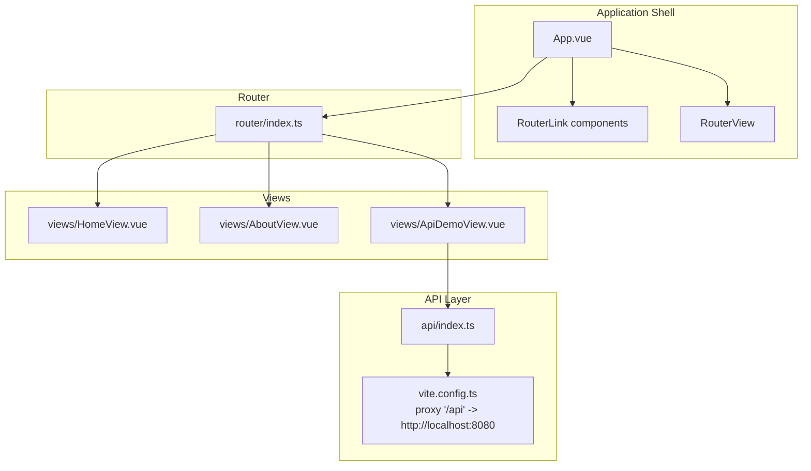
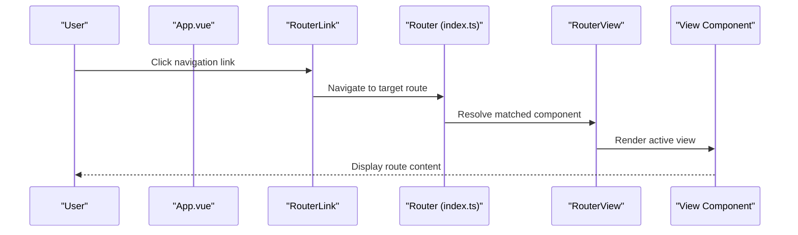
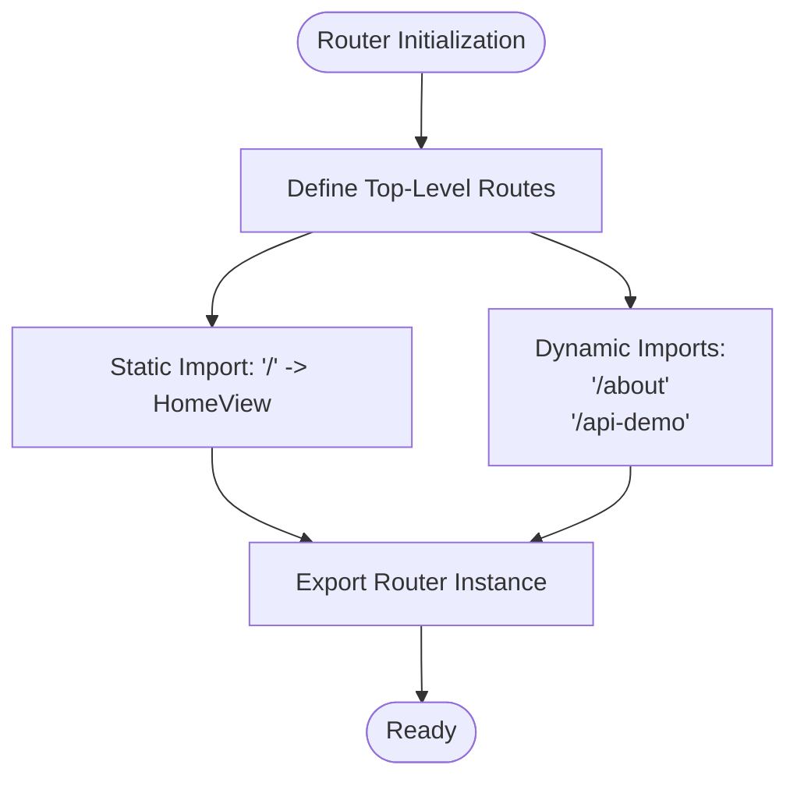
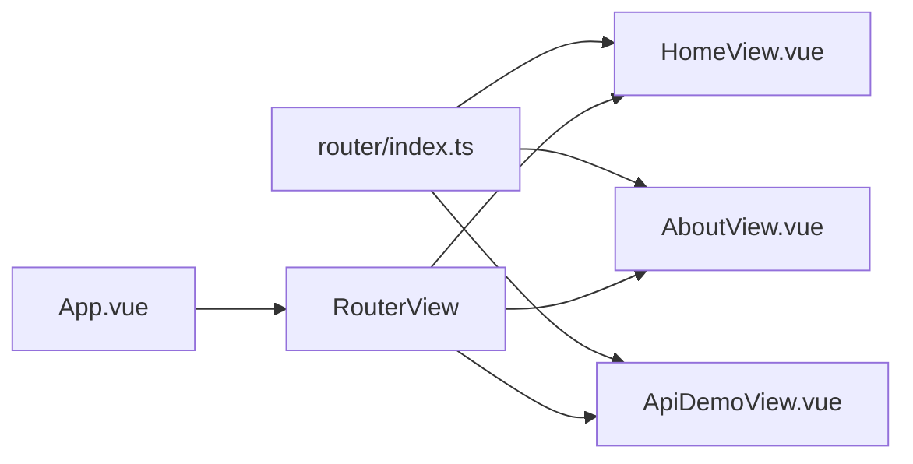
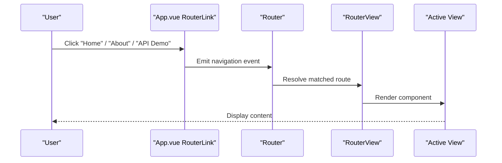
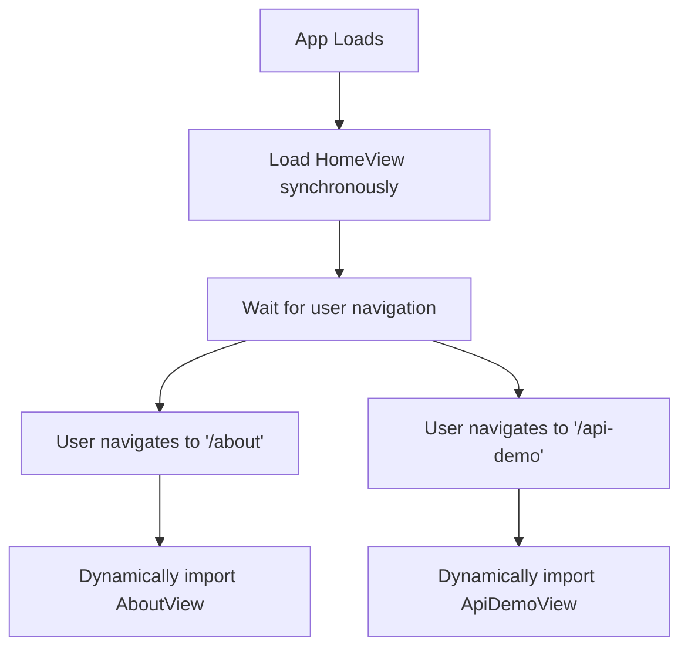
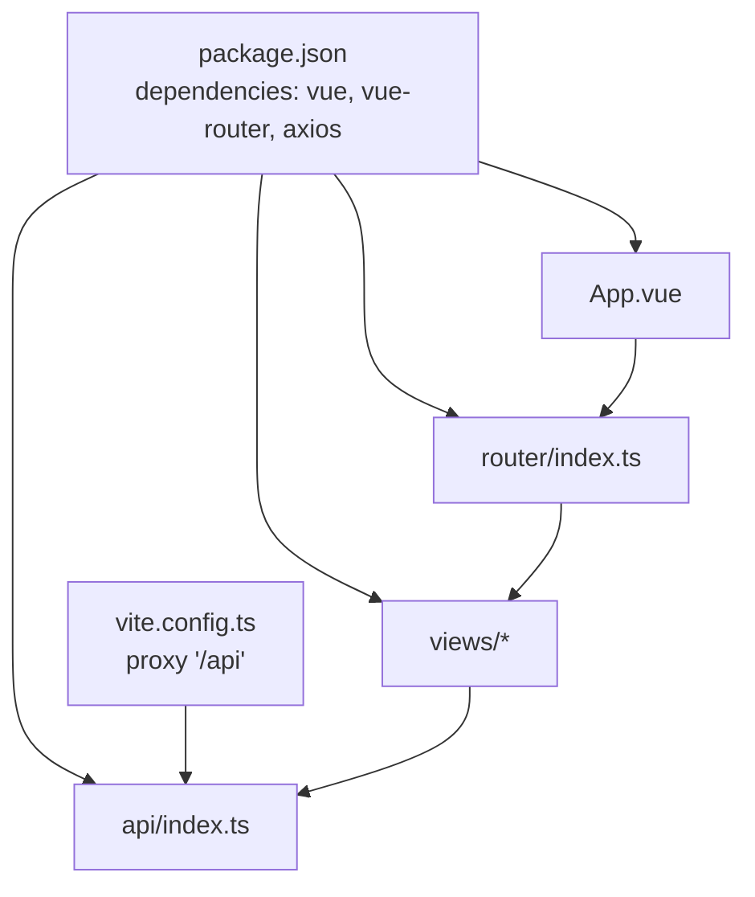

# Routing System

<cite>
**Referenced Files in This Document**
- [router/index.ts](file://vue3-springboot-demo/src/router/index.ts)
- [App.vue](file://vue3-springboot-demo/src/App.vue)
- [HomeView.vue](file://vue3-springboot-demo/src/views/HomeView.vue)
- [AboutView.vue](file://vue3-springboot-demo/src/views/AboutView.vue)
- [ApiDemoView.vue](file://vue3-springboot-demo/src/views/ApiDemoView.vue)
- [api/index.ts](file://vue3-springboot-demo/src/api/index.ts)
- [vite.config.ts](file://vue3-springboot-demo/vite.config.ts)
- [package.json](file://vue3-springboot-demo/package.json)
</cite>

## Table of Contents
1. [Introduction](#introduction)
2. [Project Structure](#project-structure)
3. [Core Components](#core-components)
4. [Architecture Overview](#architecture-overview)
5. [Detailed Component Analysis](#detailed-component-analysis)
6. [Dependency Analysis](#dependency-analysis)
7. [Performance Considerations](#performance-considerations)
8. [Troubleshooting Guide](#troubleshooting-guide)
9. [Conclusion](#conclusion)

## Introduction
This document explains the Vue Router implementation in the Vue 3 + Spring Boot demo application. It covers routing configuration, route definitions, navigation patterns, lazy loading strategies, and how routes relate to view components. It also provides practical guidance for extending the routing system with new pages while maintaining clean navigation patterns.

## Project Structure
The routing system centers around a single router configuration file that defines top-level routes and integrates with the application shell via RouterLink and RouterView. Views are organized under a dedicated folder and consumed by the router. An API client configured with Vite proxy supports backend integration during development.

**Diagram sources**
- [router/index.ts:1-26](file://vue3-springboot-demo/src/router/index.ts#L1-L26)
- [App.vue:1-87](file://vue3-springboot-demo/src/App.vue#L1-L87)
- [HomeView.vue:1-10](file://vue3-springboot-demo/src/views/HomeView.vue#L1-L10)
- [AboutView.vue:1-16](file://vue3-springboot-demo/src/views/AboutView.vue#L1-L16)
- [ApiDemoView.vue:1-100](file://vue3-springboot-demo/src/views/ApiDemoView.vue#L1-L100)
- [api/index.ts:1-22](file://vue3-springboot-demo/src/api/index.ts#L1-L22)
- [vite.config.ts:1-28](file://vue3-springboot-demo/vite.config.ts#L1-L28)

**Section sources**
- [router/index.ts:1-26](file://vue3-springboot-demo/src/router/index.ts#L1-L26)
- [App.vue:1-87](file://vue3-springboot-demo/src/App.vue#L1-L87)
- [vite.config.ts:18-26](file://vue3-springboot-demo/vite.config.ts#L18-L26)

## Core Components
- Router configuration: Defines the browser history mode and top-level routes. Routes include a static import for the home page and lazy-loaded imports for other pages.
- Application shell: Provides navigation links and renders the active view via RouterView.
- View components: Represented by HomeView, AboutView, and ApiDemoView. ApiDemoView demonstrates fetching data from the backend using the configured API client.
- API client: Axios-based client configured with a base URL and development proxy to the Spring Boot backend.

Key implementation references:
- Router creation and routes: [router/index.ts:4-23](file://vue3-springboot-demo/src/router/index.ts#L4-L23)
- Navigation links and RouterView: [App.vue:13-21](file://vue3-springboot-demo/src/App.vue#L13-L21)
- Lazy-loaded route definition: [router/index.ts:12-21](file://vue3-springboot-demo/src/router/index.ts#L12-L21)
- View component usage: [HomeView.vue:1-10](file://vue3-springboot-demo/src/views/HomeView.vue#L1-L10), [AboutView.vue:1-16](file://vue3-springboot-demo/src/views/AboutView.vue#L1-L16), [ApiDemoView.vue:1-100](file://vue3-springboot-demo/src/views/ApiDemoView.vue#L1-L100)
- API client and proxy: [api/index.ts:3-9](file://vue3-springboot-demo/src/api/index.ts#L3-L9), [vite.config.ts:20-25](file://vue3-springboot-demo/vite.config.ts#L20-L25)

**Section sources**
- [router/index.ts:4-23](file://vue3-springboot-demo/src/router/index.ts#L4-L23)
- [App.vue:13-21](file://vue3-springboot-demo/src/App.vue#L13-L21)
- [HomeView.vue:1-10](file://vue3-springboot-demo/src/views/HomeView.vue#L1-L10)
- [AboutView.vue:1-16](file://vue3-springboot-demo/src/views/AboutView.vue#L1-L16)
- [ApiDemoView.vue:1-100](file://vue3-springboot-demo/src/views/ApiDemoView.vue#L1-L100)
- [api/index.ts:3-9](file://vue3-springboot-demo/src/api/index.ts#L3-L9)
- [vite.config.ts:20-25](file://vue3-springboot-demo/vite.config.ts#L20-L25)

## Architecture Overview
The routing architecture follows a straightforward top-level route pattern with lazy loading for non-home pages. The application shell hosts navigation and renders the active route’s component. The API client leverages Vite’s proxy to communicate with the Spring Boot backend during development.

**Diagram sources**
- [App.vue:13-21](file://vue3-springboot-demo/src/App.vue#L13-L21)
- [router/index.ts:4-23](file://vue3-springboot-demo/src/router/index.ts#L4-L23)

## Detailed Component Analysis

### Router Index Configuration
The router is initialized with browser history mode and a set of top-level routes. The home route uses a synchronous import, while other routes use dynamic imports for lazy loading. This improves initial load performance by deferring non-critical bundles.

- Router initialization and history mode: [router/index.ts:4-6](file://vue3-springboot-demo/src/router/index.ts#L4-L6)
- Home route with static import: [router/index.ts:6-11](file://vue3-springboot-demo/src/router/index.ts#L6-L11)
- Lazy-loaded routes: [router/index.ts:12-21](file://vue3-springboot-demo/src/router/index.ts#L12-L21)

**Diagram sources**
- [router/index.ts:4-23](file://vue3-springboot-demo/src/router/index.ts#L4-L23)

**Section sources**
- [router/index.ts:4-23](file://vue3-springboot-demo/src/router/index.ts#L4-L23)

### Route Definitions and View Relationship
Each route maps a path to a component. The application shell uses RouterView to render the matched component. The home route renders HomeView, which composes a welcome component. Other routes render dedicated views.

- Route-to-component mapping: [router/index.ts:6-21](file://vue3-springboot-demo/src/router/index.ts#L6-L21)
- RouterView rendering: [App.vue:21](file://vue3-springboot-demo/src/App.vue#L21)
- Home view composition: [HomeView.vue:1-10](file://vue3-springboot-demo/src/views/HomeView.vue#L1-L10)

**Diagram sources**
- [router/index.ts:6-21](file://vue3-springboot-demo/src/router/index.ts#L6-L21)
- [App.vue:21](file://vue3-springboot-demo/src/App.vue#L21)
- [HomeView.vue:1-10](file://vue3-springboot-demo/src/views/HomeView.vue#L1-L10)
- [AboutView.vue:1-16](file://vue3-springboot-demo/src/views/AboutView.vue#L1-L16)
- [ApiDemoView.vue:1-100](file://vue3-springboot-demo/src/views/ApiDemoView.vue#L1-L100)

**Section sources**
- [router/index.ts:6-21](file://vue3-springboot-demo/src/router/index.ts#L6-L21)
- [App.vue:21](file://vue3-springboot-demo/src/App.vue#L21)
- [HomeView.vue:1-10](file://vue3-springboot-demo/src/views/HomeView.vue#L1-L10)
- [AboutView.vue:1-16](file://vue3-springboot-demo/src/views/AboutView.vue#L1-L16)
- [ApiDemoView.vue:1-100](file://vue3-springboot-demo/src/views/ApiDemoView.vue#L1-L100)

### Navigation Patterns and RouterView Usage
Navigation is declarative using RouterLink components in the application shell. RouterView dynamically renders the matched route’s component. The shell also applies styles to highlight the active link.

- Navigation links: [App.vue:14-16](file://vue3-springboot-demo/src/App.vue#L14-L16)
- Active link styling: [App.vue:42-48](file://vue3-springboot-demo/src/App.vue#L42-L48)
- RouterView placement: [App.vue:21](file://vue3-springboot-demo/src/App.vue#L21)

**Diagram sources**
- [App.vue:14-21](file://vue3-springboot-demo/src/App.vue#L14-L21)
- [router/index.ts:6-21](file://vue3-springboot-demo/src/router/index.ts#L6-L21)

**Section sources**
- [App.vue:14-21](file://vue3-springboot-demo/src/App.vue#L14-L21)
- [router/index.ts:6-21](file://vue3-springboot-demo/src/router/index.ts#L6-L21)

### Parameter Passing and Query Handling
The current routing configuration does not define parameterized routes or query parameters. To extend the system:
- Add parameterized routes using dynamic segments in the path.
- Access parameters via route properties in the view component.
- Handle query parameters using route properties or a query parsing utility.

Guidance references:
- Route definition structure: [router/index.ts:6-21](file://vue3-springboot-demo/src/router/index.ts#L6-L21)
- View component lifecycle: [ApiDemoView.vue:24-26](file://vue3-springboot-demo/src/views/ApiDemoView.vue#L24-L26)

**Section sources**
- [router/index.ts:6-21](file://vue3-springboot-demo/src/router/index.ts#L6-L21)
- [ApiDemoView.vue:24-26](file://vue3-springboot-demo/src/views/ApiDemoView.vue#L24-L26)

### Nested Routes
Nested routes are not present in the current configuration. To implement nested layouts:
- Define parent routes with children arrays.
- Use RouterView inside parent components to render child routes.
- Manage shared layout concerns in parent components.

Reference for route structure:
- Parent-child route pattern: [router/index.ts:6-21](file://vue3-springboot-demo/src/router/index.ts#L6-L21)

**Section sources**
- [router/index.ts:6-21](file://vue3-springboot-demo/src/router/index.ts#L6-L21)

### Programmatic Navigation
Programmatic navigation can be achieved using the router instance. Typical use cases include redirecting after form submission or navigating based on computed conditions.

References:
- Router export: [router/index.ts:25](file://vue3-springboot-demo/src/router/index.ts#L25)
- View component usage: [ApiDemoView.vue:1-100](file://vue3-springboot-demo/src/views/ApiDemoView.vue#L1-L100)

**Section sources**
- [router/index.ts:25](file://vue3-springboot-demo/src/router/index.ts#L25)
- [ApiDemoView.vue:1-100](file://vue3-springboot-demo/src/views/ApiDemoView.vue#L1-L100)

### Route Guards
Route guards are not implemented in the current configuration. To add guards:
- Use navigation guards at the route level or globally.
- Implement authentication checks, redirects, or pre-fetch logic.

Reference for guard integration points:
- Route definitions: [router/index.ts:6-21](file://vue3-springboot-demo/src/router/index.ts#L6-L21)

**Section sources**
- [router/index.ts:6-21](file://vue3-springboot-demo/src/router/index.ts#L6-L21)

### Lazy Loading Strategies
Lazy loading is implemented for non-home routes using dynamic imports. This reduces the initial bundle size and defers loading until the route is accessed.

- Dynamic imports for About and API Demo: [router/index.ts:12-21](file://vue3-springboot-demo/src/router/index.ts#L12-L21)

**Diagram sources**
- [router/index.ts:12-21](file://vue3-springboot-demo/src/router/index.ts#L12-L21)

**Section sources**
- [router/index.ts:12-21](file://vue3-springboot-demo/src/router/index.ts#L12-L21)

### Backend Integration and Proxy
The API client uses a base URL that aligns with the Vite proxy configuration. During development, requests to the API base URL are proxied to the Spring Boot backend server.

- API client base URL: [api/index.ts:4](file://vue3-springboot-demo/src/api/index.ts#L4)
- Vite proxy configuration: [vite.config.ts:20-25](file://vue3-springboot-demo/vite.config.ts#L20-L25)

**Section sources**
- [api/index.ts:4](file://vue3-springboot-demo/src/api/index.ts#L4)
- [vite.config.ts:20-25](file://vue3-springboot-demo/vite.config.ts#L20-L25)

## Dependency Analysis
The routing system depends on Vue Router and the application shell. Views depend on the router for navigation and on the API client for backend communication. The API client depends on Vite’s proxy for development-time backend integration.

**Diagram sources**
- [package.json:17-22](file://vue3-springboot-demo/package.json#L17-L22)
- [router/index.ts:1-26](file://vue3-springboot-demo/src/router/index.ts#L1-L26)
- [App.vue:1-87](file://vue3-springboot-demo/src/App.vue#L1-L87)
- [api/index.ts:1-22](file://vue3-springboot-demo/src/api/index.ts#L1-L22)
- [vite.config.ts:1-28](file://vue3-springboot-demo/vite.config.ts#L1-L28)

**Section sources**
- [package.json:17-22](file://vue3-springboot-demo/package.json#L17-L22)
- [router/index.ts:1-26](file://vue3-springboot-demo/src/router/index.ts#L1-L26)
- [App.vue:1-87](file://vue3-springboot-demo/src/App.vue#L1-L87)
- [api/index.ts:1-22](file://vue3-springboot-demo/src/api/index.ts#L1-L22)
- [vite.config.ts:1-28](file://vue3-springboot-demo/vite.config.ts#L1-L28)

## Performance Considerations
- Prefer lazy loading for non-critical routes to reduce initial bundle size.
- Keep route definitions minimal and avoid deeply nested structures unless necessary.
- Use route-level components that are optimized for rendering and memory usage.

[No sources needed since this section provides general guidance]

## Troubleshooting Guide
- Navigation links not updating active state: Verify RouterLink usage and active class selectors in the application shell.
  - Reference: [App.vue:14-16](file://vue3-springboot-demo/src/App.vue#L14-L16), [App.vue:42-48](file://vue3-springboot-demo/src/App.vue#L42-L48)
- Route not rendering: Confirm the route path matches the RouterLink and that the component is properly exported.
  - Reference: [router/index.ts:6-21](file://vue3-springboot-demo/src/router/index.ts#L6-L21)
- API requests failing in development: Ensure the Vite proxy is configured and the backend server is running.
  - Reference: [vite.config.ts:20-25](file://vue3-springboot-demo/vite.config.ts#L20-L25), [api/index.ts:4](file://vue3-springboot-demo/src/api/index.ts#L4)

**Section sources**
- [App.vue:14-16](file://vue3-springboot-demo/src/App.vue#L14-L16)
- [App.vue:42-48](file://vue3-springboot-demo/src/App.vue#L42-L48)
- [router/index.ts:6-21](file://vue3-springboot-demo/src/router/index.ts#L6-L21)
- [vite.config.ts:20-25](file://vue3-springboot-demo/vite.config.ts#L20-L25)
- [api/index.ts:4](file://vue3-springboot-demo/src/api/index.ts#L4)

## Conclusion
The routing system is intentionally simple and focused on demonstrating core concepts: browser history mode, top-level routes, lazy loading, and integration with the application shell and API client. Extending the system involves adding parameterized routes, nested layouts, and guards as needs arise, while preserving clean navigation patterns and performance characteristics.