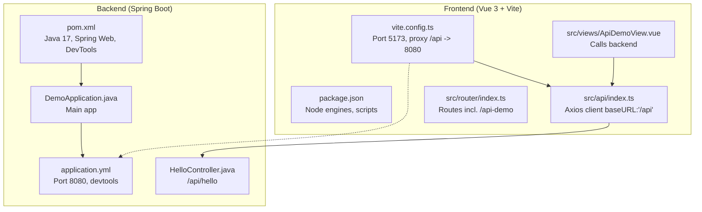
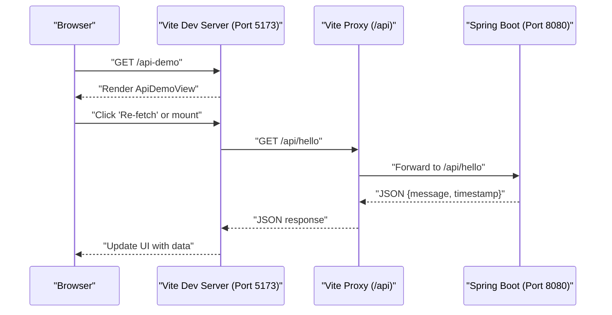

# Getting Started

<cite>
**Referenced Files in This Document**
- [pom.xml](file://springboot3-demo/pom.xml)
- [application.yml](file://springboot3-demo/src/main/resources/application.yml)
- [DemoApplication.java](file://springboot3-demo/src/main/java/com/example/demo/DemoApplication.java)
- [HelloController.java](file://springboot3-demo/src/main/java/com/example/demo/controller/HelloController.java)
- [package.json](file://vue3-springboot-demo/package.json)
- [vite.config.ts](file://vue3-springboot-demo/vite.config.ts)
- [README.md](file://vue3-springboot-demo/README.md)
- [index.ts](file://vue3-springboot-demo/src/api/index.ts)
- [ApiDemoView.vue](file://vue3-springboot-demo/src/views/ApiDemoView.vue)
- [index.ts](file://vue3-springboot-demo/src/router/index.ts)
</cite>

## Table of Contents
1. [Introduction](#introduction)
2. [Prerequisites](#prerequisites)
3. [Project Structure](#project-structure)
4. [Installation and Setup](#installation-and-setup)
5. [Running the Application](#running-the-application)
6. [Verification Steps](#verification-steps)
7. [Architecture Overview](#architecture-overview)
8. [Troubleshooting Guide](#troubleshooting-guide)
9. [Conclusion](#conclusion)

## Introduction
This guide helps you set up and run the qoder full-stack demo application locally. It includes prerequisites, step-by-step installation for both backend (Spring Boot 3) and frontend (Vue 3 + Vite), and a quick start to launch both servers. You will also learn how to verify the setup, understand expected behavior, and troubleshoot common issues.

## Prerequisites
- Java 17 runtime and toolchain for building and running the Spring Boot backend.
- Node.js version satisfying the project's engines requirement.
- A modern web browser for the Vue 3 frontend.
- Optional: IDE recommended for Vue development.

**Section sources**
- [pom.xml:21-23](file://springboot3-demo/pom.xml#L21-L23)
- [package.json:45-47](file://vue3-springboot-demo/package.json#L45-L47)
- [README.md:5-21](file://vue3-springboot-demo/README.md#L5-L21)

## Project Structure
The repository contains two independent projects:
- Backend: Spring Boot 3 Maven project with a single REST controller exposing an API endpoint.
- Frontend: Vue 3 + Vite project with routing, an API client, and a demo view that calls the backend.

**Diagram sources**
- [pom.xml:1-68](file://springboot3-demo/pom.xml#L1-L68)
- [application.yml:1-16](file://springboot3-demo/src/main/resources/application.yml#L1-L16)
- [DemoApplication.java:1-14](file://springboot3-demo/src/main/java/com/example/demo/DemoApplication.java#L1-L14)
- [HelloController.java:1-24](file://springboot3-demo/src/main/java/com/example/demo/controller/HelloController.java#L1-L24)
- [package.json:1-49](file://vue3-springboot-demo/package.json#L1-L49)
- [vite.config.ts:1-28](file://vue3-springboot-demo/vite.config.ts#L1-L28)
- [index.ts (API):1-22](file://vue3-springboot-demo/src/api/index.ts#L1-22)
- [ApiDemoView.vue:1-100](file://vue3-springboot-demo/src/views/ApiDemoView.vue#L1-100)
- [index.ts (Router):1-26](file://vue3-springboot-demo/src/router/index.ts#L1-26)

**Section sources**
- [pom.xml:1-68](file://springboot3-demo/pom.xml#L1-L68)
- [package.json:1-49](file://vue3-springboot-demo/package.json#L1-L49)

## Installation and Setup

### Backend (Spring Boot 3)
1. Ensure Java 17 is installed and available on your PATH.
2. Navigate to the backend directory.
3. Build the backend using Maven to download dependencies and compile the application.

Key properties and dependencies:
- Java 17 is configured as the project’s Java version.
- Spring Web starter provides the embedded server and REST support.
- Spring DevTools enables live reload during development.

**Section sources**
- [pom.xml:21-23](file://springboot3-demo/pom.xml#L21-L23)
- [pom.xml:25-49](file://springboot3-demo/pom.xml#L25-L49)

### Frontend (Vue 3 + Vite)
1. Ensure Node.js satisfies the engines requirement defined in the project.
2. Navigate to the frontend directory.
3. Install dependencies using your package manager.

Scripts and tooling:
- Development script starts the Vite dev server.
- Build script compiles for production.
- Additional scripts support testing and linting.

**Section sources**
- [package.json:45-47](file://vue3-springboot-demo/package.json#L45-L47)
- [package.json:6-16](file://vue3-springboot-demo/package.json#L6-L16)
- [README.md:26-54](file://vue3-springboot-demo/README.md#L26-L54)

## Running the Application

### Start the Spring Boot Backend
- From the backend directory, run the Spring Boot application. The main class launches the embedded server.
- The server listens on the port configured in the backend configuration.

What to expect:
- The backend exposes a REST endpoint under the API base path.
- CORS is preconfigured to accept requests from the frontend origin.

**Section sources**
- [DemoApplication.java:9-11](file://springboot3-demo/src/main/java/com/example/demo/DemoApplication.java#L9-L11)
- [application.yml:1-2](file://springboot3-demo/src/main/resources/application.yml#L1-L2)
- [HelloController.java:12-13](file://springboot3-demo/src/main/java/com/example/demo/controller/HelloController.java#L12-L13)

### Start the Vue 3 Frontend
- From the frontend directory, start the Vite development server.
- The dev server runs on the port configured in the frontend configuration and proxies API calls to the backend.

What to expect:
- The frontend includes a route dedicated to demonstrating API calls to the backend.
- The API client is configured to send requests to the backend via the proxy.

**Section sources**
- [vite.config.ts:18-26](file://vue3-springboot-demo/vite.config.ts#L18-L26)
- [index.ts (Router):17-21](file://vue3-springboot-demo/src/router/index.ts#L17-L21)
- [index.ts (API):3-9](file://vue3-springboot-demo/src/api/index.ts#L3-L9)

## Verification Steps

### Verify Backend
- Confirm the backend server is listening on the configured port.
- Access the backend endpoint path to receive a JSON response containing a message and a timestamp.

**Section sources**
- [application.yml:1-2](file://springboot3-demo/src/main/resources/application.yml#L1-L2)
- [HelloController.java:16-22](file://springboot3-demo/src/main/java/com/example/demo/controller/HelloController.java#L16-L22)

### Verify Frontend
- Open the frontend in a browser and navigate to the API demo page.
- The page triggers a request to the backend through the proxy and displays the received data.
- The demo supports re-requesting the data and shows loading and error states.

**Section sources**
- [vite.config.ts:20-25](file://vue3-springboot-demo/vite.config.ts#L20-L25)
- [ApiDemoView.vue:10-26](file://vue3-springboot-demo/src/views/ApiDemoView.vue#L10-L26)
- [ApiDemoView.vue:29-46](file://vue3-springboot-demo/src/views/ApiDemoView.vue#L29-L46)

## Architecture Overview

**Diagram sources**
- [vite.config.ts:18-26](file://vue3-springboot-demo/vite.config.ts#L18-L26)
- [HelloController.java:12-13](file://springboot3-demo/src/main/java/com/example/demo/controller/HelloController.java#L12-L13)
- [HelloController.java:16-22](file://springboot3-demo/src/main/java/com/example/demo/controller/HelloController.java#L16-L22)
- [ApiDemoView.vue:10-26](file://vue3-springboot-demo/src/views/ApiDemoView.vue#L10-L26)

## Troubleshooting Guide

Common issues and resolutions:
- Port conflicts
  - Backend port: Change the backend server port if 8080 is in use.
  - Frontend port: Change the frontend dev server port if 5173 is in use.
- CORS errors
  - The backend allows requests from the frontend origin. Ensure the frontend runs on the configured origin and port.
- Proxy misconfiguration
  - The frontend proxy forwards "/api" to the backend. Verify the proxy target matches the backend port.
- Node.js version mismatch
  - Ensure your Node.js version satisfies the engines requirement declared in the frontend project.
- Java version mismatch
  - Ensure your Java environment matches the project’s Java version.

**Section sources**
- [application.yml:1-2](file://springboot3-demo/src/main/resources/application.yml#L1-L2)
- [HelloController.java:13](file://springboot3-demo/src/main/java/com/example/demo/controller/HelloController.java#L13)
- [vite.config.ts:18-26](file://vue3-springboot-demo/vite.config.ts#L18-L26)
- [package.json:45-47](file://vue3-springboot-demo/package.json#L45-L47)
- [pom.xml:21-23](file://springboot3-demo/pom.xml#L21-L23)

## Conclusion
You now have the prerequisites, installation steps, and operational guidance to run the qoder full-stack demo. Start the backend, start the frontend, and verify the integration by visiting the API demo page. Use the troubleshooting tips if you encounter environment-specific issues.