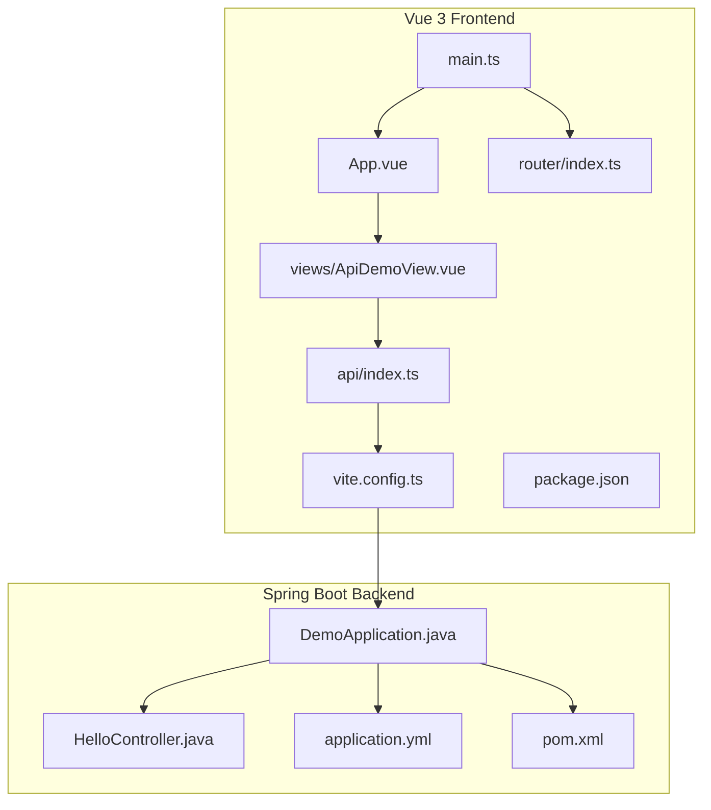
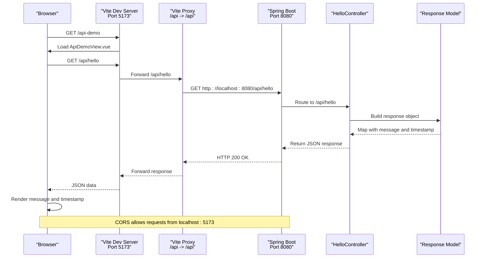
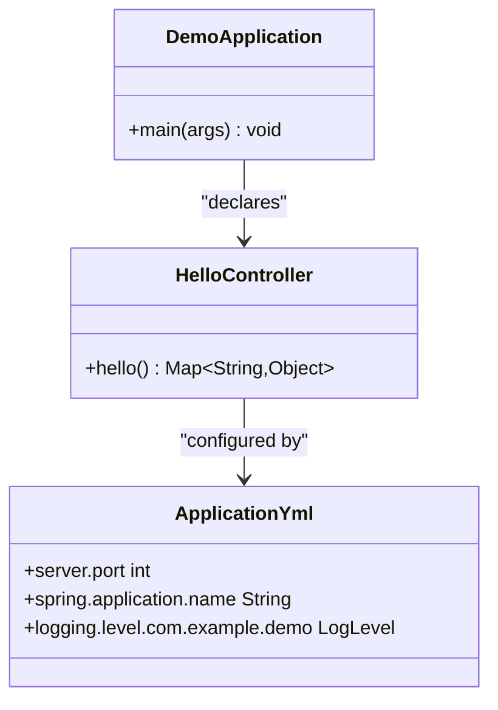
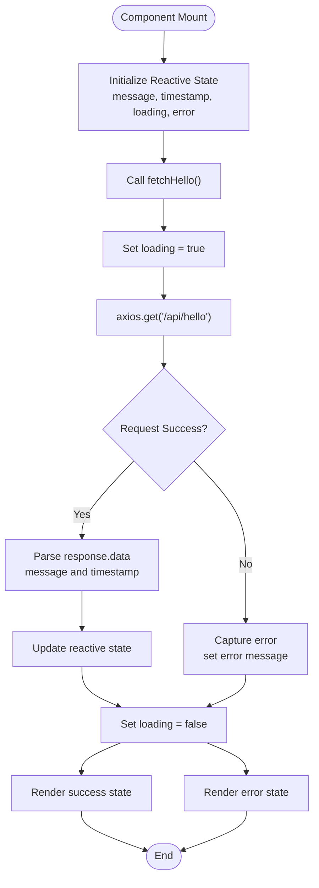
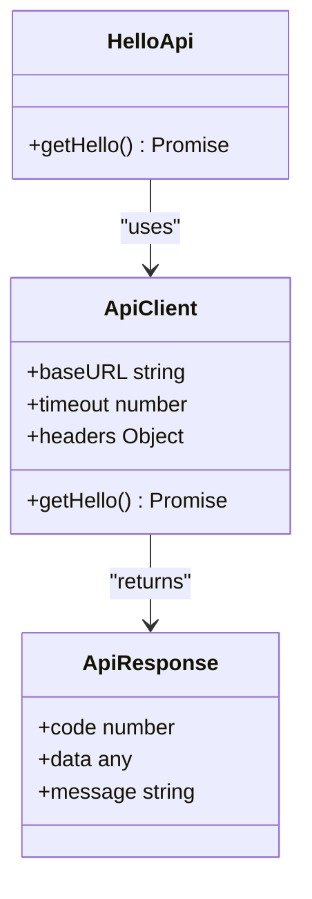
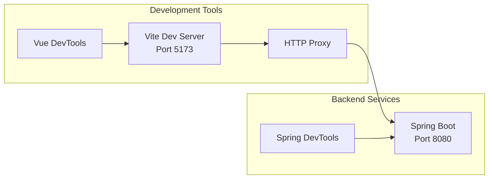
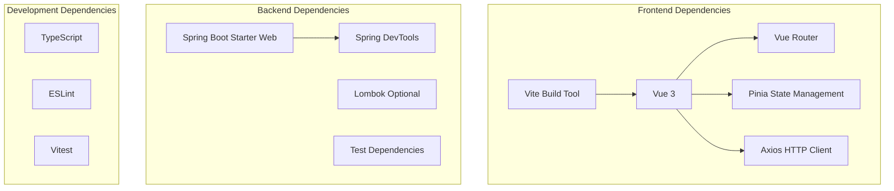

# Project Overview

<cite>
**Referenced Files in This Document**
- [DemoApplication.java](file://springboot3-demo/src/main/java/com/example/demo/DemoApplication.java)
- [HelloController.java](file://springboot3-demo/src/main/java/com/example/demo/controller/HelloController.java)
- [application.yml](file://springboot3-demo/src/main/resources/application.yml)
- [pom.xml](file://springboot3-demo/pom.xml)
- [App.vue](file://vue3-springboot-demo/src/App.vue)
- [ApiDemoView.vue](file://vue3-springboot-demo/src/views/ApiDemoView.vue)
- [index.ts](file://vue3-springboot-demo/src/api/index.ts)
- [index.ts](file://vue3-springboot-demo/src/router/index.ts)
- [main.ts](file://vue3-springboot-demo/src/main.ts)
- [vite.config.ts](file://vue3-springboot-demo/vite.config.ts)
- [package.json](file://vue3-springboot-demo/package.json)
</cite>

## Table of Contents
1. [Introduction](#introduction)
2. [Project Structure](#project-structure)
3. [Core Components](#core-components)
4. [Architecture Overview](#architecture-overview)
5. [Detailed Component Analysis](#detailed-component-analysis)
6. [Dependency Analysis](#dependency-analysis)
7. [Performance Considerations](#performance-considerations)
8. [Troubleshooting Guide](#troubleshooting-guide)
9. [Conclusion](#conclusion)

## Introduction
This project demonstrates a modern full-stack integration between a Vue 3 frontend and a Spring Boot 3 backend. It serves as a practical example of how to build a responsive web application using contemporary JavaScript frameworks and Java microservices. The application showcases cross-origin resource sharing (CORS) configuration, API client abstraction, and reactive state management patterns.

The demo focuses on a simple yet representative workflow: a Vue 3 component making HTTP requests to a Spring Boot REST endpoint, displaying dynamic content with loading states and error handling. This pattern is foundational for building scalable single-page applications that communicate with backend services.

## Project Structure
The project follows a clean separation of concerns with distinct frontend and backend modules:

**Diagram sources**
- [DemoApplication.java:1-14](file://springboot3-demo/src/main/java/com/example/demo/DemoApplication.java#L1-L14)
- [HelloController.java:1-24](file://springboot3-demo/src/main/java/com/example/demo/controller/HelloController.java#L1-L24)
- [application.yml:1-16](file://springboot3-demo/src/main/resources/application.yml#L1-L16)
- [pom.xml:1-68](file://springboot3-demo/pom.xml#L1-L68)
- [main.ts:1-15](file://vue3-springboot-demo/src/main.ts#L1-L15)
- [App.vue:1-87](file://vue3-springboot-demo/src/App.vue#L1-L87)
- [index.ts:1-26](file://vue3-springboot-demo/src/router/index.ts#L1-L26)
- [index.ts:1-22](file://vue3-springboot-demo/src/api/index.ts#L1-L22)
- [ApiDemoView.vue:1-100](file://vue3-springboot-demo/src/views/ApiDemoView.vue#L1-L100)
- [vite.config.ts:1-28](file://vue3-springboot-demo/vite.config.ts#L1-L28)
- [package.json:1-49](file://vue3-springboot-demo/package.json#L1-L49)

**Section sources**
- [DemoApplication.java:1-14](file://springboot3-demo/src/main/java/com/example/demo/DemoApplication.java#L1-L14)
- [HelloController.java:1-24](file://springboot3-demo/src/main/java/com/example/demo/controller/HelloController.java#L1-L24)
- [application.yml:1-16](file://springboot3-demo/src/main/resources/application.yml#L1-L16)
- [pom.xml:1-68](file://springboot3-demo/pom.xml#L1-L68)
- [main.ts:1-15](file://vue3-springboot-demo/src/main.ts#L1-L15)
- [App.vue:1-87](file://vue3-springboot-demo/src/App.vue#L1-L87)
- [index.ts:1-26](file://vue3-springboot-demo/src/router/index.ts#L1-L26)
- [index.ts:1-22](file://vue3-springboot-demo/src/api/index.ts#L1-L22)
- [ApiDemoView.vue:1-100](file://vue3-springboot-demo/src/views/ApiDemoView.vue#L1-L100)
- [vite.config.ts:1-28](file://vue3-springboot-demo/vite.config.ts#L1-L28)
- [package.json:1-49](file://vue3-springboot-demo/package.json#L1-L49)

## Core Components
The application consists of two primary components that demonstrate the integration pattern:

### Backend REST Endpoint
The Spring Boot application exposes a single REST endpoint that returns structured JSON data with CORS support configured for the frontend development server.

### Frontend API Client and View
The Vue 3 application implements a typed API client using Axios, with a dedicated view component that manages loading states, error handling, and reactive data binding.

**Section sources**
- [HelloController.java:16-22](file://springboot3-demo/src/main/java/com/example/demo/controller/HelloController.java#L16-L22)
- [index.ts:17-19](file://vue3-springboot-demo/src/api/index.ts#L17-L19)
- [ApiDemoView.vue:10-22](file://vue3-springboot-demo/src/views/ApiDemoView.vue#L10-L22)

## Architecture Overview
The system follows a classic client-server architecture with explicit separation between frontend and backend concerns:

**Diagram sources**
- [vite.config.ts:20-25](file://vue3-springboot-demo/vite.config.ts#L20-L25)
- [HelloController.java:12-13](file://springboot3-demo/src/main/java/com/example/demo/controller/HelloController.java#L12-L13)
- [index.ts:3-9](file://vue3-springboot-demo/src/api/index.ts#L3-L9)

The architecture demonstrates several key patterns:
- **Development-time proxying**: Vite forwards API requests to the Spring Boot server during development
- **CORS configuration**: Explicit allowance for frontend origin in development
- **RESTful service design**: Clean endpoint structure with consistent JSON responses
- **Type-safe API client**: Typed interface for better developer experience

## Detailed Component Analysis

### Spring Boot Backend Implementation
The backend provides a minimal but complete REST service:

**Diagram sources**
- [DemoApplication.java:6-11](file://springboot3-demo/src/main/java/com/example/demo/DemoApplication.java#L6-L11)
- [HelloController.java:11-22](file://springboot3-demo/src/main/java/com/example/demo/controller/HelloController.java#L11-L22)
- [application.yml:1-16](file://springboot3-demo/src/main/resources/application.yml#L1-L16)

Key implementation characteristics:
- **Annotation-driven configuration**: Uses Spring Boot auto-configuration
- **CORS policy**: Permissive configuration for local development
- **Simple response structure**: Returns a Map containing message and timestamp
- **Development-friendly**: Includes Spring DevTools for hot reloading

**Section sources**
- [DemoApplication.java:1-14](file://springboot3-demo/src/main/java/com/example/demo/DemoApplication.java#L1-L14)
- [HelloController.java:1-24](file://springboot3-demo/src/main/java/com/example/demo/controller/HelloController.java#L1-L24)
- [application.yml:1-16](file://springboot3-demo/src/main/resources/application.yml#L1-L16)

### Vue 3 Frontend Architecture
The frontend implements a reactive component pattern with comprehensive state management:

**Diagram sources**
- [ApiDemoView.vue:10-26](file://vue3-springboot-demo/src/views/ApiDemoView.vue#L10-L26)

The component lifecycle demonstrates robust error handling and user experience patterns:
- **Loading states**: Visual feedback during API requests
- **Error handling**: Graceful degradation with user-friendly messages
- **Reactive updates**: Automatic UI updates when data changes
- **Retry capability**: Users can reattempt failed requests

**Section sources**
- [ApiDemoView.vue:1-100](file://vue3-springboot-demo/src/views/ApiDemoView.vue#L1-L100)

### API Client Abstraction
The frontend implements a centralized API client with consistent configuration:

**Diagram sources**
- [index.ts:3-9](file://vue3-springboot-demo/src/api/index.ts#L3-L9)
- [index.ts:11-19](file://vue3-springboot-demo/src/api/index.ts#L11-L19)

**Section sources**
- [index.ts:1-22](file://vue3-springboot-demo/src/api/index.ts#L1-L22)

### Development Environment Configuration
The project includes comprehensive development tooling:

**Diagram sources**
- [vite.config.ts:18-26](file://vue3-springboot-demo/vite.config.ts#L18-L26)
- [application.yml:7-11](file://springboot3-demo/src/main/resources/application.yml#L7-L11)

**Section sources**
- [vite.config.ts:1-28](file://vue3-springboot-demo/vite.config.ts#L1-L28)
- [application.yml:1-16](file://springboot3-demo/src/main/resources/application.yml#L1-L16)

## Dependency Analysis
The project maintains minimal but effective dependency chains:

**Diagram sources**
- [package.json:17-22](file://vue3-springboot-demo/package.json#L17-L22)
- [pom.xml:25-48](file://springboot3-demo/pom.xml#L25-L48)

**Section sources**
- [package.json:1-49](file://vue3-springboot-demo/package.json#L1-L49)
- [pom.xml:1-68](file://springboot3-demo/pom.xml#L1-L68)

## Performance Considerations
The application implements several performance-conscious patterns:

- **Minimal payload**: Single endpoint returns essential data only
- **Efficient state updates**: Vue 3 reactivity triggers minimal DOM updates
- **Development optimizations**: Hot module replacement and fast rebuilds
- **Network efficiency**: Centralized API client reduces request overhead
- **Memory management**: Proper cleanup of reactive references

## Troubleshooting Guide
Common issues and solutions:

### CORS Configuration Issues
- **Problem**: Cross-origin requests blocked in browser console
- **Solution**: Verify CORS configuration matches frontend origin
- **Reference**: [HelloController.java](file://springboot3-demo/src/main/java/com/example/demo/controller/HelloController.java#L13)

### API Endpoint Not Found
- **Problem**: 404 errors when calling `/api/hello`
- **Solution**: Check route mapping and controller annotations
- **Reference**: [HelloController.java:12-16](file://springboot3-demo/src/main/java/com/example/demo/controller/HelloController.java#L12-L16)

### Development Server Conflicts
- **Problem**: Port 5173 or 8080 already in use
- **Solution**: Modify ports in Vite config or application.yml
- **Reference**: [vite.config.ts:18-26](file://vue3-springboot-demo/vite.config.ts#L18-L26), [application.yml:1-2](file://springboot3-demo/src/main/resources/application.yml#L1-L2)

### Type Checking Errors
- **Problem**: TypeScript compilation failures
- **Solution**: Run type checking script and fix reported issues
- **Reference**: [package.json](file://vue3-springboot-demo/package.json#L12)

**Section sources**
- [HelloController.java:1-24](file://springboot3-demo/src/main/java/com/example/demo/controller/HelloController.java#L1-L24)
- [vite.config.ts:1-28](file://vue3-springboot-demo/vite.config.ts#L1-L28)
- [application.yml:1-16](file://springboot3-demo/src/main/resources/application.yml#L1-L16)
- [package.json:1-49](file://vue3-springboot-demo/package.json#L1-L49)

## Conclusion
This qoder full-stack demo successfully demonstrates modern web development practices through a clean, minimal implementation. The project showcases effective integration patterns between Vue 3 and Spring Boot 3, including proper CORS configuration, API client abstraction, and reactive component patterns.

The architecture provides a solid foundation for building more complex applications while maintaining simplicity and clarity. The development workflow emphasizes rapid iteration through hot reloading, proxy-based development, and comprehensive error handling patterns.

Key takeaways for developers:
- Start with simple, focused examples before adding complexity
- Implement proper error handling and loading states
- Use centralized API clients for consistent request patterns
- Leverage development tools for efficient workflow
- Maintain clear separation between frontend and backend concerns

This project serves as both an educational resource and a practical template for building production-ready full-stack applications using contemporary technologies.