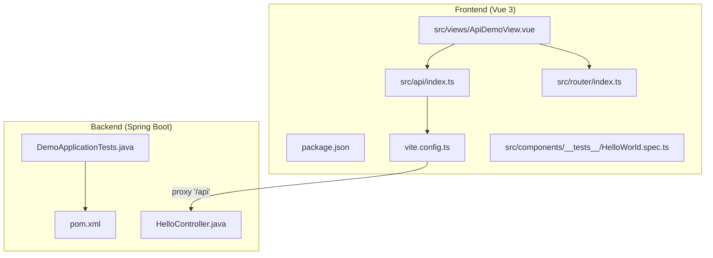
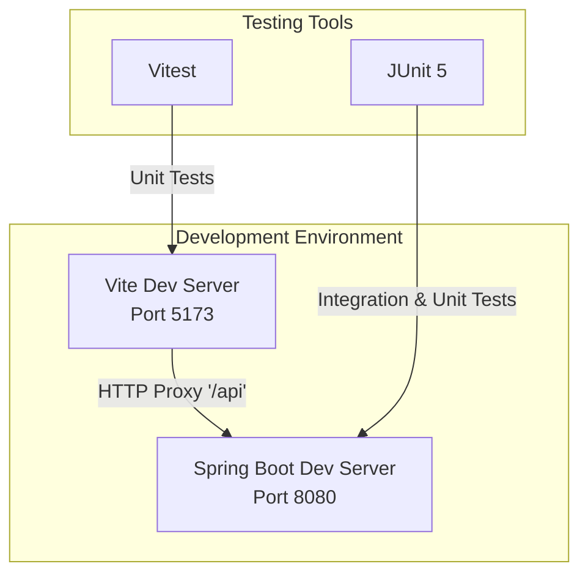
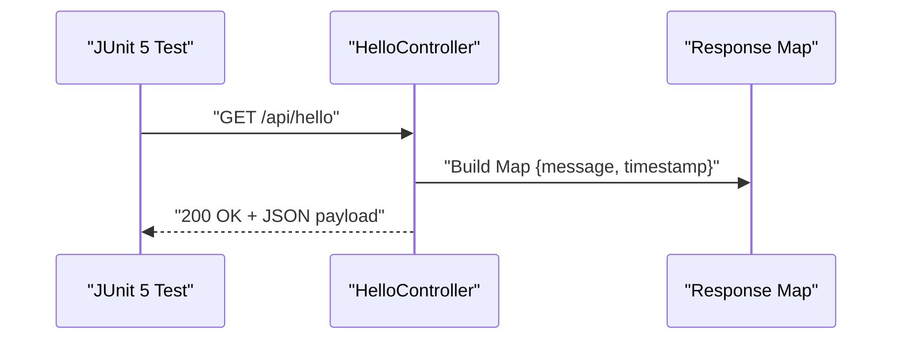
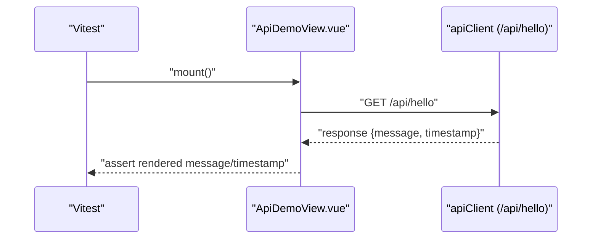
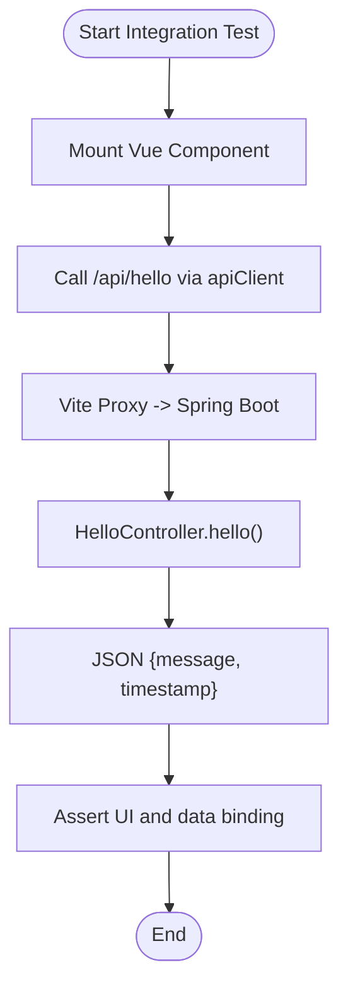
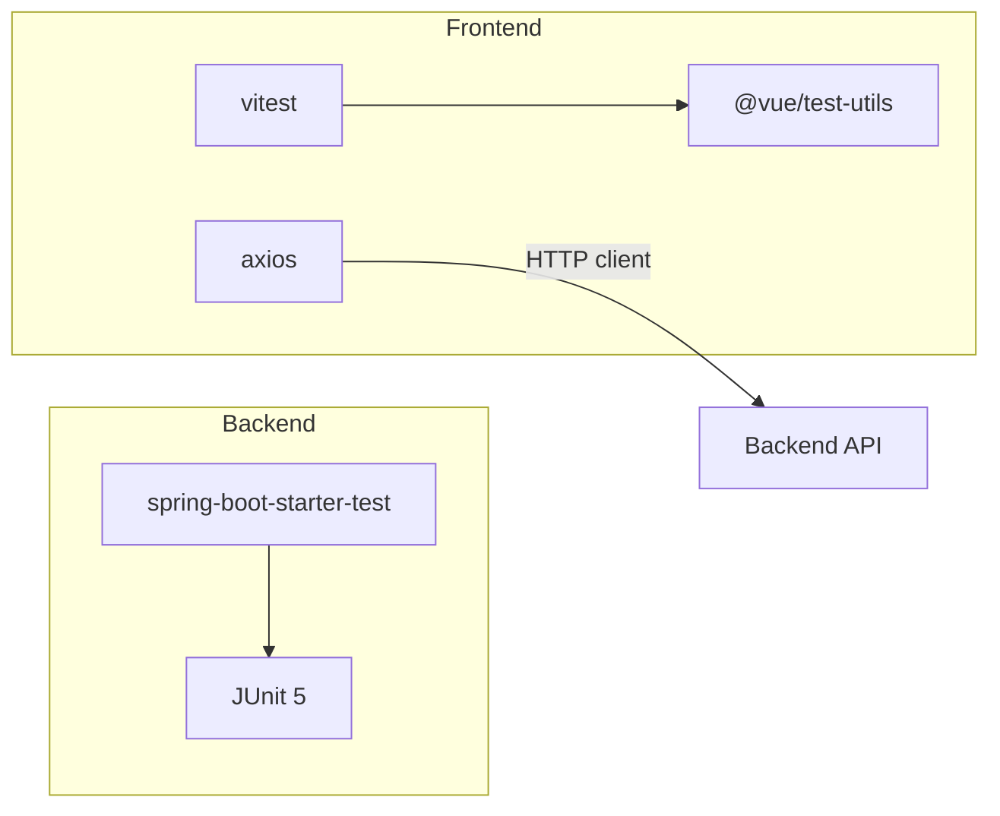

# Testing Strategy

<cite>
**Referenced Files in This Document**
- [pom.xml](file://springboot3-demo/pom.xml)
- [DemoApplicationTests.java](file://springboot3-demo/src/test/java/com/example/demo/DemoApplicationTests.java)
- [HelloController.java](file://springboot3-demo/src/main/java/com/example/demo/controller/HelloController.java)
- [package.json](file://vue3-springboot-demo/package.json)
- [vite.config.ts](file://vue3-springboot-demo/vite.config.ts)
- [index.ts](file://vue3-springboot-demo/src/api/index.ts)
- [ApiDemoView.vue](file://vue3-springboot-demo/src/views/ApiDemoView.vue)
- [index.ts](file://vue3-springboot-demo/src/router/index.ts)
- [HelloWorld.spec.ts](file://vue3-springboot-demo/src/components/__tests__/HelloWorld.spec.ts)
</cite>

## Table of Contents
1. [Introduction](#introduction)
2. [Project Structure](#project-structure)
3. [Core Components](#core-components)
4. [Architecture Overview](#architecture-overview)
5. [Detailed Component Analysis](#detailed-component-analysis)
6. [Dependency Analysis](#dependency-analysis)
7. [Performance Considerations](#performance-considerations)
8. [Troubleshooting Guide](#troubleshooting-guide)
9. [Conclusion](#conclusion)
10. [Appendices](#appendices)

## Introduction
This document outlines a comprehensive testing strategy for the full-stack application consisting of a Spring Boot 3 backend and a Vue 3 frontend. It covers backend testing frameworks and patterns, frontend testing configuration and workflows, integration testing approaches, and continuous integration considerations. Practical examples demonstrate testing API endpoints, Vue components, and integration scenarios between the frontend and backend. Guidance is included for mocking external dependencies, managing test coverage, performance testing, and debugging test failures.

## Project Structure
The repository comprises two primary modules:
- Backend: Spring Boot 3 application with Maven build configuration and JUnit 5-based tests.
- Frontend: Vue 3 application using Vite, Vitest for unit testing, and Vue Test Utils for component testing.

Key testing-related configurations and artifacts:
- Backend: Maven POM declares Spring Boot Starter Test for JUnit 5 and test-scoped dependencies.
- Frontend: Package scripts define unit test execution via Vitest; Vite config includes a proxy to the backend API server.

**Diagram sources**
- [pom.xml:1-68](file://springboot3-demo/pom.xml#L1-L68)
- [DemoApplicationTests.java:1-14](file://springboot3-demo/src/test/java/com/example/demo/DemoApplicationTests.java#L1-L14)
- [HelloController.java:1-24](file://springboot3-demo/src/main/java/com/example/demo/controller/HelloController.java#L1-L24)
- [package.json:1-49](file://vue3-springboot-demo/package.json#L1-L49)
- [vite.config.ts:1-28](file://vue3-springboot-demo/vite.config.ts#L1-L28)
- [index.ts:1-22](file://vue3-springboot-demo/src/api/index.ts#L1-L22)
- [ApiDemoView.vue:1-100](file://vue3-springboot-demo/src/views/ApiDemoView.vue#L1-L100)
- [index.ts:1-26](file://vue3-springboot-demo/src/router/index.ts#L1-L26)
- [HelloWorld.spec.ts:1-12](file://vue3-springboot-demo/src/components/__tests__/HelloWorld.spec.ts#L1-L12)

**Section sources**
- [pom.xml:1-68](file://springboot3-demo/pom.xml#L1-L68)
- [package.json:1-49](file://vue3-springboot-demo/package.json#L1-L49)

## Core Components
This section summarizes the testing capabilities present in the repository and how they support quality assurance.

- Backend testing framework
  - JUnit 5 is configured via Spring Boot Starter Test for writing and executing tests.
  - The existing test demonstrates a basic application context load test.

- Frontend testing framework
  - Vitest is configured as the unit test runner with TypeScript support.
  - Vue Test Utils is available for mounting and asserting component behavior.
  - A minimal component test exists to validate rendering under props.

- Integration testing foundation
  - The frontend uses Axios to call backend endpoints under the "/api" path.
  - Vite’s development server proxies "/api" requests to the backend service, enabling seamless integration testing during development.

**Section sources**
- [DemoApplicationTests.java:1-14](file://springboot3-demo/src/test/java/com/example/demo/DemoApplicationTests.java#L1-L14)
- [HelloWorld.spec.ts:1-12](file://vue3-springboot-demo/src/components/__tests__/HelloWorld.spec.ts#L1-L12)
- [vite.config.ts:18-26](file://vue3-springboot-demo/vite.config.ts#L18-L26)
- [index.ts:1-22](file://vue3-springboot-demo/src/api/index.ts#L1-L22)

## Architecture Overview
The testing architecture leverages separate but coordinated tools for backend and frontend, with a proxy-based integration layer during development.

**Diagram sources**
- [vite.config.ts:18-26](file://vue3-springboot-demo/vite.config.ts#L18-L26)
- [HelloController.java:1-24](file://springboot3-demo/src/main/java/com/example/demo/controller/HelloController.java#L1-L24)

## Detailed Component Analysis

### Backend Testing: JUnit 5 and Spring Boot Test
- Test setup
  - Spring Boot Starter Test provides JUnit 5 engine and Spring Boot test slices.
  - The application context test verifies that the Spring context loads successfully.

- Recommended patterns
  - Use @SpringBootTest for integration tests that require the full application context.
  - Use @WebMvcTest for focused controller tests; combine with @MockBean to isolate external dependencies.
  - Use @TestPropertySource or @Import for environment-specific test configurations.

- Example scenario
  - Test the GET endpoint "/api/hello" to assert response payload structure and HTTP status.

**Diagram sources**
- [HelloController.java:16-22](file://springboot3-demo/src/main/java/com/example/demo/controller/HelloController.java#L16-L22)

**Section sources**
- [DemoApplicationTests.java:1-14](file://springboot3-demo/src/test/java/com/example/demo/DemoApplicationTests.java#L1-L14)
- [HelloController.java:1-24](file://springboot3-demo/src/main/java/com/example/demo/controller/HelloController.java#L1-L24)

### Frontend Testing: Vitest, Vue Test Utils, and Component Workflows
- Test runner and utilities
  - Vitest executes unit tests with native ES module support and fast runtime.
  - Vue Test Utils enables mounting components, simulating user interactions, and asserting DOM updates.

- Component under test
  - ApiDemoView.vue integrates with the API client and displays loading, error, and success states.
  - The component lifecycle triggers an initial fetch on mount.

- Example scenario
  - Write a unit test that mounts ApiDemoView, stubs the API client, and asserts UI state transitions for loading, success, and error branches.

**Diagram sources**
- [ApiDemoView.vue:10-26](file://vue3-springboot-demo/src/views/ApiDemoView.vue#L10-L26)
- [index.ts:17-19](file://vue3-springboot-demo/src/api/index.ts#L17-L19)

**Section sources**
- [ApiDemoView.vue:1-100](file://vue3-springboot-demo/src/views/ApiDemoView.vue#L1-L100)
- [index.ts:1-22](file://vue3-springboot-demo/src/api/index.ts#L1-L22)

### Integration Testing: Frontend-to-Backend Communication
- Proxy configuration
  - Vite dev server proxies "/api" to the backend service, allowing frontend tests to hit real endpoints during development.

- Strategies
  - End-to-end tests can leverage the proxy to validate full request/response flows.
  - For isolated integration tests, spin up a lightweight backend stub or use a test database profile.

**Diagram sources**
- [vite.config.ts:20-25](file://vue3-springboot-demo/vite.config.ts#L20-L25)
- [HelloController.java:16-22](file://springboot3-demo/src/main/java/com/example/demo/controller/HelloController.java#L16-L22)
- [index.ts:17-19](file://vue3-springboot-demo/src/api/index.ts#L17-L19)

**Section sources**
- [vite.config.ts:18-26](file://vue3-springboot-demo/vite.config.ts#L18-L26)
- [HelloController.java:1-24](file://springboot3-demo/src/main/java/com/example/demo/controller/HelloController.java#L1-L24)
- [index.ts:1-22](file://vue3-springboot-demo/src/api/index.ts#L1-L22)

### Mock Strategies for External Dependencies
- Backend
  - Use @MockBean to replace service-layer collaborators in controller tests.
  - Use @TestConfiguration to supply test-specific beans for external systems.

- Frontend
  - Stub apiClient methods in unit tests to simulate network outcomes.
  - Use Vitest spies to verify API calls without hitting the network.

**Section sources**
- [HelloWorld.spec.ts:1-12](file://vue3-springboot-demo/src/components/__tests__/HelloWorld.spec.ts#L1-L12)
- [index.ts:1-22](file://vue3-springboot-demo/src/api/index.ts#L1-L22)

### Test Execution Commands
- Backend
  - Run all tests: use the Maven Surefire plugin bound to the test phase.
  - Debug tests: configure IDE launchers to execute JUnit 5 tests.

- Frontend
  - Run unit tests: execute the script defined in package.json for Vitest.
  - Watch mode: enable Vitest watch mode for iterative development.

**Section sources**
- [package.json:6-16](file://vue3-springboot-demo/package.json#L6-L16)
- [pom.xml:51-66](file://springboot3-demo/pom.xml#L51-L66)

### Continuous Integration Considerations
- Backend
  - Configure CI to run Maven test phase and collect JUnit XML reports for artifact storage and reporting.

- Frontend
  - Configure CI to run Vitest and produce coverage reports.
  - Cache Node dependencies to optimize pipeline performance.

- Cross-cutting
  - Align backend and frontend test outputs with CI dashboards for unified visibility.

[No sources needed since this section provides general guidance]

## Dependency Analysis
This section maps testing dependencies and their roles in the stack.

**Diagram sources**
- [pom.xml:44-48](file://springboot3-demo/pom.xml#L44-L48)
- [package.json:23-44](file://vue3-springboot-demo/package.json#L23-L44)

**Section sources**
- [pom.xml:25-49](file://springboot3-demo/pom.xml#L25-L49)
- [package.json:17-44](file://vue3-springboot-demo/package.json#L17-L44)

## Performance Considerations
- Backend
  - Favor lightweight test slices (e.g., @WebMvcTest) to reduce startup overhead.
  - Use @DirtiesContext judiciously to avoid unnecessary restarts.

- Frontend
  - Keep tests focused and fast; avoid heavy DOM assertions when shallow mounts suffice.
  - Use Vitest’s built-in concurrency controls and selective test runs.

[No sources needed since this section provides general guidance]

## Troubleshooting Guide
Common issues and resolutions:
- CORS errors during frontend-to-backend integration
  - Ensure the backend controller allows the frontend origin in development.
  - Verify Vite proxy configuration targets the correct backend port.

- Network timeouts or failures
  - Confirm axios base URL and timeout settings align with proxy behavior.
  - Add retry logic or explicit error handling in tests for flaky endpoints.

- Test flakiness
  - Use deterministic fixtures and controlled mocks.
  - Prefer deterministic timestamps or inject test-friendly values in tests.

**Section sources**
- [HelloController.java:13-14](file://springboot3-demo/src/main/java/com/example/demo/controller/HelloController.java#L13-L14)
- [vite.config.ts:20-25](file://vue3-springboot-demo/vite.config.ts#L20-L25)
- [index.ts:3-9](file://vue3-springboot-demo/src/api/index.ts#L3-L9)

## Conclusion
The repository establishes a solid foundation for full-stack testing with JUnit 5 on the backend and Vitest with Vue Test Utils on the frontend. By leveraging the Vite proxy, teams can seamlessly integrate frontend tests against backend endpoints. Extending the current setup with focused controller tests, component stubbing, and CI-aligned reporting will further strengthen quality assurance across the stack.

[No sources needed since this section summarizes without analyzing specific files]

## Appendices
- Practical examples
  - Backend: Add a controller test for the "/api/hello" endpoint using @WebMvcTest and @MockBean.
  - Frontend: Extend ApiDemoView tests to cover loading and error states with mocked API responses.
  - Integration: Add an E2E test that validates the complete flow from component mount to successful render.

[No sources needed since this section provides general guidance]